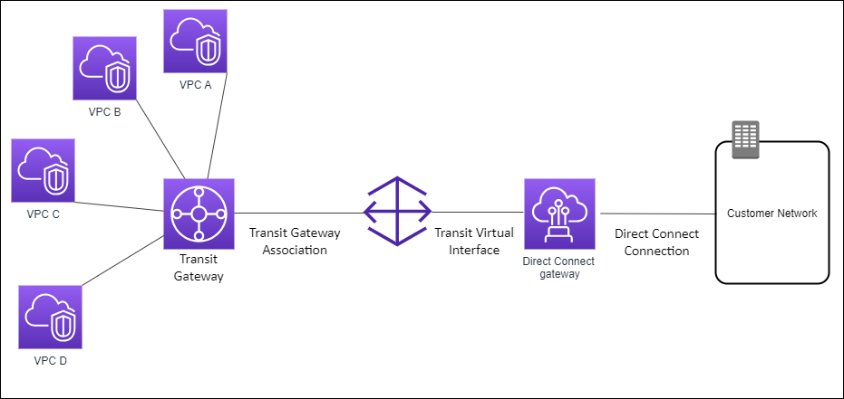

* [The Open Guide to Amazon Web Services](https://github.com/open-guides/og-aws)

# IAM
- [Identity-based policies and resource-based policies](https://docs.aws.amazon.com/IAM/latest/UserGuide/access_policies_identity-vs-resource.html)
- [Permissions boundaries for IAM entities](https://docs.aws.amazon.com/IAM/latest/UserGuide/access_policies_boundaries.html)
- [When and where to use IAM permissions boundaries](https://aws.amazon.com/blogs/security/when-and-where-to-use-iam-permissions-boundaries/)
  > The predominant use case for permissions boundaries is to limit privileges available to IAM roles created by developers (referred to as delegated administrators in the IAM documentation) who have permissions to create and manage these roles.
  >
  > To limit access, the central administrator can attach a condition to the developer’s identity policy that helps ensure that the developer can only create a role if the role has a permissions boundary policy attached to it.
  > ```
  > "Effect": "Allow",
  > "Action": "iam:CreateRole",
  > "Condition": {
  >    "StringEquals": {
  >       "iam:PermissionsBoundary": "arn:aws:iam::<YourAccount_ID>:policy/<DevelopersPermissionsBoundary>"
  >    }
  > }
  > ```
- [AWS global condition context keys | PrincipalOrgID](https://docs.aws.amazon.com/IAM/latest/UserGuide/reference_policies_condition-keys.html)
  - Properties of the principal
    - aws:PrincipalArn
    - aws:PrincipalAccount
    - aws:PrincipalOrgPaths
    - [aws:PrincipalOrgID](https://docs.aws.amazon.com/IAM/latest/UserGuide/reference_policies_condition-keys.html#condition-keys-principalorgid)
    - aws:PrincipalTag/tag-key
    - aws:PrincipalIsAWSService
    - aws:PrincipalServiceName
    - aws:PrincipalServiceNamesList
    - aws:PrincipalType
    - aws:userid
    - aws:username
  - Properties of a role session
  - Properties of the network
    - aws:SourceIp
    - aws:SourceVpc
    - aws:SourceVpce
    - aws:VpcSourceIp
  - Properties of the resource Properties of the request 
  
- [Controlling access to and for IAM users and roles using tags | PrincipalTag](https://docs.aws.amazon.com/IAM/latest/UserGuide/access_iam-tags.html)
- [How can I use IAM roles to restrict API calls from specific IP addresses to the AWS Management Console?](https://repost.aws/knowledge-center/iam-restrict-calls-ip-addresses)
- [Setting an account password policy for IAM users](https://docs.aws.amazon.com/IAM/latest/UserGuide/id_credentials_passwords_account-policy.html?icmpid=docs_iam_console)

# Compute

## EC2
- [Elastic Network Interfaces in the Virtual Private Cloud](https://aws.amazon.com/blogs/aws/new-elastic-network-interfaces-in-the-virtual-private-cloud/)
- [Reserve compute capacity with On-Demand Capacity Reservations](https://docs.aws.amazon.com/AWSEC2/latest/UserGuide/ec2-capacity-reservations.html)
  > When you create a Capacity Reservation, you specify:
  > - The Availability Zone in which to reserve the capacity
  > - The number of instances for which to reserve capacity
  > - The instance attributes, including the instance type, platform, Availability Zone, and tenancy
- [Block device mappings](https://docs.aws.amazon.com/AWSEC2/latest/UserGuide/block-device-mapping-concepts.html)
- [Add instance store volumes to your EC2 instance | Only at launch](https://docs.aws.amazon.com/AWSEC2/latest/UserGuide/add-instance-store-volumes.html)
- [Elastic Network Adapter – High Performance Network Interface for Amazon EC2](https://aws.amazon.com/blogs/aws/elastic-network-adapter-high-performance-network-interface-for-amazon-ec2/)
- [Now Available – Elastic Fabric Adapter (EFA) for Tightly-Coupled HPC Workloads](https://aws.amazon.com/blogs/aws/now-available-elastic-fabric-adapter-efa-for-tightly-coupled-hpc-workloads/)
- [How do I turn on and configure enhanced networking on my EC2 instances?](https://repost.aws/knowledge-center/enable-configure-enhanced-networking)
- [Hibernate your Amazon EC2 instance](https://docs.aws.amazon.com/AWSEC2/latest/UserGuide/Hibernate.html)
- [Instance purchasing options](https://docs.aws.amazon.com/AWSEC2/latest/UserGuide/instance-purchasing-options.html)
  > **Reserved Instances do not reserve capacity**
  >
  > RIs do not guarantee that the reserved instance type will be available when you need it. This is an important distinction, as it means that even if you have an RI, you may not be able to launch an instance of the reserved type if the AZ is fully utilized or if there's an outage.
- [Differences between Capacity Reservations, Reserved Instances, and Savings Plans](https://docs.aws.amazon.com/AWSEC2/latest/UserGuide/ec2-capacity-reservations.html#capacity-reservations-differences)
- [Placement groups](https://docs.aws.amazon.com/AWSEC2/latest/UserGuide/placement-groups.html)
- [Best practices for handling EC2 Spot Instance interruptions](https://aws.amazon.com/blogs/compute/best-practices-for-handling-ec2-spot-instance-interruptions/)

## EC2 Auto-Scaling
- [Step and simple scaling policies for Amazon EC2 Auto Scaling](https://docs.aws.amazon.com/autoscaling/ec2/userguide/as-scaling-simple-step.html)
  > Step scaling and simple scaling policies scale the capacity of your Auto Scaling group in predefined increments based on CloudWatch alarms. You can define separate scaling policies to handle scaling out (increasing capacity) and scaling in (decreasing capacity) when an alarm threshold is breached.
- [Target tracking scaling policies for Amazon EC2 Auto Scaling](https://docs.aws.amazon.com/autoscaling/ec2/userguide/as-scaling-target-tracking.html)
- [Scaling policy based on Amazon SQS](https://docs.aws.amazon.com/autoscaling/ec2/userguide/as-using-sqs-queue.html)

## Cloud Watch
- [Enable or turn off detailed monitoring for your instances](https://docs.aws.amazon.com/AWSEC2/latest/UserGuide/using-cloudwatch-new.html)
- [Metrics collected by the CloudWatch agent](https://docs.aws.amazon.com/AmazonCloudWatch/latest/monitoring/metrics-collected-by-CloudWatch-agent.html)
  - cpu
  - disk
  - diskio
  - ethtool
  - mem
  - net
  - netstat
  - processes
  - swap
- [Sharing CloudWatch dashboards](https://docs.aws.amazon.com/AmazonCloudWatch/latest/monitoring/cloudwatch-dashboard-sharing.html)
  > You can share your CloudWatch dashboards with people who do not have direct access to your AWS account. This enables you to share dashboards across teams, with stakeholders, and with people external to your organization.
- [Publish custom metrics](https://docs.aws.amazon.com/AmazonCloudWatch/latest/monitoring/publishingMetrics.html)
  > To publish a single data point for a new or existing metric, use the `put-metric-data` command with one value and time stamp.

### Cloud Watch Logs
- [Real-time processing of log data with subscriptions](https://docs.aws.amazon.com/AmazonCloudWatch/latest/logs/Subscriptions.html)
- [Streaming CloudWatch Logs data to Amazon OpenSearch Service](https://docs.aws.amazon.com/AmazonCloudWatch/latest/logs/CWL_OpenSearch_Stream.html)
  > You can configure a CloudWatch Logs log group to stream data it receives to your Amazon OpenSearch Service cluster in near real-time through a CloudWatch Logs subscription. For more information, see Real-time processing of log data with subscriptions.
  - Firehose is a possible solution as well, but it involves another service

### CloudWatch Container Insighsts
- [Container Insights](https://docs.aws.amazon.com/AmazonCloudWatch/latest/monitoring/ContainerInsights.html)
  > Use CloudWatch Container Insights to collect, aggregate, and summarize metrics and logs from your containerized applications and microservices. Container Insights is available for Amazon Elastic Container Service (Amazon ECS), Amazon Elastic Kubernetes Service (Amazon EKS), and Kubernetes platforms on Amazon EC2.
  > 
  > With Container Insights for EKS you can see the top contributors by memory or CPU, or the most recently active resources. This is available when you select any of the following dashboards in the drop-down box near the top of the page:
  > - ECS Services
  > - ECS Tasks
  > - EKS Namespaces
  > - EKS Services
  > - EKS Pods

## HPC
- [High Performance Computing Lens - AWS Well-Architected Framework](https://docs.aws.amazon.com/wellarchitected/latest/high-performance-computing-lens/welcome.html)

## Batch
- [Multi-node parallel jobs](https://docs.aws.amazon.com/batch/latest/userguide/multi-node-parallel-jobs.html)
  > You can use multi-node parallel jobs to run single jobs that span multiple Amazon EC2 instances. With AWS Batch multi-node parallel jobs, you can run large-scale, high-performance computing applications and distributed GPU model training without the need to launch, configure, and manage Amazon EC2 resources directly. An AWS Batch multi-node parallel job is compatible with any framework that supports IP-based, internode communication. Examples include Apache MXNet, TensorFlow, Caffe2, or Message Passing Interface (MPI).

## Lambda
- [Invoking Lambda with events from other AWS services](https://docs.aws.amazon.com/lambda/latest/dg/lambda-services.html)
- [Using Lambda with Amazon SQS](https://docs.aws.amazon.com/lambda/latest/dg/with-sqs.html)
- [Invoking Lambda functions with Amazon SNS notifications](https://docs.aws.amazon.com/lambda/latest/dg/with-sns.html)
- [Understanding Lambda function scaling](https://docs.aws.amazon.com/lambda/latest/dg/lambda-concurrency.html)
   - Account quota of 1,000 concurrent executions across all functions in an AWS Region
   - Reserved Concurrency | reserve a portion of your account's concurrency for a function
   - Provisioned Concurrency |  pre-initialize a number of environment instances for a function.

## ECS
- [Amazon ECS task IAM role](https://docs.aws.amazon.com/AmazonECS/latest/developerguide/task-iam-roles.html)
- [Amazon ECS container instance IAM role](https://docs.aws.amazon.com/AmazonECS/latest/developerguide/instance_IAM_role.html)
- [AWS managed policies for Amazon Elastic Container Service](https://docs.aws.amazon.com/AmazonECS/latest/developerguide/security-iam-awsmanpol.html)
  - [AmazonECSTaskExecutionRolePolicy](https://docs.aws.amazon.com/AmazonECS/latest/developerguide/security-iam-awsmanpol.html#security-iam-awsmanpol-AmazonECSTaskExecutionRolePolicy) grants the permissions that are needed by the Amazon ECS container agent and AWS Fargate container agents to make AWS API calls on your behalf (pull image, write logs etc)
- [Automatically scale your Amazon ECS service](https://docs.aws.amazon.com/AmazonECS/latest/developerguide/service-auto-scaling.html)

## EKS
- [EKS | Enabling secret encryption on an existing cluster](https://docs.aws.amazon.com/eks/latest/userguide/enable-kms.html)
- [Private cluster requirements](https://docs.aws.amazon.com/eks/latest/userguide/private-clusters.html)
- [Metrics Server](https://kubernetes.io/docs/tasks/debug/debug-cluster/resource-metrics-pipeline/#metrics-server)
- [EKS Autoscaling](https://docs.aws.amazon.com/eks/latest/userguide/autoscaling.html)
- [Deploy private clusters with limited internet access](https://docs.aws.amazon.com/eks/latest/userguide/private-clusters.html)
  > f your cluster doesn't have outbound internet access, then it must meet the following requirements:
  > - Your cluster must pull images from a container registry that's in your VPC.
  > - Your cluster must have endpoint private access enabled. This is required for nodes to register with the cluster endpoint.

# Networking  
## VPC
- [NAT gateways](https://docs.aws.amazon.com/vpc/latest/userguide/vpc-nat-gateway.html)
- [NAT gateway basics](https://docs.aws.amazon.com/vpc/latest/userguide/nat-gateway-basics.html)
    - created in a specific Availability Zone 
    - implemented with redundancy in that zone
    - quota (of 5) of NAT gateways that you can create in each Availability Zone
- [Control traffic to your AWS resources using security groups](https://docs.aws.amazon.com/vpc/latest/userguide/vpc-security-groups.html)
    - Default SG allows inbound from from within the group and all outbound traffic
    - Custom SG denies all inbound and allows all outbound traffic by default
- [Hybrid network connections](https://docs.aws.amazon.com/whitepapers/latest/hybrid-connectivity/hybrid-network-connections.html)
- [AWS PrivateLink concepts](https://docs.aws.amazon.com/vpc/latest/privatelink/concepts.html)
- [Share your VPC with other accounts](https://docs.aws.amazon.com/vpc/latest/userguide/vpc-sharing.html)
- [Control subnet traffic with network access control lists](https://docs.aws.amazon.com/vpc/latest/userguide/vpc-network-acls.html)
    - [Default network ACL | Allows all inbound and outbound](https://docs.aws.amazon.com/vpc/latest/userguide/default-network-acl.html)
    - Custom Network ACL | Denies all inbound and outbound by default
    - Gotcha: Network ACL only applies to services in a subnet - cannot be used for CloudFront
- [Share your VPC subnets with other accounts](https://docs.aws.amazon.com/vpc/latest/userguide/vpc-sharing.html)
  > VPC sharing allows multiple AWS accounts to create their application resources, such as Amazon EC2 instances, Amazon Relational Database Service (RDS) databases, Amazon Redshift clusters, and AWS Lambda functions, into shared, centrally-managed virtual private clouds (VPCs). In this model, the account that owns the VPC (owner) shares one or more subnets with other accounts (participants) that belong to the same organization from AWS Organizations.

## PrivateLink
- [What is AWS PrivateLink?](https://docs.aws.amazon.com/vpc/latest/privatelink/what-is-privatelink.html)
  > AWS PrivateLink is a highly available, scalable technology that you can use to privately connect your VPC to services as if they were in your VPC. You do not need to use an internet gateway, NAT device, public IP address, AWS Direct Connect connection, or AWS Site-to-Site VPN connection to allow communication with the service from your private subnets. Therefore, you control the specific API endpoints, sites, and services that are reachable from your VPC.
- [Access AWS services through AWS PrivateLink](https://docs.aws.amazon.com/vpc/latest/privatelink/privatelink-access-aws-services.html)
- [Securely Access Services Over AWS PrivateLink](https://docs.aws.amazon.com/whitepapers/latest/aws-privatelink/aws-privatelink.html)
- [Gateway endpoints](https://docs.aws.amazon.com/vpc/latest/privatelink/gateway-endpoints.html)
  - S3
  - DynamoDB
- [Share your services through AWS PrivateLink](https://docs.aws.amazon.com/vpc/latest/privatelink/privatelink-share-your-services.html)
  > You can host your own AWS PrivateLink powered service, known as an endpoint service, and share it with other AWS customers.
  >
  > PrivateLink endpoint in consumer VPC
  > Load balancer (NLB or GLB) in provider VPC
    
## VPN
- [What is AWS Site-to-Site VPN?](https://docs.aws.amazon.com/vpn/latest/s2svpn/VPC_VPN.html)
- [How AWS Site-to-Site VPN works](https://docs.aws.amazon.com/vpn/latest/s2svpn/how_it_works.html)
  > A Site-to-Site VPN connection consists of the following components:
  > - A virtual private gateway or a transit gateway
  > - A customer gateway device 
  >   - A customer gateway device is a physical device or software application on your side of the Site-to-Site VPN connection. You configure the device to work with the Site-to-Site VPN connection.
  > - A customer gateway
  >   - A customer gateway is a resource that you create in AWS that represents the customer gateway device in your on-premises network. When you create a customer gateway, you provide information about your device to AWS.
- [Your customer gateway device](https://docs.aws.amazon.com/vpn/latest/s2svpn/your-cgw.html)
- [Site-to-Site VPN single and multiple VPN connection examples](https://docs.aws.amazon.com/vpn/latest/s2svpn/Examples.html)
  - Single Site-to-Site VPN connection
  - Single Site-to-Site VPN connection with a transit gateway
  - Multiple Site-to-Site VPN connections
  - Multiple Site-to-Site VPN connections with a transit gateway
  - Site-to-Site VPN connection with AWS Direct Connect
  - Private IP Site-to-Site VPN connection with AWS Direct Connect
- [Using redundant Site-to-Site VPN connections to provide failover](https://docs.aws.amazon.com/vpn/latest/s2svpn/vpn-redundant-connection.html)
- [Network-to-Amazon VPC connectivity options](https://docs.aws.amazon.com/whitepapers/latest/aws-vpc-connectivity-options/network-to-amazon-vpc-connectivity-options.html)
  - [AWS Site-to-Site VPN](https://docs.aws.amazon.com/whitepapers/latest/aws-vpc-connectivity-options/aws-site-to-site-vpn.html)
  - [AWS Transit Gateway + Site-to-Site VPN](https://docs.aws.amazon.com/whitepapers/latest/aws-vpc-connectivity-options/aws-transit-gateway-vpn.html)
  - [AWS Direct Connect](https://docs.aws.amazon.com/whitepapers/latest/aws-vpc-connectivity-options/aws-direct-connect.html)
  - [AWS Direct Connect + AWS Transit Gateway](https://docs.aws.amazon.com/whitepapers/latest/aws-vpc-connectivity-options/aws-direct-connect-aws-transit-gateway.html)
  - [AWS Direct Connect + AWS Site-to-Site VPN](https://docs.aws.amazon.com/whitepapers/latest/aws-vpc-connectivity-options/aws-direct-connect-site-to-site-vpn.html)
    > With AWS Direct Connect + AWS Site-to-Site VPN, you can combine AWS Direct Connect connections with an AWS-managed VPN solution. AWS Direct Connect public VIFs establish a dedicated network connection between your network and public AWS resources such as an AWS Site-to-Site VPN endpoint. **Once you establish the connection to the service, you can create IPsec connections to the corresponding Amazon VPC virtual private gateways**.
  - [AWS Direct Connect + AWS Transit Gateway + AWS Site-to-Site VPN](https://docs.aws.amazon.com/whitepapers/latest/aws-vpc-connectivity-options/aws-direct-connect-aws-transit-gateway-vpn.html)
  - [AWS VPN CloudHub](https://docs.aws.amazon.com/whitepapers/latest/aws-vpc-connectivity-options/aws-vpn-cloudhub.html)
  - [AWS Transit Gateway + SD-WAN solutions](https://docs.aws.amazon.com/whitepapers/latest/aws-vpc-connectivity-options/aws-transit-gateway-sd-wan.html)
  - [Software VPN](https://docs.aws.amazon.com/whitepapers/latest/aws-vpc-connectivity-options/software-vpn.html)
- [Amazon VPC-to-Amazon VPC connectivity options](https://docs.aws.amazon.com/whitepapers/latest/aws-vpc-connectivity-options/amazon-vpc-to-amazon-vpc-connectivity-options.html)
  - [VPC peering](https://docs.aws.amazon.com/whitepapers/latest/aws-vpc-connectivity-options/vpc-peering.html)
  - [AWS Transit Gateway](https://docs.aws.amazon.com/whitepapers/latest/aws-vpc-connectivity-options/aws-transit-gateway.html)
  - [AWS PrivateLink](https://docs.aws.amazon.com/whitepapers/latest/aws-vpc-connectivity-options/aws-privatelink.html)
  - [Software VPN](https://docs.aws.amazon.com/whitepapers/latest/aws-vpc-connectivity-options/software-vpn-1.html)
  - [Software VPN-to-AWS Site-to-Site VPN](https://docs.aws.amazon.com/whitepapers/latest/aws-vpc-connectivity-options/software-vpn-to-aws-site-to-site-vpn.html)
  - Gotcha: No Amazon-managed VPN between VPCs

## Direct Connect
- [Direct Connect gateways](https://docs.aws.amazon.com/directconnect/latest/UserGuide/direct-connect-gateways-intro.html)
  > Use AWS Direct Connect gateway to connect your VPCs. You associate an AWS Direct Connect gateway with either of the following gateways:
  > - A transit gateway when you have multiple VPCs in the same Region
  > - A virtual private gateway
  - [Virtual private gateway associations](https://docs.aws.amazon.com/directconnect/latest/UserGuide/direct-connect-gateways-intro.html#virtual-private-gateway)
    
  - [Virtual private gateway associations across accounts](https://docs.aws.amazon.com/directconnect/latest/UserGuide/direct-connect-gateways-intro.html#virtual-private-gateway-across-accounts)
    
  - [Transit gateway associations](https://docs.aws.amazon.com/directconnect/latest/UserGuide/direct-connect-gateways-intro.html#transit-gateway)
    
- Do I need a Direct connect gateway to use AWS Direct Connect?  
  > **When you don't need a Direct Connect Gateway:**
  >
  > **Single connection**: If you have a single AWS Direct Connect connection to a single AWS Region, you don't need a Direct Connect Gateway.
  >
  > **When you need a Direct Connect Gateway:**
  > - Multiple AWS Regions
  > - Multiple AWS Accounts
  An AWS Direct Connect Gateway is a virtual router that allows you to manage and route traffic between your on-premises network and multiple AWS Regions or accounts. It's a logical component that sits between your on-premises network and AWS, providing a centralized point of management for your Direct Connect connections.
  > 
- [AWS Direct Connect Resiliency Recommendations](https://aws.amazon.com/directconnect/resiliency-recommendation/)

## Load Balancers
- [Access logs for your Application Load Balancer | to S3 bucket](https://docs.aws.amazon.com/elasticloadbalancing/latest/application/load-balancer-access-logs.html)
- [What is a Gateway Load Balancer?](https://docs.aws.amazon.com/elasticloadbalancing/latest/gateway/introduction.html)
- [Scaling network traffic inspection using AWS Gateway Load Balancer](https://aws.amazon.com/blogs/networking-and-content-delivery/scaling-network-traffic-inspection-using-aws-gateway-load-balancer/)


- [Health checks for your target groups](https://docs.aws.amazon.com/elasticloadbalancing/latest/network/target-group-health-checks.html)
- [How do I attach backend instances with private IP addresses to my internet-facing load balancer in ELB?](https://repost.aws/knowledge-center/public-load-balancer-private-ec2)
- [Monitor your Network Load Balancers](https://docs.aws.amazon.com/elasticloadbalancing/latest/network/load-balancer-monitoring.html)
   - CloudWatch metrics
   - VPC Flow Logs (One per network interface. There is one network interface per load balancer subnet)
   - Access logs
   - CloudTrail logs
- [Elastic Load Balancing adds support for Connection Draining](https://aws.amazon.com/about-aws/whats-new/2014/03/20/elastic-load-balancing-supports-connection-draining/)

## Cloudfront
- [Amazon CloudFront Dynamic Content Delivery](https://aws.amazon.com/cloudfront/dynamic-content/)
  - Slack Talks About Secure API Acceleration with Amazon CloudFront
- [Amazon S3 + Amazon CloudFront](https://aws.amazon.com/blogs/networking-and-content-delivery/amazon-s3-amazon-cloudfront-a-match-made-in-the-cloud/)
- [How do I use CloudFront to serve a static website that’s hosted on Amazon S3?](https://repost.aws/knowledge-center/cloudfront-serve-static-website)
- [Restrict access to an Amazon Simple Storage Service origin | origin access control (OAC) and origin access identity (OAI)](https://docs.aws.amazon.com/AmazonCloudFront/latest/DeveloperGuide/private-content-restricting-access-to-s3.html)
  > CloudFront provides two ways to send authenticated requests to an Amazon S3 origin: origin access control (OAC) and origin access identity (OAI). OAC helps you secure your origins, such as for Amazon S3. We recommend using OAC
- [Restrict access to an AWS Lambda function URL origin](https://docs.aws.amazon.com/AmazonCloudFront/latest/DeveloperGuide/private-content-restricting-access-to-lambda.html)
  > CloudFront provides origin access control (OAC) for restricting access to a Lambda function URL origin.
- [How do I restrict direct traffic to an Application Load Balancer and allow traffic through only CloudFront?](https://repost.aws/knowledge-center/waf-restrict-alb-allow-cloudfront)
  > To restrict direct traffic to an Application Load Balancer and allow access only through CloudFront, use one or both of the following solutions:
  > - AWS WAF
  > - Security groups
  >
  > Note: It's a best practice to combine the two following solutions.
  > 
  > To use AWS WAF to restrict direct traffic to an Application Load Balancer and allow traffic through only CloudFront, do the following:
  > 1. Configure CloudFront to add a custom HTTP header with a secret value in the requests that CloudFront sends to the Application Load Balancer.
  > 2. Create a rule in the AWS WAF web access control list (web ACL) associated with the Application Load Balancer. Use this rule to block requests that don't contain the custom HTTP header secret value.
  >
  > You can use security groups to restrict direct traffic to an Application Load Balancer and allow traffic through only CloudFront. To do this, use an AWS managed prefix list on security groups in the Application Load Balancer.
  >
  > To update an existing security group, follow the steps in Update the associated security groups. To associate your Application Load Balancer with a security group, complete the following:
  > 1. Open the Amazon EC2 console.
  > 2. Select Load balancers, and then select the Application Load Balancer that you want to restrict direct access to.
  > 3. Choose Security.
  > 4. Select the security group that you want to associate with your Application Load Balancer.
  > 5. To modify the inbound rules, select Edit inbound rules, and then update the configurations to your use case.
  > 6. To allow specific protocols, select the protocol and then choose Custom.
  > 7. For Source type, choose CloudFront, and then select your prefixes from the AWS managed prefix list.
  > 8. Choose Save.
  >
  > See [How to Automatically Update Your Security Groups for Amazon CloudFront and AWS WAF by Using AWS Lambda](https://aws.amazon.com/blogs/security/how-to-automatically-update-your-security-groups-for-amazon-cloudfront-and-aws-waf-by-using-aws-lambda/)

- [Optimize high availability with CloudFront origin failover](https://docs.aws.amazon.com/AmazonCloudFront/latest/DeveloperGuide/high_availability_origin_failover.html)
- [Differences between CloudFront Functions and Lambda@Edge](https://docs.aws.amazon.com/AmazonCloudFront/latest/DeveloperGuide/edge-functions-choosing.html)
  > CloudFront Functions is ideal for lightweight, short-running functions for the following use cases:
  > - **Cache key normalization** – Transform HTTP request attributes (headers, query strings, cookies, and even the URL path) to create an optimal cache key, which can improve your cache hit ratio.
  > - **Header manipulation** – Insert, modify, or delete HTTP headers in the request or response. For example, you can add a True-Client-IP header to every request.
  > - **URL redirects or rewrites** – Redirect viewers to other pages based on information in the request, or rewrite all requests from one path to another.
  > - **Request authorization** – Validate hashed authorization tokens, such as JSON web tokens (JWT), by inspecting authorization headers or other request metadata.
  >
  > Lambda@Edge is ideal for the following use cases:
  > - Functions that take several milliseconds or more to complete
  > - Functions that require adjustable CPU or memory
  > - Functions that depend on third-party libraries (including the AWS SDK, for integration with other AWS services)
  > - Functions that require network access to use external services for processing
  > - Functions that require file system access or access to the body of HTTP requests

- [Restrict the geographic distribution of your content](https://docs.aws.amazon.com/AmazonCloudFront/latest/DeveloperGuide/georestrictions.html)
- [Use signed cookies](https://docs.aws.amazon.com/AmazonCloudFront/latest/DeveloperGuide/private-content-signed-cookies.html)
  > CloudFront signed cookies are a method to control who can access your content. When a user authenticates and is verified as an enrolled student, the application can set a cookie in the student's browser. The cookie contains the same information that can be included in a signed URL but applies to multiple files in one or multiple directories.
- [Amazon CloudFront Pricing | Price Class](https://aws.amazon.com/cloudfront/pricing/)
- [Lambda@Edge Use cases](https://aws.amazon.com/lambda/edge/)
  - SIMPLIFY AND REDUCE ORIGIN INFRASTRUCTURE
    - Website Security and Privacy
    - Dynamic Web Application at the Edge
    - Search Engine Optimization (SEO)
    - Intelligently Route Across Origins and Data Centers
    - Bot Mitigation at the Edge
  - IMPROVED USER EXPERIENCE
    - Real-time Image Transformation
    - A/B Testing
    - User Authentication and Authorization
    - User Prioritization
- Gotcha: CloudFront cannot listen on UDP

## AWS Global Accelerator
- [What is AWS Global Accelerator?](https://docs.aws.amazon.com/global-accelerator/latest/dg/what-is-global-accelerator.html)

## API Gateway
- [Set up an API Gateway canary release deployment](https://docs.aws.amazon.com/apigateway/latest/developerguide/canary-release.html)
- [Set up VPC links for HTTP APIs](https://docs.aws.amazon.com/apigateway/latest/developerguide/http-api-vpc-links.html)
- [Invoking a Lambda function using an Amazon API Gateway endpoint](https://docs.aws.amazon.com/lambda/latest/dg/services-apigateway.html)
- [Tutorial: Create a REST API with a Lambda proxy integration](https://docs.aws.amazon.com/apigateway/latest/developerguide/api-gateway-create-api-as-simple-proxy-for-lambda.html)
  > Lambda proxy integration is a lightweight, flexible API Gateway API integration type that allows you to integrate an API method – or an entire API – with a Lambda function. The Lambda function can be written in any language that Lambda supports. Because it's a proxy integration, you can change the Lambda function implementation at any time without needing to redeploy your API.
- [Using Amazon API Gateway as a proxy for DynamoDB](https://aws.amazon.com/blogs/compute/using-amazon-api-gateway-as-a-proxy-for-dynamodb/)
- [Use API Gateway Lambda authorizers](https://docs.aws.amazon.com/apigateway/latest/developerguide/apigateway-use-lambda-authorizer.html)

## AppSync
- [GraphQL | Building Serverless APIs on AWS](https://aws.amazon.com/graphql/serverless-api/)

## Route53
- [DNS domain name format](https://docs.aws.amazon.com/Route53/latest/DeveloperGuide/DomainNameFormat.html)
- [Configuring DNS failover](https://docs.aws.amazon.com/Route53/latest/DeveloperGuide/dns-failover-configuring.html)
- [Choosing a routing policy](https://docs.aws.amazon.com/Route53/latest/DeveloperGuide/routing-policy.html)
  - Simple routing policy
  - Failover routing policy 
  - Geolocation routing policy
  - Geoproximity routing policy
  - Latency routing policy
  - IP-based routing policy
  - Multivalue answer routing policy
  - Weighted routing policy
- [How do I use Route 53 health checks for DNS failover?](https://repost.aws/knowledge-center/route-53-dns-health-checks)
  > You can use Route 53 to check the health of your resources and only return healthy resources in response to DNS queries. There are three types of DNS failover configurations:
  > 1. Active-passive: Route 53 actively returns a primary resource. If there's a failure, then Route 53 returns the backup resource. Route 53 configures this method from a failover policy.
  > 2. Active-active: Route 53 actively returns more than one resource. If there's a failure, then Route 53 fails back to the healthy resource. Route 53 configures this method from any routing policy other than a failover.
  > 3. Combination: Multiple routing policies (such as latency-based and weighted) combine into a tree to configure a more complex DNS failover.
- [Routing traffic to a website that is hosted in an Amazon S3 bucket](https://docs.aws.amazon.com/Route53/latest/DeveloperGuide/RoutingToS3Bucket.html)
- [Routing traffic to an Amazon CloudFront distribution by using your domain name](https://docs.aws.amazon.com/Route53/latest/DeveloperGuide/routing-to-cloudfront-distribution.html)

# Storage

## EBS
- [Amazon EBS volume types](https://docs.aws.amazon.com/AWSEC2/latest/UserGuide/ebs-volume-types.html)
- [Amazon EBS fast snapshot restore](https://docs.aws.amazon.com/ebs/latest/userguide/ebs-fast-snapshot-restore.html)
  > Amazon EBS fast snapshot restore (FSR) enables you to create a volume from a snapshot that is fully initialized at creation. This eliminates the latency of I/O operations on a block when it is accessed for the first time. Volumes that are created using fast snapshot restore instantly deliver all of their provisioned performance.
- [Amazon Data Lifecycle Manager | EBS snapshots and EBS-backed AMI](https://docs.aws.amazon.com/ebs/latest/userguide/snapshot-lifecycle.html)
- [Delete an Amazon EBS snapshot](https://docs.aws.amazon.com/ebs/latest/userguide/ebs-deleting-snapshot.html)
  - Incremental snapshot deletion
- [EBS Snapshot Copy (Between Regions)](https://aws.amazon.com/blogs/aws/ebs-snapshot-copy/)
- [Amazon EBS encryption](https://docs.aws.amazon.com/ebs/latest/userguide/ebs-encryption.html)
- [Amazon EBS–optimized EC2 instances](https://docs.aws.amazon.com/AWSEC2/latest/UserGuide/ebs-optimized.html)
- [Attach a volume to multiple instances with Amazon EBS Multi-Attach](https://docs.aws.amazon.com/ebs/latest/userguide/ebs-volumes-multi.html)
  > Amazon EBS Multi-Attach enables you to attach a single Provisioned IOPS SSD (io1 or io2) volume to multiple instances that are in the same Availability Zone.

## EFS
- [How Amazon EFS works](https://docs.aws.amazon.com/efs/latest/ug/how-it-works.html)
- [Replicating file systems](https://docs.aws.amazon.com/efs/latest/ug/efs-replication.html)
  > After the initial replication is finished, Amazon EFS maintains a Recovery Point Objective (RPO) of 15 minutes for most file systems. However, if the source file system has files that change very frequently and has either more than 100 million files or files that are larger than 100 GB, replication may take longer than 15 minutes.
  - Cross-region replication is supported
- [Managing file system storage](https://docs.aws.amazon.com/efs/latest/ug/lifecycle-management-efs.html)
  > Lifecycle policies:
  > - Transition into IA
  > - Transition into Archive
  > - Transition into Standard
  >
  > Lifecycle policies apply to the entire EFS file system.
- [Amazon EFS Infrequent Access](https://aws.amazon.com/efs/features/infrequent-access/)
- [Managing mount targets](https://docs.aws.amazon.com/efs/latest/ug/accessing-fs.html)
  - For Amazon EFS file systems that use Regional storage classes, you can create a mount target in each Availability Zone in an AWS Region. 
  - For One Zone file systems, you can only create a single mount target in the same Availability Zone as the file system.

## S3
- [Amazon S3 Storage Classes](https://aws.amazon.com/s3/storage-classes/)
- [Long-term data storage using S3 Glacier storage classes](https://docs.aws.amazon.com/AmazonS3/latest/userguide/glacier-storage-classes.html)

> | S3 Glacier Storage Class | Minimum Storage Duration | Recommended Access Frequency | Average Retrieval Times | Archival? |
> | --- | --- | --- | --- | --- |
> | S3 Glacier Instant Retrieval | 90 days | Quarterly | Milliseconds | No |
> | S3 Glacier Flexible Retrieval | 90 days | Semi-annually | Minutes to 12 hours | Yes |
> | S3 Glacier Deep Archive | 180 days | Annually | 9 to 48 hours | Yes |
- [Bucket policies for Amazon S3](https://docs.aws.amazon.com/AmazonS3/latest/userguide/bucket-policies.html)
- [Controlling access from VPC endpoints with bucket policies](https://docs.aws.amazon.com/AmazonS3/latest/userguide/example-bucket-policies-vpc-endpoint.html)
  - [Restricting access to a specific VPC endpoint](https://docs.aws.amazon.com/AmazonS3/latest/userguide/example-bucket-policies-vpc-endpoint.html#example-bucket-policies-restrict-accesss-vpc-endpoint)
  - [Restricting access to a specific VPC](https://docs.aws.amazon.com/AmazonS3/latest/userguide/example-bucket-policies-vpc-endpoint.html#example-bucket-policies-restrict-access-vpc)
- [Identity-based policies for Amazon S3](https://docs.aws.amazon.com/AmazonS3/latest/userguide/security_iam_id-based-policy-examples.html)
- [Access control list (ACL) overview](https://docs.aws.amazon.com/AmazonS3/latest/userguide/acl-overview.html)
  >  With bucket policies, there is a single policy for the entire bucket, but object ACLs are specified for each object. We recommend that you keep ACLs turned off, except in unusual circumstances where you must individually control access for each object.
  >
  > When you grant access rights, you specify each grantee as a type="value" pair, where type is one of the following:
  > - `id` – If the value specified is the canonical user ID of an AWS account
  > - `uri` – If you are granting permissions to a predefined group
  > - `emailAddress` – If the value specified is the email address of an AWS account 
- [Managing your storage lifecycle](https://docs.aws.amazon.com/AmazonS3/latest/userguide/object-lifecycle-mgmt.html)
  - Transition Actions
  - Expiration Acions
- [Amazon S3 Object Lambda](https://aws.amazon.com/s3/features/object-lambda/)
- [Using S3 Object Lock](https://docs.aws.amazon.com/AmazonS3/latest/userguide/object-lock.html)
  > Object Lock provides two ways to manage object retention: *retention periods* and *legal holds*. An object version can have a retention period, a legal hold, or both.
  > - **Retention period** – A retention period specifies a fixed period of time during which an object remains locked.
  > - **Legal hold** – A legal hold provides the same protection as a retention period, but it has no expiration date. Instead, a legal hold remains in place until you explicitly remove it. Legal holds are independent from retention periods and are placed on individual object versions.
  > #### Retention modes
  > S3 Object Lock provides two retention modes that apply different levels of protection to your objects:
  > - Compliance mode
  > - Governance mode
  >
  > In *compliance mode*, a protected object version can't be overwritten or deleted by any user, including the root user in your AWS account. When an object is locked in compliance mode, its retention mode can't be changed, and its retention period can't be shortened. Compliance mode helps ensure that an object version can't be overwritten or deleted for the duration of the retention period.
  >
  > In *governance mode*30 minut, users can't overwrite or delete an object version or alter its lock settings unless they have special permissions. With governance mode, you protect objects against being deleted by most users, but you can still grant some users permission to alter the retention settings or delete the objects if necessary. You can also use governance mode to test retention-period settings before creating a compliance-mode retention period.
  >
  > #### Legal holds
  > With Object Lock, you can also place a legal hold on an object version. Like a retention period, a legal hold prevents an object version from being overwritten or deleted. However, a legal hold doesn't have an associated fixed amount of time and remains in effect until removed. Legal holds can be freely placed and removed by any user who has the s3:PutObjectLegalHold permission.
  > 
  > Legal holds are independent from retention periods. Placing a legal hold on an object version doesn't affect the retention mode or retention period for that object version.
  > 
  > For example, suppose that you place a legal hold on an object version and that object version is also protected by a retention period. If the retention period expires, the object doesn't lose its WORM protection. Rather, the legal hold continues to protect the object until an authorized user explicitly removes the legal hold. Similarly, if you remove a legal hold while an object version has a retention period in effect, the object version remains protected until the retention period expires.
- [Create Write-Once-Read-Many Archive Storage with Amazon Glacier](https://aws.amazon.com/blogs/aws/glacier-vault-lock/)
- [S3 Lock Policies and Glacier Vault Lock](http://www.ebsguide.com/9-s3-lock-policies-and-glacier-vault-lock/)
- [AWS PrivateLink for Amazon S3](https://docs.aws.amazon.com/AmazonS3/latest/userguide/privatelink-interface-endpoints.html)
> | **Feature** | **Gateway endpoints for Amazon S3** | **Interface endpoints for Amazon S3** |
> | --- | --- | --- |
> | **Network Traffic** | Remains on AWS network | Remains on AWS network |
> | **IP Addresses** | Amazon S3 public IP addresses | Private IP addresses from your Amazon VPC |
> | **On-Premises Access** | Do not allow access from on premises | Allow access from on premises |
> | **Cross-Region Access** | Do not allow access from another AWS Region | Allow access from a VPC in another AWS Region using Amazon VPC peering or AWS Transit Gateway |
> | **Billing** | Not billed | Billed |
- [AWS PrivateLink for DynamoDB](https://docs.aws.amazon.com/amazondynamodb/latest/developerguide/privatelink-interface-endpoints.html)
> | **Feature** | **Gateway Endpoints for DynamoDB** | **Interface Endpoints for DynamoDB** |
> | --- | --- | --- |
> | **Network Traffic** | Remains on AWS network | Remains on AWS network |
> | **IP Addresses** | Amazon DynamoDB public IP addresses | Private IP addresses from your Amazon VPC |
> | **On-Premises Access** | Do not allow access from on premises | Allow access from on premises |
> | **Cross-Region Access** | Do not allow access from another AWS Region | Allow access from an Amazon VPC endpoint in another AWS Region using Amazon VPC peering or AWS Transit Gateway |
> | **Billing** | Not billed | Billed |
- [Retrieving S3 Glacier Archives Using AWS Console](https://docs.aws.amazon.com/amazonglacier/latest/dev/downloading-an-archive-two-steps.html)
- [Amazon S3 Access Points](https://aws.amazon.com/s3/features/access-points/)
- [How to Prevent Uploads of Unencrypted Objects to Amazon S3](https://aws.amazon.com/blogs/security/how-to-prevent-uploads-of-unencrypted-objects-to-amazon-s3/)
  > `x-amz-server-side-encryption` header
- [What S3 bucket policy can I use to comply with the AWS Config rule s3-bucket-ssl-requests-only?](https://repost.aws/knowledge-center/s3-bucket-policy-for-config-rule)
  > `aws:SecureTransport`
- [Key differences between a website endpoint and a REST API endpoint](https://docs.aws.amazon.com/AmazonS3/latest/userguide/WebsiteEndpoints.html#WebsiteRestEndpointDiff)
- [Hosting a static website using Amazon S3](https://docs.aws.amazon.com/AmazonS3/latest/userguide/WebsiteHosting.html)
- [Deleting an object from an MFA delete-enabled bucket](https://docs.aws.amazon.com/AmazonS3/latest/userguide/UsingMFADelete.html)
  - `x-amz-mfa` header
- [Amazon S3 server access log format](https://docs.aws.amazon.com/AmazonS3/latest/userguide/LogFormat.html)
- [Using server-side encryption with Amazon S3 managed keys (SSE-S3)](https://docs.aws.amazon.com/AmazonS3/latest/userguide/UsingServerSideEncryption.html)
- [Using server-side encryption with AWS KMS keys (SSE-KMS)](https://docs.aws.amazon.com/AmazonS3/latest/userguide/UsingKMSEncryption.html)

## DynamoDB
- [DynamoDB on-demand and provisioned capacity](https://docs.aws.amazon.com/wellarchitected/latest/serverless-applications-lens/capacity.html)
- [Managing throughput capacity automatically with DynamoDB auto scaling](https://docs.aws.amazon.com/amazondynamodb/latest/developerguide/AutoScaling.html)
- [Change data capture for DynamoDB Streams](https://docs.aws.amazon.com/amazondynamodb/latest/developerguide/Streams.html)
- [Using Kinesis Data Streams to capture changes to DynamoDB](https://docs.aws.amazon.com/amazondynamodb/latest/developerguide/kds.html)

## FSx
- [Mounting Amazon FSx file systems from on-premises or a peered Amazon VPC](https://docs.aws.amazon.com/fsx/latest/LustreGuide/mounting-on-premises.html)
- [Availability and durability: Single-AZ and Multi-AZ file systems](https://docs.aws.amazon.com/fsx/latest/WindowsGuide/high-availability-multiAZ.html)
- [Amazon FSx for Lustre](https://aws.amazon.com/fsx/lustre/)
  - [Mounting from Amazon Elastic Container Service](https://docs.aws.amazon.com/fsx/latest/LustreGuide/mounting-ecs.html)
  - Gotcha: Mounting FSx for Lustre on an AWS Fargate launch type isn't supported.
  > Access and process Amazon S3 data from a high-performance file system by linking your file systems to S3 buckets.
- [Accessing SMB file shares remotely with Amazon FSx for Windows File Server](https://aws.amazon.com/blogs/storage/accessing-smb-file-shares-remotely-with-amazon-fsx-for-windows-file-server/)

## Storage gateway
- [Amazon S3 File Gateway](https://aws.amazon.com/storagegateway/file/s3/)
- [Amazon FSx File Gateway](https://aws.amazon.com/storagegateway/file/fsx/)
- [AWS Storage Gateway Hardware Appliance](https://aws.amazon.com/storagegateway/hardware-appliance/)
  > The AWS Storage Gateway Hardware Appliance is a physical, standalone, validated server configuration for on-premises deployments. It comes pre-loaded with Storage Gateway software, and provides all the required CPU, memory, network, and SSD cache resources for creating and configuring File Gateway, Volume Gateway, or Tape Gateway. The Storage Gateway Hardware Appliance is designed to provide you with a simple out of the box experience that does not require any additional infrastructure, and is managed from the AWS Console or API.
  >
  > Compare AWS Storage gateway with AWS Storage gateway hardware appliance
  >
  > **AWS Storage Gateway (Software Appliance)**
  > A software appliance that can be installed on a virtual machine or a physical server in your on-premises environment.
  >
  > **AWS Storage Gateway Hardware Appliance**
  > * A pre-configured, physical appliance that is shipped to your location.

## DataSync
- [AWS DataSync features](https://aws.amazon.com/datasync/features/)
- [AWS DataSync FAQs](https://aws.amazon.com/datasync/faqs/)
- [Choosing a service endpoint for your AWS DataSync agent](https://docs.aws.amazon.com/datasync/latest/userguide/choose-service-endpoint.html)

## RDS
- [Configuring and managing a Multi-AZ deployment](https://docs.aws.amazon.com/AmazonRDS/latest/UserGuide/Concepts.MultiAZ.html)
  > Gotcha: Only one region
- [Multi-AZ DB instance deployments | Sync, Only Failover](https://docs.aws.amazon.com/AmazonRDS/latest/UserGuide/Concepts.MultiAZSingleStandby.html)
- [Multi-AZ DB cluster deployments | Sync, Failover & Reads](https://docs.aws.amazon.com/AmazonRDS/latest/UserGuide/multi-az-db-clusters-concepts.html)
- [Working with DB instance read replicas | Async](https://docs.aws.amazon.com/AmazonRDS/latest/UserGuide/USER_ReadRepl.html)
  - Gotcha: You cannot create an RDS Read Replica of a database that is running on Amazon EC2.
- [Supported Regions and DB engines for cross-Region read replicas in Amazon RDS](https://docs.aws.amazon.com/AmazonRDS/latest/UserGuide/Concepts.RDS_Fea_Regions_DB-eng.Feature.CrossRegionReadReplicas.html) 
  - MariaDB, MySQL, PostgreSQL, Oracle, and SQL Server
- [Amazon RDS Read Replicas Now Support Multi-AZ Deployments](https://aws.amazon.com/about-aws/whats-new/2018/01/amazon-rds-read-replicas-now-support-multi-az-deployments/)
- [Encrypting Amazon RDS resources](https://docs.aws.amazon.com/AmazonRDS/latest/UserGuide/Overview.Encryption.html)
- [Stopping an Amazon RDS DB instance temporarily](https://docs.aws.amazon.com/AmazonRDS/latest/UserGuide/USER_StopInstance.html)
- [Creating a database account using IAM authentication](https://docs.aws.amazon.com/AmazonRDS/latest/UserGuide/UsingWithRDS.IAMDBAuth.DBAccounts.html)
  > With MariaDB and MySQL, authentication is handled by `AWSAuthenticationPlugin`—an AWS-provided plugin that works seamlessly with IAM to authenticate your users. Connect to the DB instance as the master user or a different user who can create users and grant privileges. After connecting, issue the `CREATE USER` statement, as shown in the following example.
  > ```
  >CREATE USER 'jane_doe' IDENTIFIED WITH AWSAuthenticationPlugin AS 'RDS'; 
  >```          
  > The `IDENTIFIED WITH` clause allows MariaDB and MySQL to use the `AWSAuthenticationPlugin` to authenticate the database account (`jane_doe`). The `AS 'RDS'` clause refers to the authentication method. Make sure the specified database user name is the same as a resource in the IAM policy for IAM database access.
- [Managing capacity automatically with Amazon RDS storage autoscaling](https://docs.aws.amazon.com/AmazonRDS/latest/UserGuide/USER_PIOPS.StorageTypes.html#USER_PIOPS.Autoscaling)
- [Encrypt an existing Amazon RDS for PostgreSQL DB instance | DMS to synchronize new data](https://docs.aws.amazon.com/prescriptive-guidance/latest/patterns/encrypt-an-existing-amazon-rds-for-postgresql-db-instance.html)
- [Using SSL/TLS to encrypt a connection to a DB instance or cluster](https://docs.aws.amazon.com/AmazonRDS/latest/UserGuide/UsingWithRDS.SSL.html)
- [Performance Insights](https://aws.amazon.com/rds/performance-insights/)

## Aurora
- [Replication with Amazon Aurora](https://docs.aws.amazon.com/AmazonRDS/latest/AuroraUserGuide/Aurora.Replication.html)
  > Amazon Aurora further extends the benefits of read replicas by employing an SSD-backed virtualized storage layer purpose-built for database workloads. Amazon Aurora replicas share the same underlying storage as the source instance, lowering costs and avoiding the need to copy data to the replica nodes.
- [Using Amazon Aurora global databases](https://docs.aws.amazon.com/AmazonRDS/latest/AuroraUserGuide/aurora-global-database.html)
  > By using an Amazon Aurora global database, you can run your globally distributed applications using a single Aurora database that spans multiple AWS Regions.
  >
  > An Aurora global database consists of one `primary` AWS Region where your data is written, and up to five read-only `secondary` AWS Regions. You issue write operations directly to the primary DB cluster in the primary AWS Region. Aurora replicates data to the secondary AWS Regions using dedicated infrastructure, with latency typically under a second.
  > 
  > You can scale up each secondary cluster independently, by adding one or more Aurora Replicas (read-only Aurora DB instances) to serve read-only workloads.
  >
  > Only the primary cluster performs write operations. Clients that perform write operations connect to the DB cluster endpoint of the primary DB cluster. As shown in the diagram, Aurora global database uses the cluster storage volume and not the database engine for replication.
- [High availability for Amazon Aurora]()
  - High availability for Aurora data
    > Aurora stores copies of the data in a DB cluster across multiple Availability Zones in a single AWS Region. Aurora stores these copies regardless of whether the instances in the DB cluster span multiple Availability Zones. For more information on Aurora, see Managing an Amazon Aurora DB cluster.
    > 
    > When data is written to the primary DB instance, Aurora synchronously replicates the data across Availability Zones to six storage nodes associated with your cluster volume. Doing so provides data redundancy, eliminates I/O freezes, and minimizes latency spikes during system backups. Running a DB instance with high availability can enhance availability during planned system maintenance, and help protect your databases against failure and Availability Zone disruption.
  - High availability for Aurora DB instances
    > After you create the primary (writer) instance, you can create up to 15 read-only Aurora Replicas. The Aurora Replicas are also known as reader instances.
  - High availability across AWS Regions with Aurora global databases
  - Fault tolerance for an Aurora DB cluster
  - High availability with Amazon RDS Proxy
- [Recovering an Amazon Aurora global database from an unplanned outage](https://docs.aws.amazon.com/AmazonRDS/latest/AuroraUserGuide/aurora-global-database-disaster-recovery.html#aurora-global-database-failover)
- [Amazon Aurora storage and reliability](https://docs.aws.amazon.com/AmazonRDS/latest/AuroraUserGuide/Aurora.Overview.StorageReliability.html)
- [How is Aurora serverless different than aurora with autoscaling?](https://stackoverflow.com/questions/74352620/how-is-aurora-serverless-different-than-aurora-with-autoscaling)
  > **AWS Aurora Autoscaling** works by adding more number of reader instances to the Aurora Cluster and when it has to scale down, it remove the reader instances. Important here, this process takes some time to spin up the new reader instances as well to remove them, so you should configure your autoscaling policy accordingly. Autoscaling only add read capacity to Aurora Cluster.
  >
  > **AWS Aurora Serverless** continuously tracks utilization of resources such as CPU, memory, and network and scale any writer or reader instance. AWS Aurora Serverless scales instantly to hundreds of thousands of transactions in a fraction of a second, it adjusts capacity in fine-grained increments to provide the right amount of database resources that the application needs. Aurora Serverles increase write and read capacity to Aurora Cluster.
- [Multi-Master is no longer available as of Feb 28, 2023](https://aws.amazon.com/about-aws/whats-new/2019/08/amazon-aurora-multimaster-now-generally-available/)
  >  - Multi-master was only available for Aurora MySQL 5.6, which is now deprecated.
  - Gotcha: Multi-master used to work only within a Region it does not work across Regions.

## Caching
- [Authenticating with the Redis AUTH command](https://docs.aws.amazon.com/AmazonElastiCache/latest/red-ug/auth.html)
- [Comparing Redis OSS and Memcached](https://aws.amazon.com/elasticache/redis-vs-memcached/)
- [Turbocharge Amazon S3 with Amazon ElastiCache for Redis](https://aws.amazon.com/blogs/storage/turbocharge-amazon-s3-with-amazon-elasticache-for-redis/)

## Redshift
- [System and architecture overview](https://docs.aws.amazon.com/redshift/latest/dg/c_redshift_system_overview.html)
- [Querying external data using Amazon Redshift Spectrum](https://docs.aws.amazon.com/redshift/latest/dg/c-using-spectrum.html)
- [Amazon Redshift Introduces Result Caching for Sub-Second Response for Repeat Queries](https://aws.amazon.com/about-aws/whats-new/2017/11/amazon-redshift-introduces-result-caching-for-sub-second-response-for-repeat-queries/)
  > Dashboard, visualization, and business intelligence (BI) tools that execute repeat queries will see a significant boost in performance due to result caching. In addition, result caching frees up resources to improve performance of all other queries. 


## Lake Formation
- [What is AWS Lake Formation?](https://docs.aws.amazon.com/lake-formation/latest/dg/what-is-lake-formation.html)
- [Lake Formation tag-based access control](https://docs.aws.amazon.com/lake-formation/latest/dg/tag-based-access-control.html)

# Data Migration & Transfer
## Database Migration Service
- [What is AWS Database Migration Service?](https://docs.aws.amazon.com/dms/latest/userguide/Welcome.html)
- [Using an Amazon DynamoDB database as a target for AWS Database Migration Service](https://docs.aws.amazon.com/dms/latest/userguide/CHAP_Target.DynamoDB.html)
- [Creating tasks for ongoing replication using AWS DMS](https://docs.aws.amazon.com/dms/latest/userguide/CHAP_Task.CDC.html)
- [Migrate an on-premises Microsoft SQL Server database to Amazon RDS for SQL Server](https://docs.aws.amazon.com/prescriptive-guidance/latest/patterns/migrate-an-on-premises-microsoft-sql-server-database-to-amazon-rds-for-sql-server.html)
  - Using AWS DMS
  - Using native SQL Server tools
- [Enable large-scale database migrations with AWS DMS and AWS Snowball](https://aws.amazon.com/blogs/storage/enable-large-scale-database-migrations-with-aws-dms-and-aws-snowball/)
- [Migrating large data stores using AWS Database Migration Service and AWS Snowball Edge](https://web.archive.org/web/20230921201835/https://docs.aws.amazon.com/dms/latest/userguide/CHAP_LargeDBs.html)
> When you're using an Edge device, the data migration process has the following stages:
> 1. You use the AWS Schema Conversion Tool (AWS SCT) to extract the data locally and move it to an Edge device.
> 2. You ship the Edge device or devices back to AWS.
> 3. After AWS receives your shipment, the Edge device automatically loads its data into an Amazon S3 bucket.
> 4. AWS DMS takes the files and migrates the data to the target data store. If you are using change data capture (CDC), those updates are written to the Amazon S3 bucket and then applied to the target data store.

## AWS Transfer Family
- [AWS Transfer Family | Secure File Transfer Service](https://aws.amazon.com/aws-transfer-family/)

## Snow family:
- [AWS Snow Family](https://aws.amazon.com/snow/)
  - Snowcone: 8 TB HDD + 14TB SSD
  - SNOWBALL EDGE STORAGE OPTIMIZED 80 TB
  - SNOWBALL EDGE STORAGE OPTIMIZED 210 TB
  - SNOWBALL EDGE COMPUTE OPTIMIZED 28 TB

# Integration
## SQS
- [Amazon SQS FIFO queue quotas](https://docs.aws.amazon.com/AWSSimpleQueueService/latest/SQSDeveloperGuide/quotas-fifo.html)
  > -  Messages per queue (backlog): unlimited
  > - Messages per queue (in flight): 20,000 (received from a queue by a consumer, but not yet deleted from the queue)
- [Amazon SQS standard queue quotas](https://docs.aws.amazon.com/AWSSimpleQueueService/latest/SQSDeveloperGuide/quotas-queues.html)
  > -  Messages per queue (backlog): unlimited
  > - Messages per queue (in flight): 120,000 (received from a queue by a consumer, but not yet deleted from the queue)
- [Amazon SQS message quotas](https://docs.aws.amazon.com/AWSSimpleQueueService/latest/SQSDeveloperGuide/quotas-messages.html)
  > - Message size: The minimum message size is 1 byte (1 character). The maximum is 262,144 bytes (256 KiB).
- [Amazon SQS visibility timeout](https://docs.aws.amazon.com/AWSSimpleQueueService/latest/SQSDeveloperGuide/sqs-visibility-timeout.html)
- [Amazon SQS short and long polling](https://docs.aws.amazon.com/AWSSimpleQueueService/latest/SQSDeveloperGuide/sqs-short-and-long-polling.html)
- [Basic examples of Amazon SQS policies](https://docs.aws.amazon.com/AWSSimpleQueueService/latest/SQSDeveloperGuide/sqs-basic-examples-of-sqs-policies.html)
  - Grant one permission to one AWS account
  - Grant two permissions to one AWS account
  - Grant all permissions to two AWS accounts
  - Grant cross-account permissions to a role and a username
  - Grant a permission to all users
  - Grant a time-limited permission to all users
  - Grant all permissions to all users in a CIDR range
  - Allowlist and blocklist permissions for users in different CIDR ranges

## SNS
- [What is Amazon SNS?](https://docs.aws.amazon.com/sns/latest/dg/welcome.html)
  > While SNS provides some control over message delivery, such as:
  > 1. **Message filtering**: You can use message attributes and filtering policies to control which messages are delivered to specific subscribers.
  > 2. **Message throttling**: You can set a limit on the number of messages delivered per second to a subscriber.
  >
  > However, SNS does not provide direct control over the flow of messages or buffering, which means that if the consumer is not able to process messages quickly enough, they might be lost or delivered multiple times.
- [Amazon SNS dead-letter queues (DLQs)](https://docs.aws.amazon.com/sns/latest/dg/sns-dead-letter-queues.html)
  > Server-side errors can happen when the system responsible for the subscribed endpoint becomes unavailable or returns an exception that indicates that it can't process a valid request from Amazon SNS. When server-side errors occur, Amazon SNS retries the failed deliveries using either a linear or exponential backoff function. For server-side errors caused by **AWS managed endpoints backed by Amazon SQS or AWS Lambda**, Amazon SNS retries delivery up to 100,015 times, over 23 days.
  > 
  > **Customer managed endpoints (such as HTTP, SMTP, SMS, or mobile push)** can also cause server-side errors. Amazon SNS retries delivery to these types of endpoints as well. While HTTP endpoints support customer-defined retry policies, Amazon SNS sets an internal delivery retry policy to 50 times over 6 hours, for SMTP, SMS, and mobile push endpoints.

## Kinesis
- [Amazon Kinesis Data Streams Terminology and Concepts](https://docs.aws.amazon.com/streams/latest/dev/key-concepts.html)
  - Gotcha: Amazon Kinesis Data Streams should be used for near-real time or real-time use cases instead of Amazon SQS
- [Amazon Data Firehose Destinations](https://docs.aws.amazon.com/firehose/latest/dev/create-destination.html)
- [Amazon Kinesis Data Analytics for SQL Applications: How It Works](https://docs.aws.amazon.com/kinesisanalytics/latest/dev/how-it-works.html)
  - Gotcha: Kinesis Data Streams can handle real-time data ingestion and Lambda can perform real-time processing, but this approach requires managing the stream consumers (like AWS Lambda) and ensuring they are scaled properly.
- [Amazon Managed Service for Apache Flink](https://aws.amazon.com/managed-service-apache-flink/)

# Analytics

## Athena
- [Amazon Athena FAQs](https://aws.amazon.com/athena/faqs/)
- [AWS Data Exchange](https://aws.amazon.com/data-exchange/)
- [Using Amazon Athena Federated Query](https://docs.aws.amazon.com/athena/latest/ug/connect-to-a-data-source.html)
  > If you have data in sources other than Amazon S3, you can use Athena Federated Query to query the data in place or build pipelines that extract data from multiple data sources and store them in Amazon S3. With Athena Federated Query, you can run SQL queries across data stored in relational, non-relational, object, and custom data sources.
  > 
  > Athena uses data source connectors that run on AWS Lambda to run federated queries. A data source connector is a piece of code that can translate between your target data source and Athena. You can think of a connector as an extension of Athena's query engine. Prebuilt Athena data source connectors exist for data sources like Amazon CloudWatch Logs, Amazon DynamoDB, Amazon DocumentDB, and Amazon RDS, and JDBC-compliant relational data sources such MySQL, and PostgreSQL under the Apache 2.0 license
- [Querying AWS CloudTrail logs](https://docs.aws.amazon.com/athena/latest/ug/cloudtrail-logs.html)
- [Querying JSON](https://docs.aws.amazon.com/athena/latest/ug/querying-JSON.html)

## EMR
- [What is Amazon EMR?](https://docs.aws.amazon.com/emr/latest/ManagementGuide/emr-what-is-emr.html)

## QuickSight
- [How Amazon QuickSight works](https://docs.aws.amazon.com/quicksight/latest/user/how-quicksight-works.html)
  
- [Refreshing data in Amazon QuickSight](https://docs.aws.amazon.com/quicksight/latest/user/refreshing-data.html)
  > When refreshing data, Amazon QuickSight handles datasets differently depending on the connection properties and the storage location of the data.
  >
  > If QuickSight connects to the data store by using a direct query, the data automatically refreshes when you open an associated dataset, analysis, or dashboard. Filter controls are refreshed automatically every 24 hours.
  >
  > To refresh SPICE datasets, QuickSight must independently authenticate using stored credentials to connect to the data. QuickSight can't refresh manually uploaded data—even from S3 buckets, even though it's stored in SPICE—because QuickSight doesn't store its connection and location metadata. If you want to automatically refresh data that's stored in an S3 bucket, create a dataset by using the S3 data source card.
- [Logging operations with AWS CloudTrail](https://docs.aws.amazon.com/quicksight/latest/user/logging-using-cloudtrail.html)

# Security
- [What are AWS WAF, AWS Shield Advanced;, and AWS Firewall Manager?](https://docs.aws.amazon.com/waf/latest/developerguide/what-is-aws-waf.html)

## AWS Network Firewall
- [What is AWS Network Firewall?](https://docs.aws.amazon.com/network-firewall/latest/developerguide/what-is-aws-network-firewall.html)
- [How AWS Network Firewall works](https://docs.aws.amazon.com/network-firewall/latest/developerguide/how-it-works.html)

## Web Application Firewall
- [AWS WAF rules](https://docs.aws.amazon.com/waf/latest/developerguide/waf-rules.html)
- [Match rule statements](https://docs.aws.amazon.com/waf/latest/developerguide/waf-rule-statements-match.html)
  - Geographic match
  - IP set match
  - Label match rule statement
  - Regex match rule statement
  - Regex pattern set
  - Size constraint
  - SQLi attack
  - String match
  - XSS scripting attack
- [AWS Firewall Manager](https://docs.aws.amazon.com/waf/latest/developerguide/fms-chapter.html)
  > AWS Firewall Manager simplifies your administration and maintenance tasks across multiple accounts and resources for a variety of protections, including AWS WAF, AWS Shield Advanced, Amazon VPC security groups, AWS Network Firewall, and Amazon Route 53 Resolver DNS Firewall. With Firewall Manager, you set up your protections just once and the service automatically applies them across your accounts and resources, even as you add new accounts and resources.
- [AWS Certificate Manager](https://aws.amazon.com/certificate-manager/)
  >  provision, manage, and deploy public and private SSL/TLS certificates for use with AWS services and your internal connected resources. ACM removes the time-consuming manual process of purchasing, uploading, and renewing SSL/TLS certificates.

## IAM Identity Center
- [Connect a self-managed directory in Active Directory to IAM Identity Center](https://docs.aws.amazon.com/singlesignon/latest/userguide/connectonpremad.html)
  > o configure single sign-on access for these users, you can do either of the following:
  > - **Create a two-way trust relationship** – When two-way trust relationships are created between AWS Managed Microsoft AD and a self-managed directory in AD, users in your self-managed directory in AD can sign in with their corporate credentials to various AWS services and business applications. One-way trusts do not work with IAM Identity Center.
  >
  >   AWS IAM Identity Center requires a two-way trust so that it has permissions to read user and group information from your domain to synchronize user and group metadata. IAM Identity Center uses this metadata when assigning access to permission sets or applications. User and group metadata is also used by applications for collaboration, like when you share a dashboard with another user or group. The trust from AWS Directory Service for Microsoft Active Directory to your domain permits IAM Identity Center to trust your domain for authentication. The trust in the opposite direction grants AWS permissions to read user and group metadata.
  > - **Create an AD Connector** – AD Connector is a directory gateway that can redirect directory requests to your self-managed AD without caching any information in the cloud.
- [Connect to a Microsoft AD directory](https://docs.aws.amazon.com/singlesignon/latest/userguide/manage-your-identity-source-ad.html)
- [Manage access to AWS accounts](https://docs.aws.amazon.com/singlesignon/latest/userguide/manage-your-accounts.html)
  > AWS IAM Identity Center is integrated with AWS Organizations, which enables you to centrally manage permissions across multiple AWS accounts without configuring each of your accounts manually. You can define permissions and assign these permissions to workforce users to control their access to specific AWS accounts using an organization instance of IAM Identity Center. Account instances of IAM Identity Center don't support account access.

## Cognito
- [Amazon Cognito user pools](https://docs.aws.amazon.com/cognito/latest/developerguide/cognito-user-identity-pools.html)
  > An Amazon Cognito user pool is a user directory for web and mobile app authentication and authorization. From the perspective of your app, an Amazon Cognito user pool is an OpenID Connect (OIDC) identity provider (IdP). A user pool adds layers of additional features for security, identity federation, app integration, and customization of the user experience.
- [Amazon Cognito identity pools](https://docs.aws.amazon.com/cognito/latest/developerguide/cognito-identity.html)
  > An Amazon Cognito identity pool is a directory of federated identities that you can exchange for AWS credentials. Identity pools generate temporary AWS credentials for the users of your app, whether they’ve signed in or you haven’t identified them yet. With AWS Identity and Access Management (IAM) roles and policies, you can choose the level of permission that you want to grant to your users. 
  > #### Features of Amazon Cognito identity pools
  > - Sign requests for AWS services
  > - Filter requests with resource-based policies
  > - Assign guest access
  > - Assign IAM roles based on user characteristics
  > - Accept a variety of identity providers
  > - Validate your own identities

## Other
- [What is AWS Security Hub?](https://docs.aws.amazon.com/securityhub/latest/userguide/what-is-securityhub.html)
  > AWS Security Hub provides you with a comprehensive view of your security state in AWS and helps you assess your AWS environment against security industry standards and best practices.
  >
  > Security Hub collects security data across AWS accounts, AWS services, and supported third-party products and helps you analyze your security trends and identify the highest priority security issues.

# Governance and Management

## Cloud Trail
- [What Is AWS CloudTrail?](https://docs.aws.amazon.com/awscloudtrail/latest/userguide/cloudtrail-user-guide.html)
- [Creating a trail for an organization](https://docs.aws.amazon.com/awscloudtrail/latest/userguide/creating-trail-organization.html)
  > If you have created an organization in AWS Organizations, you can create a trail that logs all events for all AWS accounts in that organization. This is sometimes called an organization trail.

- [Analyzing log data with CloudWatch Logs Insights](https://docs.aws.amazon.com/AmazonCloudWatch/latest/logs/AnalyzingLogData.html)
- [Tutorial: Create an EventBridge rule that reacts to AWS API calls via CloudTrail](https://docs.aws.amazon.com/eventbridge/latest/userguide/eb-log-api-call.html)
- [Monitoring AWS Config with Amazon EventBridge](https://docs.aws.amazon.com/config/latest/developerguide/monitor-config-with-cloudwatchevents.html)
  > Amazon EventBridge delivers a near real-time stream of system events that describe changes in AWS resources. Use Amazon EventBridge to detect and react to changes in the status of AWS Config events.
  >
  > You can create a rule that runs whenever there is a state transition, or when there is a transition to one or more states that are of interest. Then, based on rules you create, Amazon EventBridge invokes one or more target actions when an event matches the values you specify in a rule. Depending on the type of event, you might want to send notifications, capture event information, take corrective action, initiate events, or take other actions.
- AWS Config Managed rules 
  - [access-keys-rotated](https://docs.aws.amazon.com/config/latest/developerguide/access-keys-rotated.html)
  - [required-tags](https://docs.aws.amazon.com/config/latest/developerguide/required-tags.html       )
- [Logging data events](https://docs.aws.amazon.com/awscloudtrail/latest/userguide/logging-data-events-with-cloudtrail.html)
  - Examples: Logging data events for Amazon S3 objects

## AWS Organizations
- [Service control policies (SCPs)](https://docs.aws.amazon.com/organizations/latest/userguide/orgs_manage_policies_scps.html)
  - SCPs affect only member accounts in the organization. They have no effect on users or roles in the management account.
  - Users and roles must still be granted permissions with appropriate IAM permission policies. A user without any IAM permission policies has no access, even if the applicable SCPs allow all services and all actions.
  - If a user or role has an IAM permission policy that grants access to an action that is also allowed by the applicable SCPs, the user or role can perform that action.
  - If a user or role has an IAM permission policy that grants access to an action that is either not allowed or explicitly denied by the applicable SCPs, the user or role can't perform that action.
  - SCPs affect all users and roles in attached accounts, including the root user. The only exceptions are those described in Tasks and entities not restricted by SCPs.
- [How do I move an account from an existing AWS Organization to another AWS Organization?](https://repost.aws/knowledge-center/organizations-move-accounts)
  > - Use the AWS Organizations console if you have only a few accounts to migrate.
  > - If you're migrating many accounts, then use the AWS Organizations API or AWS Command Line Interface (AWS CLI) to move the accounts instead.
- [How to Use AWS Organizations to Automate End-to-End Account Creation](https://aws.amazon.com/blogs/security/how-to-use-aws-organizations-to-automate-end-to-end-account-creation/)
  > - AWS Organizations API to create accounts
  > - CloudFormation to configure accounts
- [An easier way to control access to AWS resources by using the AWS organization of IAM principals](https://aws.amazon.com/blogs/security/control-access-to-aws-resources-by-using-the-aws-organization-of-iam-principals/)
  > AWS Identity and Access Management (IAM) now makes it easier for you to control access to your AWS resources by using the AWS organization of IAM principals (users and roles). For some services, you grant permissions using resource-based policies to specify the accounts and principals that can access the resource and what actions they can perform on it. Now, you can use a new condition key, `aws:PrincipalOrgID`, in these policies to require all principals accessing the resource to be from an account (including the master account) in the organization. For example, let’s say you have an Amazon S3 bucket policy and you want to restrict access to only principals from AWS accounts inside of your organization. To accomplish this, you can define the `aws:PrincipalOrgID` condition and set the value to your organization ID in the bucket policy.
- [What is AWS Resource Access Manager?](https://docs.aws.amazon.com/ram/latest/userguide/what-is.html)
  > AWS Resource Access Manager (AWS RAM) helps you securely share your resources across AWS accounts, within your organization or organizational units (OUs), and with AWS Identity and Access Management (IAM) roles and users for supported resource types.
- [Shareable AWS resources](https://docs.aws.amazon.com/ram/latest/userguide/shareable.html)

## AWS Control Tower
- [AWS Control Tower?](https://docs.aws.amazon.com/controltower/latest/userguide/what-is-control-tower.html)
  - Landing Zone
  - Controls
    > A control (sometimes called a guardrail) is a high-level rule that provides ongoing governance for your overall AWS environment. It's expressed in plain language. Three kinds of controls exist: *preventive*, *detective*, and *proactive*. Three categories of guidance apply to controls: *mandatory*, *strongly recommended*, or *elective*.
  - Account Factory
  - Dashboard
- [Control behavior and guidance](https://docs.aws.amazon.com/controltower/latest/controlreference/control-behavior.html)
  > **Control behavior**
  > - **Preventive** – A preventive control ensures that your accounts maintain compliance, because it disallows actions that lead to policy violations.
  > - **Detective** – A detective control detects noncompliance of resources within your accounts, such as policy violations, and provides alerts through the dashboard. The status of a detective control is either clear, in violation, or not enabled.
  > - **Proactive** – A proactive control scans your resources before they are provisioned, and makes sure that the resources are compliant with that control. Resources that are not compliant will not be provisioned. Proactive controls are implemented by means of AWS CloudFormation hooks, and they apply to resources that would be provisioned by AWS CloudFormation
  > 
  > **Implementation of control behavior**
  > - The preventive controls are implemented using Service Control Policies (SCPs), which are part of AWS Organizations.
  > - The detective controls are implemented using AWS Config rules.
  > - The proactive controls are implemented using AWS CloudFormation hooks.


## Systems Manager
- [AWS Systems Manager Patch Manager](https://docs.aws.amazon.com/systems-manager/latest/userguide/patch-manager.html)
  > You can use Patch Manager to apply patches for both operating systems and applications. (On Windows Server, application support is limited to updates for applications released by Microsoft.) You can use Patch Manager to install Service Packs on Windows nodes and perform minor version upgrades on Linux nodes.
- [Patching your Windows EC2 instances using AWS Systems Manager Patch Manager](https://aws.amazon.com/blogs/mt/patching-your-windows-ec2-instances-using-aws-systems-manager-patch-manager/)
- [Install or update packages | Run Command & State Manager](https://docs.aws.amazon.com/systems-manager/latest/userguide/distributor-working-with-packages-deploy.html)

## Configuration 
- [AWS Systems Manager Parameter Store](https://docs.aws.amazon.com/systems-manager/latest/userguide/systems-manager-parameter-store.html)
- [AWS Secrets Manager](https://aws.amazon.com/secrets-manager/)
  > Newer service. Supports key rotation 
  >
  > To implement password rotation lifecycles, use AWS Secrets Manager. You can rotate, manage, and retrieve database credentials, API keys, and other secrets throughout their lifecycle using Secrets Manager. 
  >
  > Reddit: 
  > I wrote the original launch post for secrets manager.
  > 
  > I remember raising the issue of the service’s similarity to parameter store, to the product manager of Secrets Manager, and then being told "no, it's completely different..."
  >
  > So then I showed a code sample of using the two services... and then a table comparing everything. Still nothing. The launch was going to happen no matter what anyone said.
  > 
  > I can see why you'd want a secrets manager service specifically and it's in a better place in 2021 than it was in 2018... but they launched way too early and at way too high of a price point.
- [AWS Secrets Manager: Store, Distribute, and Rotate Credentials Securely](https://aws.amazon.com/blogs/aws/aws-secrets-manager-store-distribute-and-rotate-credentials-securely/)
- [AWS System Manager Parameter Store vs Secrets Manager vs Environment Variation in Lambda, when to use which](https://stackoverflow.com/questions/63235425/aws-system-manager-parameter-store-vs-secrets-manager-vs-environment-variation-i)

## Backups
- [What is AWS Backup?](https://docs.aws.amazon.com/aws-backup/latest/devguide/whatisbackup.html)

## GuardDuty
- [What is Amazon GuardDuty?](https://docs.aws.amazon.com/guardduty/latest/ug/what-is-guardduty.html)
  > GuardDuty uses machine learning and anomaly detection to identify potential threats in your AWS environment, including network traffic, system calls, and DNS queries.
  >
  > GuardDuty is more focused on detecting and alerting on potential security threats, making it a better choice for protecting against attacks.
  > GuardDuty can detect various types of attacks, including:
  > * Network-based attacks, such as port scanning and SQL injection
  > * Malware and ransomware
  > * Unauthorized access to resources
  > * Anomalous API calls
- [Creating custom responses to GuardDuty findings with Amazon CloudWatch Events](https://docs.aws.amazon.com/guardduty/latest/ug/guardduty_findings_cloudwatch.html)
  > GuardDuty creates an event for Amazon CloudWatch Events when any change in findings takes place. Finding changes that will create a CloudWatch event include newly generated findings or newly aggregated findings. Events are emitted on a best effort basis.

## Inspector
- [Amazon Inspector - Automated vulnerability management](https://aws.amazon.com/inspector/)
  > Inspector is focused on identifying vulnerabilities and compliance issues, which can help prevent attacks, but it does not detect or alert on active threats.

## License Manager 
- [AWS License Manager](https://aws.amazon.com/license-manager/)

## Service Catalog
- [AWS Service Catalog | Manage IaC templates](https://aws.amazon.com/servicecatalog/)


# ML
- [Amazon Comprehend - NLP](https://aws.amazon.com/comprehend/)
- [Amazon Kendra - Enterprise Search Engine](https://aws.amazon.com/kendra/)
- [Types of Amazon Macie findings](https://docs.aws.amazon.com/macie/latest/user/findings-types.html)
  - SensitiveData:S3Object/Credentials
  - SensitiveData:S3Object/CustomIdentifier
  - SensitiveData:S3Object/Financial
  - SensitiveData:S3Object/Multiple
  - SensitiveData:S3Object/Personal
    > The object contains sensitive personal information—personally identifiable information (PII) such as passport numbers or driver's license identification numbers, personal health information (PHI) such as health insurance or medical identification numbers, or a combination of PII and PHI.
- [Automating the analysis of multi-speaker audio files using Amazon Transcribe and Amazon Athena](https://aws.amazon.com/blogs/machine-learning/automating-the-analysis-of-multi-speaker-audio-files-using-amazon-transcribe-and-amazon-athena/)
- [Amazon Textract](https://aws.amazon.com/textract/)

# Misc
- [AWS Private 5G](https://aws.amazon.com/private5g/)
- [AWS Amplify](https://aws.amazon.com/amplify/)
  > AWS Amplify simplifies the process of hosting web applications with automated deployment processes. It also integrates with CloudFront, providing a global content delivery network to efficiently serve the game interface.

# Billing and Pricing
- [AWS Compute Optimizer FAQs](https://aws.amazon.com/compute-optimizer/faqs/)
  > AWS Compute Optimizer helps you identify the optimal AWS resource configurations, such as Amazon Elastic Compute Cloud (EC2) instance types, Amazon Elastic Block Store (EBS) volume configurations, task sizes of Amazon Elastic Container Service (ECS) services on AWS Fargate, commercial software licenses, AWS Lambda function memory sizes, and Amazon Relational Database Service (RDS) DB instance classes, using machine learning to analyze historical utilization metrics. Compute Optimizer provides a set of APIs and a console experience to help you reduce costs and increase workload performance by recommending the optimal AWS resources for your AWS workloads.
- [AWS Cost Explorer](https://aws.amazon.com/aws-cost-management/aws-cost-explorer/)
- [AWS Cost Explorer Video](https://www.youtube.com/watch?v=xTIR5cvOfPc)
- [AWS Cost Explorer API](https://docs.aws.amazon.com/aws-cost-management/latest/APIReference/API_Operations_AWS_Cost_Explorer_Service.html)
- [What are AWS Cost and Usage Reports?](https://docs.aws.amazon.com/cur/latest/userguide/what-is-cur.html)
  > The AWS Cost and Usage Reports (AWS CUR) contains the most comprehensive set of cost and usage data available. You can use Cost and Usage Reports to publish your AWS billing reports to an Amazon Simple Storage Service (Amazon S3) bucket that you own. You can receive reports that break down your costs by the hour, day, or month, by product or product resource, or by tags that you define yourself. AWS updates the report in your bucket once a day in comma-separated value (CSV) format. You can view the reports using spreadsheet software such as Microsoft Excel or Apache OpenOffice Calc, or access them from an application using the Amazon S3 API.
- [Configuring AWS Budgets actions](https://docs.aws.amazon.com/cost-management/latest/userguide/budgets-controls.html)
- [Reserved Instances and Savings Plans discount sharing](https://docs.aws.amazon.com/awsaccountbilling/latest/aboutv2/ri-turn-off.html)

# Architecture & Design
- [Rapidly recover mission-critical systems in a disaster](https://aws.amazon.com/blogs/publicsector/rapidly-recover-mission-critical-systems-in-a-disaster/)