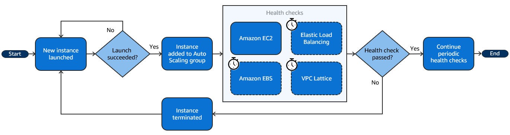

* [The Open Guide to Amazon Web Services](https://github.com/open-guides/og-aws)

# IAM
- [Identity-based policies and resource-based policies](https://docs.aws.amazon.com/IAM/latest/UserGuide/access_policies_identity-vs-resource.html)
- [Permissions boundaries for IAM entities](https://docs.aws.amazon.com/IAM/latest/UserGuide/access_policies_boundaries.html)
  - Gotcha: They can only be applied to roles or users, not IAM groups.
- [When and where to use IAM permissions boundaries](https://aws.amazon.com/blogs/security/when-and-where-to-use-iam-permissions-boundaries/)
  > The predominant use case for permissions boundaries is to limit privileges available to IAM roles created by developers (referred to as delegated administrators in the IAM documentation) who have permissions to create and manage these roles.
  >
  > To limit access, the central administrator can attach a condition to the developer’s identity policy that helps ensure that the developer can only create a role if the role has a permissions boundary policy attached to it.
  > ```
  > "Effect": "Allow",
  > "Action": "iam:CreateRole",
  > "Condition": {
  >    "StringEquals": {
  >       "iam:PermissionsBoundary": "arn:aws:iam::<YourAccount_ID>:policy/<DevelopersPermissionsBoundary>"
  >    }
  > }
  > ```
- [AWS global condition context keys | PrincipalOrgID](https://docs.aws.amazon.com/IAM/latest/UserGuide/reference_policies_condition-keys.html)
  - Properties of the principal
    - aws:PrincipalArn
    - aws:PrincipalAccount
    - aws:PrincipalOrgPaths
    - [aws:PrincipalOrgID](https://docs.aws.amazon.com/IAM/latest/UserGuide/reference_policies_condition-keys.html#condition-keys-principalorgid)
    - aws:PrincipalTag/tag-key
    - aws:PrincipalIsAWSService
    - aws:PrincipalServiceName
    - aws:PrincipalServiceNamesList
    - aws:PrincipalType
    - aws:userid
    - aws:username
  - Properties of a role session
  - Properties of the network
    - aws:SourceIp
    - aws:SourceVpc
    - aws:SourceVpce
    - aws:VpcSourceIp
  - Properties of the resource 
  - Properties of the request 
    - aws:RequestedRegion
    - aws:SourceAccount
    - aws:SourceOrgID
  
- [Controlling access to and for IAM users and roles using tags | PrincipalTag](https://docs.aws.amazon.com/IAM/latest/UserGuide/access_iam-tags.html)
- [How can I use IAM roles to restrict API calls from specific IP addresses to the AWS Management Console?](https://repost.aws/knowledge-center/iam-restrict-calls-ip-addresses)
- [Setting an account password policy for IAM users](https://docs.aws.amazon.com/IAM/latest/UserGuide/id_credentials_passwords_account-policy.html?icmpid=docs_iam_console)
- [Permit IAM users to change their own passwords](https://docs.aws.amazon.com/IAM/latest/UserGuide/id_credentials_passwords_enable-user-change.html)
- [IAM roles](https://docs.aws.amazon.com/IAM/latest/UserGuide/id_roles.html)
  - Role
    > Roles can be assumed by the following:
    > - An IAM user in the same AWS account or another AWS account
    > - IAM roles in the same account
    > - Service principals, for use with AWS services and features like:
    > - Services that allow you to run code on compute services, like Amazon EC2 or AWS Lambda
    > - Features that perform actions to your resources on your behalf, like Amazon S3 object replication
    >  - Services that deliver temporary security credentials to your applications that run outside of AWS, such as IAM Roles Anywhere or Amazon ECS Anywhere
    > - An external user authenticated by an external identity provider (IdP) service that is compatible with SAML 2.0 or OpenID Connect
  - AWS service role
    > A service role is an IAM role that a service assumes to perform actions on your behalf.
  - AWS service-linked role
    > A service-linked role is a type of service role that is linked to an AWS service.
  > When a user assumes a role in AWS, the process involves the following steps:  
  > 1. AssumeRole API Call: The user makes an AssumeRole API call to AWS Security Token Service (STS). This call includes the ARN of the role to be assumed and optionally a session name and external ID.  
  > 2. Temporary Security Credentials: AWS STS returns a set of temporary security credentials (access key ID, secret access key, and session token) that the user can use to make AWS service requests.  
  > 3. Session Context: These temporary credentials include information about the assumed role, such as the role ARN and the session name. This information is embedded in the session token.  
  > 4. Request Signing: When the user makes requests to AWS services using the temporary credentials, the requests are signed with the session token. AWS services can decode the session token to determine the role being assumed.  
  > 5. Access Control: AWS services use the role's permissions to authorize the requests. The user's original permissions are not considered while they are acting under the assumed role.  
  > Here is an example of how a user might assume a role using the AWS SDK for Python (Boto3):
  > ```
  > import boto3
  > 
  > # Create an STS client
  > sts_client = boto3.client('sts')
  > 
  > # Assume a role
  > response = sts_client.assume_role(
  >  RoleArn='arn:aws:iam::123456789012:role/example-role',
  >  RoleSessionName='example-session'
  > )
  >
  > # Extract the temporary credentials
  > credentials = response['Credentials']
  > 
  > # Use the temporary credentials to create a new session
  > session = boto3.Session(
  >    aws_access_key_id=credentials['AccessKeyId'],
  >    aws_secret_access_key=credentials['SecretAccessKey'],
  >    aws_session_token=credentials['SessionToken']
  > )
  >
  > # Use the session to make requests to AWS services
  > s3_client = session.client('s3')
  > response = s3_client.list_buckets()
  > print(response)
  > ```
- [Policy summaries](https://docs.aws.amazon.com/IAM/latest/UserGuide/access_policies_understand.html)
- [AWS IAM Access Analyzer](https://aws.amazon.com/iam/access-analyzer/)
- [AWS account root user](https://docs.aws.amazon.com/IAM/latest/UserGuide/id_root-user.html)
  - [Tasks that require root user credentials](https://docs.aws.amazon.com/IAM/latest/UserGuide/id_root-user.html#root-user-tasks)

# Compute

## EC2

### Networking
- [Elastic Network Interfaces in the Virtual Private Cloud](https://aws.amazon.com/blogs/aws/new-elastic-network-interfaces-in-the-virtual-private-cloud/)
- [Enhanced networking on Amazon EC2 instances](https://docs.aws.amazon.com/AWSEC2/latest/UserGuide/enhanced-networking.html)
  > Enhanced networking uses single root I/O virtualization (SR-IOV) to provide high-performance networking capabilities on supported instance types. SR-IOV is a method of device virtualization that provides higher I/O performance and lower CPU utilization when compared to traditional virtualized network interfaces. Enhanced networking provides higher bandwidth, higher packet per second (PPS) performance, and consistently lower latency between instances. There is no additional charge for using enhanced networking.
  >
  > You can enable enhanced networking using one of the following mechanisms:
  > - Elastic Network Adapter (ENA)
  > - Intel 82599 Virtual Function (VF) interface
- [Elastic Network Adapter – High Performance Network Interface for Amazon EC2](https://aws.amazon.com/blogs/aws/elastic-network-adapter-high-performance-network-interface-for-amazon-ec2/)
- [Elastic Fabric Adapter for HPC and ML workloads on Amazon EC2](https://docs.aws.amazon.com/AWSEC2/latest/UserGuide/efa.html)
- [Now Available – Elastic Fabric Adapter (EFA) for Tightly-Coupled HPC Workloads](https://aws.amazon.com/blogs/aws/now-available-elastic-fabric-adapter-efa-for-tightly-coupled-hpc-workloads/)
  > An Elastic Fabric Adapter is an AWS Elastic Network Adapter (ENA) with added capabilities (read my post, Elastic Network Adapter – High Performance Network Interface for Amazon EC2, to learn more about ENA). An EFA can still handle IP traffic, but also supports an important access model commonly called OS bypass. This model allows the application (most commonly through some user-space middleware) access the network interface without having to get the operating system involved with each message.
- [How do I turn on and configure enhanced networking on my EC2 instances?](https://repost.aws/knowledge-center/enable-configure-enhanced-networking)

### Storage
- [Block device mappings](https://docs.aws.amazon.com/AWSEC2/latest/UserGuide/block-device-mapping-concepts.html)
- [Add instance store volumes to your EC2 instance | Only at launch](https://docs.aws.amazon.com/AWSEC2/latest/UserGuide/add-instance-store-volumes.html)
- [Instance store temporary block storage for EC2 instances](https://docs.aws.amazon.com/AWSEC2/latest/UserGuide/InstanceStorage.html)
- [Data persistence for Amazon EC2 instance store volumes](https://docs.aws.amazon.com/AWSEC2/latest/UserGuide/instance-store-lifetime.html)
- [Add instance store volumes to an Amazon EC2 instance](https://docs.aws.amazon.com/AWSEC2/latest/UserGuide/add-instance-store-volumes.html)
  > Instance store volumes can be attached to an instance only when you launch it. You can't attach instance store volumes to an instance after you've launched it.

### Purchasing
- [Instance purchasing options](https://docs.aws.amazon.com/AWSEC2/latest/UserGuide/instance-purchasing-options.html)
  > **Reserved Instances do not reserve capacity**
  >
  > RIs do not guarantee that the reserved instance type will be available when you need it. This is an important distinction, as it means that even if you have an RI, you may not be able to launch an instance of the reserved type if the AZ is fully utilized or if there's an outage.
- [Reserve compute capacity with On-Demand Capacity Reservations](https://docs.aws.amazon.com/AWSEC2/latest/UserGuide/ec2-capacity-reservations.html)
  > When you create a Capacity Reservation, you specify:
  > - The Availability Zone in which to reserve the capacity
  > - The number of instances for which to reserve capacity
  > - The instance attributes, including the instance type, platform, Availability Zone, and tenancy
- [Differences between Capacity Reservations, Reserved Instances, and Savings Plans](https://docs.aws.amazon.com/AWSEC2/latest/UserGuide/ec2-capacity-reservations.html#capacity-reservations-differences)
- [Placement groups](https://docs.aws.amazon.com/AWSEC2/latest/UserGuide/placement-groups.html)
- [Spot Instances](https://docs.aws.amazon.com/AWSEC2/latest/UserGuide/using-spot-instances.html)
- [How Spot Instances work](https://docs.aws.amazon.com/AWSEC2/latest/UserGuide/how-spot-instances-work.html)
  > A one-time Spot Instance request remains active until Amazon EC2 launches the Spot Instance, the request expires, or you cancel the request. If capacity is not available, your Spot Instance is terminated and the Spot Instance request is closed.
  > 
  > A persistent Spot Instance request remains active until it expires or you cancel it, even if the request is fulfilled. If capacity is not available, your Spot Instance is interrupted. After your instance is interrupted, when capacity becomes available again, the Spot Instance is started if stopped or resumed if hibernated. You can stop a Spot Instance and start it again if capacity is available. If the Spot Instance is terminated (irrespective of whether the Spot Instance is in a stopped or running state), the Spot Instance request is opened again and Amazon EC2 launches a new Spot Instance. 
- [Create a Spot Instance request](https://docs.aws.amazon.com/AWSEC2/latest/UserGuide/spot-requests.html)
- [EC2 Fleet and Spot Fleet](https://docs.aws.amazon.com/AWSEC2/latest/UserGuide/Fleets.html)
- [Which is the best fleet method to use?](https://docs.aws.amazon.com/AWSEC2/latest/UserGuide/which-fleet-method-to-use.html)
- [EC2 Fleet and Spot Fleet request types](https://docs.amazonaws.cn/en_us/AWSEC2/latest/UserGuide/ec2-fleet-request-type.html)
- [Use allocation strategies to determine how EC2 Fleet or Spot Fleet fulfills Spot and On-Demand capacity](https://docs.aws.amazon.com/AWSEC2/latest/UserGuide/ec2-fleet-allocation-strategy.html)
- [Best practices for handling EC2 Spot Instance interruptions](https://aws.amazon.com/blogs/compute/best-practices-for-handling-ec2-spot-instance-interruptions/)
- [Regions and Zones](https://docs.aws.amazon.com/AWSEC2/latest/UserGuide/using-regions-availability-zones.html)

### Lifecycle
- [Hibernate your Amazon EC2 instance](https://docs.aws.amazon.com/AWSEC2/latest/UserGuide/Hibernate.html)  
- [Status checks for Amazon EC2 instances](https://docs.aws.amazon.com/AWSEC2/latest/UserGuide/monitoring-system-instance-status-check.html)
  - System status checks
  - Instance status checks
  - Attached EBS status checks
- [Instance resiliency](https://docs.aws.amazon.com/AWSEC2/latest/UserGuide/ec2-instance-recover.html)
  > **Instance recovery alternatives**
  > - Auto Scaling groups
  > - Amazon EBS Multi-Attach
  - [Configure CloudWatch action based recovery](https://docs.aws.amazon.com/AWSEC2/latest/UserGuide/cloudwatch-recovery.html)
  - [Configure simplified automatic recovery](https://docs.aws.amazon.com/AWSEC2/latest/UserGuide/instance-configuration-recovery.html)
- [Enable termination protection](https://docs.aws.amazon.com/AWSEC2/latest/UserGuide/Using_ChangingDisableAPITermination.html)
  - `DisableApiTermination` attribute

### AMI
- [Amazon Machine Images in Amazon EC2](https://docs.aws.amazon.com/AWSEC2/latest/UserGuide/AMIs.html)
- [AMI types and characteristics in Amazon EC2](https://docs.aws.amazon.com/AWSEC2/latest/UserGuide/ComponentsAMIs.html)
- [How Amazon EC2 AMI copy works](https://docs.aws.amazon.com/AWSEC2/latest/UserGuide/how-ami-copy-works.html)
  - Cross-Region copying
  - Cross-account copying
  - Encryption and copying
- [Access instance metadata for an EC2 instance](https://docs.aws.amazon.com/AWSEC2/latest/UserGuide/instancedata-data-retrieval.html)
  > http://169.254.169.254/latest/meta-data/

### EC2 Roles
- [IAM roles for Amazon EC2](https://docs.aws.amazon.com/AWSEC2/latest/UserGuide/iam-roles-for-amazon-ec2.html)
- [IAM role for applications that run on Amazon EC2 instances](https://docs.aws.amazon.com/autoscaling/ec2/userguide/us-iam-role.html)
  > A service role is an IAM role that a service assumes to perform actions on your behalf. Service roles provide access only within your account and cannot be used to grant access to services in other accounts. An IAM administrator can create, modify, and delete a service role from within IAM. When you create the service role, you define the `trusted entity` in the definition.
  > 
  > If you are going to use the role with Amazon EC2 or another AWS service that uses Amazon EC2, you must store the role in an instance profile. An instance profile is a container for a role that can be attached to an Amazon EC2 instance when launched. An instance profile can contain only one role, and that limit cannot be increased. If you create the role using the AWS Management Console, the instance profile is created for you with the same name as the role.
- [Use an IAM role to grant permissions to applications running on Amazon EC2 instances](https://docs.aws.amazon.com/IAM/latest/UserGuide/id_roles_use_switch-role-ec2.html)
  > When the application runs, it obtains temporary security credentials from Amazon EC2 instance metadata, as described in Retrieving Security Credentials from Instance Metadata. These are temporary security credentials that represent the role and are valid for a limited period of time.
  > 
  > With some AWS SDKs, the developer can use a provider that manages the temporary security credentials transparently.
- [How does an EC2 instance assume an IAM Role?](https://repost.aws/questions/QUQuYy16JHTzqRHuvM7uxGfw/how-does-an-ec2-instance-assume-an-iam-role)

## EC2 Auto-Scaling
- [Dynamic scaling for Amazon EC2 Auto Scaling](https://docs.aws.amazon.com/autoscaling/ec2/userguide/as-scale-based-on-demand.html)
- [Step and simple scaling policies for Amazon EC2 Auto Scaling](https://docs.aws.amazon.com/autoscaling/ec2/userguide/as-scaling-simple-step.html)
  > Step scaling and simple scaling policies scale the capacity of your Auto Scaling group in predefined increments based on CloudWatch alarms. You can define separate scaling policies to handle scaling out (increasing capacity) and scaling in (decreasing capacity) when an alarm threshold is breached.
- [Target tracking scaling policies for Amazon EC2 Auto Scaling](https://docs.aws.amazon.com/autoscaling/ec2/userguide/as-scaling-target-tracking.html)
  > We strongly recommend that you use target tracking scaling policies to scale on metrics like average CPU utilization or average request count per target. Metrics that decrease when capacity increases and increase when capacity decreases can be used to proportionally scale out or in the number of instances using target tracking. This **helps ensure that Amazon EC2 Auto Scaling follows the demand curve for your applications closely**. 
- [Scheduled scaling for Amazon EC2 Auto Scaling](https://docs.aws.amazon.com/autoscaling/ec2/userguide/ec2-auto-scaling-scheduled-scaling.html)
  > To use scheduled scaling, create scheduled actions, which tell Amazon EC2 Auto Scaling to perform scaling activities at specific times. When you create a scheduled action, you specify the Auto Scaling group, when the scaling activity should occur, the new desired capacity, and optionally a new minimum capacity and a new maximum capacity. You can create scheduled actions that scale one time only or that scale on a recurring schedule.
  > 
  > At the specified time, Amazon EC2 Auto Scaling scales based on the new capacity values, by comparing current capacity to the specified desired capacity.
  > - If current capacity is less than the specified desired capacity, Amazon EC2 Auto Scaling scales out, or adds instances, to the specified desired capacity.
  > - If current capacity is greater than the specified desired capacity, Amazon EC2 Auto Scaling scales in, or removes instances, to the specified desired capacity.
  > 
  > A scheduled action sets the group's desired, minimum, and maximum capacity at the date and time specified. You can create a scheduled action for only one of these capacities at a time, for example, desired capacity. However, there are some cases where you must include the minimum and maximum capacity to ensure that the desired capacity that you specified in the action is not outside of these limits.
- [Scaling policy based on Amazon SQS](https://docs.aws.amazon.com/autoscaling/ec2/userguide/as-using-sqs-queue.html)
- [Temporarily remove instances from your Auto Scaling group](https://docs.aws.amazon.com/autoscaling/ec2/userguide/as-enter-exit-standby.html)
- [Suspend and resume Amazon EC2 Auto Scaling processes](https://docs.aws.amazon.com/autoscaling/ec2/userguide/as-suspend-resume-processes.html)
- [How an instance refresh works in an Auto Scaling group](https://docs.aws.amazon.com/autoscaling/ec2/userguide/instance-refresh-overview.html)
- [Deprecated: Auto Scaling launch configurations](https://docs.aws.amazon.com/autoscaling/ec2/userguide/launch-configurations.html)
- [Auto Scaling launch templates](https://docs.aws.amazon.com/autoscaling/ec2/userguide/launch-templates.html)
- [Why can’t I modify my Amazon EC2 instance launch template?](https://repost.aws/knowledge-center/ec2-modify-launch-template)
  > Launch templates are immutable. After you create a launch template, you can't modify it. Instead, you can create a new version of the launch template that includes any changes that you require. You can create different versions of a launch template, set the default version, describe a launch template version, and delete launch template versions.
- [Health checks for instances in an Auto Scaling group](https://docs.aws.amazon.com/autoscaling/ec2/userguide/ec2-auto-scaling-health-checks.html)
  
- [Configure termination policies for Amazon EC2 Auto Scaling](https://docs.aws.amazon.com/autoscaling/ec2/userguide/ec2-auto-scaling-termination-policies.html)
  
- [Control which Auto Scaling instances terminate during scale in](https://docs.aws.amazon.com/autoscaling/ec2/userguide/as-instance-termination.html)
  > When rebalancing, Amazon EC2 Auto Scaling launches new instances before terminating the old ones, so that rebalancing does not compromise the performance or availability of your application.
- [Amazon EC2 Auto Scaling instance lifecycle](https://docs.aws.amazon.com/autoscaling/ec2/userguide/ec2-auto-scaling-lifecycle.html)
- [Amazon EC2 Auto Scaling lifecycle hooks](https://docs.aws.amazon.com/autoscaling/ec2/userguide/lifecycle-hooks.html)
- [Use instance scale-in protection to control instance termination](https://docs.aws.amazon.com/autoscaling/ec2/userguide/ec2-auto-scaling-instance-protection.html)
  > Instance scale-in protection gives you control over which instances Amazon EC2 Auto Scaling can terminate. 

## Cloud Watch
- [Manage detailed monitoring for your EC2 instances](https://docs.aws.amazon.com/AWSEC2/latest/UserGuide/manage-detailed-monitoring.html)
- [Metrics collected by the CloudWatch agent](https://docs.aws.amazon.com/AmazonCloudWatch/latest/monitoring/metrics-collected-by-CloudWatch-agent.html)
  - cpu
  - disk
  - diskio
  - ethtool
  - mem
  - net
  - netstat
  - processes
  - swap
- [Sharing CloudWatch dashboards](https://docs.aws.amazon.com/AmazonCloudWatch/latest/monitoring/cloudwatch-dashboard-sharing.html)
  > You can share your CloudWatch dashboards with people who do not have direct access to your AWS account. This enables you to share dashboards across teams, with stakeholders, and with people external to your organization.
- [Publish custom metrics](https://docs.aws.amazon.com/AmazonCloudWatch/latest/monitoring/publishingMetrics.html)
  > To publish a single data point for a new or existing metric, use the `put-metric-data` command with one value and time stamp.
- [CloudWatch cross-account observability](https://docs.aws.amazon.com/AmazonCloudWatch/latest/monitoring/CloudWatch-Unified-Cross-Account.html)

### Cloudwatch Alarms
- [Using Amazon CloudWatch alarms](https://docs.aws.amazon.com/AmazonCloudWatch/latest/monitoring/AlarmThatSendsEmail.html)
  > #### Alarm actions
  The following are supported as alarm actions.
  > - **Notify one or more subscribers by using an Amazon Simple Notification Service topic**. Subscribers can be applications as well as persons. For more information about Amazon SNS, see What is Amazon SNS?.
  > - **Invoke a Lambda function**. This is the easiest way for you to automate custom actions on alarm state changes.
  > - **Alarms based on EC2 metrics can also perform EC2 actions**, such as stopping, terminating, rebooting, or recovering an EC2 instance. For more information, see [Create alarms to stop, terminate, reboot, or recover an EC2 instance.](https://docs.aws.amazon.com/AmazonCloudWatch/latest/monitoring/UsingAlarmActions.html) NOTE: actions are based on alarms, not CloudWatch events
  > - Alarms can perform actions to **scale an Auto Scaling group**. For more information, see Step and simple scaling policies for Amazon EC2 Auto Scaling.
  > - Alarms can **create OpsItems in Systems Manager Ops Center or create incidents in AWS Systems Manager Incident Manager**. These actions are performed only when the alarm goes into ALARM state. For more information, see Configuring CloudWatch to create OpsItems from alarms and Incident creation.


### Cloud Watch Logs
- [Working with log groups and log streams](https://docs.aws.amazon.com/AmazonCloudWatch/latest/logs/Working-with-log-groups-and-streams.html)
- [Real-time processing of log data with subscriptions](https://docs.aws.amazon.com/AmazonCloudWatch/latest/logs/Subscriptions.html)
- [Streaming CloudWatch Logs data to Amazon OpenSearch Service](https://docs.aws.amazon.com/AmazonCloudWatch/latest/logs/CWL_OpenSearch_Stream.html)
  > You can configure a CloudWatch Logs log group to stream data it receives to your Amazon OpenSearch Service cluster in near real-time through a CloudWatch Logs subscription. For more information, see Real-time processing of log data with subscriptions.
  - Firehose is a possible solution as well, but it involves another service
- [Analyzing log data with CloudWatch Logs Insights](https://docs.aws.amazon.com/AmazonCloudWatch/latest/logs/AnalyzingLogData.html)
- [Creating metrics from log events using filters](https://docs.aws.amazon.com/AmazonCloudWatch/latest/logs/MonitoringLogData.html)
  > You can search and filter the log data coming into CloudWatch Logs by creating one or more metric filters. Metric filters define the terms and patterns to look for in log data as it is sent to CloudWatch Logs. CloudWatch Logs uses these metric filters to turn log data into numerical CloudWatch metrics that you can graph or set an alarm on.

### CloudWatch Container Insighsts
- [Container Insights](https://docs.aws.amazon.com/AmazonCloudWatch/latest/monitoring/ContainerInsights.html)
  > Use CloudWatch Container Insights to collect, aggregate, and summarize metrics and logs from your containerized applications and microservices. Container Insights is available for Amazon Elastic Container Service (Amazon ECS), Amazon Elastic Kubernetes Service (Amazon EKS), and Kubernetes platforms on Amazon EC2.
  > 
  > With Container Insights for EKS you can see the top contributors by memory or CPU, or the most recently active resources. This is available when you select any of the following dashboards in the drop-down box near the top of the page:
  > - ECS Services
  > - ECS Tasks
  > - EKS Namespaces
  > - EKS Services
  > - EKS Pods

## HPC
- [High Performance Computing Lens - AWS Well-Architected Framework](https://docs.aws.amazon.com/wellarchitected/latest/high-performance-computing-lens/welcome.html)

## Batch
- [Components of AWS Batch](https://docs.aws.amazon.com/batch/latest/userguide/batch_components.html)
  - Jobs
  - Job definitions
  - Job queues
  - Compute environment
- [Compute environments for AWS Batch](https://docs.aws.amazon.com/batch/latest/userguide/compute_environments.html)
- [Multi-node parallel jobs](https://docs.aws.amazon.com/batch/latest/userguide/multi-node-parallel-jobs.html)
  > You can use multi-node parallel jobs to run single jobs that span multiple Amazon EC2 instances. With AWS Batch multi-node parallel jobs, you can run large-scale, high-performance computing applications and distributed GPU model training without the need to launch, configure, and manage Amazon EC2 resources directly. An AWS Batch multi-node parallel job is compatible with any framework that supports IP-based, internode communication. Examples include Apache MXNet, TensorFlow, Caffe2, or Message Passing Interface (MPI).

## Lambda
- [Invoking Lambda with events from other AWS services](https://docs.aws.amazon.com/lambda/latest/dg/lambda-services.html)
- [Using Lambda with Amazon SQS](https://docs.aws.amazon.com/lambda/latest/dg/with-sqs.html)
- [Invoking Lambda functions with Amazon SNS notifications](https://docs.aws.amazon.com/lambda/latest/dg/with-sns.html)
- [Understanding the Different Ways to Invoke Lambda Functions](https://aws.amazon.com/blogs/architecture/understanding-the-different-ways-to-invoke-lambda-functions/)
- [Understanding Lambda function scaling](https://docs.aws.amazon.com/lambda/latest/dg/lambda-concurrency.html)
   - Account quota of 1,000 concurrent executions across all functions in an AWS Region
   - Reserved Concurrency | reserve a portion of your account's concurrency for a function
   - Provisioned Concurrency |  pre-initialize a number of environment instances for a function.
- [New – Provisioned Concurrency for Lambda Functions](https://aws.amazon.com/blogs/aws/new-provisioned-concurrency-for-lambda-functions/)
- [Best Practices for Developing on AWS Lambda](https://aws.amazon.com/blogs/architecture/best-practices-for-developing-on-aws-lambda/)
  > #### Tip #1: When to VPC-Enable a Lambda Function
  > Lambda functions always operate from an AWS-owned VPC. By default, your function has full ability to make network requests to any public internet address — this includes access to any of the public AWS APIs. For example, your function can interact with AWS DynamoDB APIs to PutItem or Query for records. You should only enable your functions for VPC access when you need to interact with a private resource located in a private subnet. An RDS instance is a good example.
  >
  >  
  > Once your function is VPC-enabled, all network traffic from your function is subject to the routing rules of your VPC/Subnet. If your function needs to interact with a public resource, you will need a route through a NAT gateway in a public subnet.
  >
  > #### Tip #2: Deploy Common Code to a Lambda Layer (i.e. the AWS SDK)
  > If you intend to reuse code in more than one function, consider creating a Layer and deploying it there. A great candidate would be a logging package that your team is required to standardize on. Another great example is the AWS SDK. AWS will include the AWS SDK for NodeJS and Python functions (and update the SDK periodically). However, you should bundle your own SDK and pin your functions to a version of the SDK you have tested.
  > 
  > #### Tip #3: Watch Your Package Size and Dependencies
  > Lambda functions require you to package all needed dependencies (or attach a Layer) — the bigger your deployment package, the slower your function will cold-start. Remove all unnecessary items, such as documentation and unused libraries. If you are using Java functions with the AWS SDK, only bundle the module(s) that you actually need to use — not the entire SDK.
  > 
  > Good:
  >```
  ><dependency>
  >  <groupId>software.amazon.awssdk</groupId>
  >  <artifactId>dynamodb</artifactId>
  >  <version>2.6.0</version>
  ></dependency>
  >```
  > Bad:
  >```
  ><!-- https://mvnrepository.com/artifact/software.amazon.awssdk/aws-sdk-java -->
  ><dependency>
  >  <groupId>software.amazon.awssdk</groupId>
  >  <artifactId>aws-sdk-java</artifactId>
  >  <version>2.6.0</version>
  ></dependency>
  >```
  >
  > #### Tip #4: Monitor Your Concurrency (and Set Alarms)
  > Our first post in this series talked about how concurrency can effect your down stream systems. Since Lambda functions can scale extremely quickly, this means you should have controls in place to notify you when you have a spike in concurrency. A good idea is to deploy a CloudWatch Alarm that notifies your team when function metrics such as ConcurrentExecutions or Invocations exceeds your threshold. You should create an AWS Budget so you can monitor costs on a daily basis. Here is a great example of how to set up automated cost controls.
  > 
  > #### Tip #5: Over-Provision Memory (in some use cases) but Not Function Timeout
  > Lambda allocates compute power in proportion to the memory you allocate to your function. This means you can over provision memory to run your functions faster and potentially reduce your costs. You should benchmark your use case to determine where the breakeven point is for running faster and using more memory vs running slower and using less memory.
  > 
  > However, we recommend you do not over provision your function time out settings. Always understand your code performance and set a function time out accordingly. Overprovisioning function timeout often results in Lambda functions running longer than expected and unexpected costs.
- [Managing Lambda dependencies with layers](https://docs.aws.amazon.com/lambda/latest/dg/chapter-layers.html)
- [Lambda – Container Image Support](https://aws.amazon.com/blogs/aws/new-for-aws-lambda-container-image-support/)
  >  To work with Lambda, these images must implement the Lambda Runtime API.
- [Visualize Lambda function invocations using AWS X-Ray](https://docs.aws.amazon.com/lambda/latest/dg/services-xray.html)
- [Networking and VPC configurations](https://docs.aws.amazon.com/lambda/latest/operatorguide/networking-vpc.html)
- [Announcing improved VPC networking for AWS Lambda functions](https://aws.amazon.com/blogs/compute/announcing-improved-vpc-networking-for-aws-lambda-functions/)

## ECS
- [IAM roles for Amazon ECS](https://docs.aws.amazon.com/AmazonECS/latest/developerguide/security-ecs-iam-role-overview.html)
  - [Amazon ECS task execution IAM role](https://docs.aws.amazon.com/AmazonECS/latest/developerguide/task_execution_IAM_role.html)
  - [Amazon ECS task IAM role](https://docs.aws.amazon.com/AmazonECS/latest/developerguide/task-iam-roles.html)
  - [Amazon ECS container instance IAM role](https://docs.aws.amazon.com/AmazonECS/latest/developerguide/instance_IAM_role.html)
- [AWS managed policies for Amazon Elastic Container Service](https://docs.aws.amazon.com/AmazonECS/latest/developerguide/security-iam-awsmanpol.html)
  - [AmazonECSTaskExecutionRolePolicy](https://docs.aws.amazon.com/AmazonECS/latest/developerguide/security-iam-awsmanpol.html#security-iam-awsmanpol-AmazonECSTaskExecutionRolePolicy) grants the permissions that are needed by the Amazon ECS container agent and AWS Fargate container agents to make AWS API calls on your behalf (pull image, write logs etc)
  - [AmazonEC2ContainerServiceforEC2Role](https://docs.aws.amazon.com/aws-managed-policy/latest/reference/AmazonEC2ContainerServiceforEC2Role.html) policy
- [Automatically scale your Amazon ECS service](https://docs.aws.amazon.com/AmazonECS/latest/developerguide/service-auto-scaling.html)
  - [Scale your Amazon ECS service using a target metric value](https://docs.aws.amazon.com/AmazonECS/latest/developerguide/service-autoscaling-targettracking.html)
  - [Scale your Amazon ECS service using predefined increments based on CloudWatch alarms](https://docs.aws.amazon.com/AmazonECS/latest/developerguide/service-autoscaling-stepscaling.html)
- [How do I set up ALB dynamic port mapping for Amazon ECS?](https://repost.aws/knowledge-center/dynamic-port-mapping-ecs)


## EKS
- [Cluster Architecture](https://kubernetes.io/docs/concepts/architecture/)
- [Pods](https://kubernetes.io/docs/concepts/workloads/pods/)
- [De-mystifying cluster networking for Amazon EKS worker nodes](https://aws.amazon.com/blogs/containers/de-mystifying-cluster-networking-for-amazon-eks-worker-nodes/)
- [Deploy private clusters with limited internet access](https://docs.aws.amazon.com/eks/latest/userguide/private-clusters.html)
  > If your cluster doesn't have outbound internet access, then it must meet the following requirements:
  > - Your cluster must pull images from a container registry that's in your VPC.
  > - Your cluster must have endpoint private access enabled. This is required for nodes to register with the cluster endpoint.
- [Metrics Server](https://kubernetes.io/docs/tasks/debug/debug-cluster/resource-metrics-pipeline/#metrics-server)
  > The Metrics Server collects resource metrics like CPU and memory usage from each node and its pods and provides these metrics to the Kubernetes API server for use by the Horizontal Pod Autoscaler, which automatically scales the number of pods in a deployment, replication controller, replica set, or stateful set based on observed CPU utilization.
- [What is Application Auto Scaling?](https://docs.aws.amazon.com/autoscaling/application/userguide/what-is-application-auto-scaling.html)
- [Horizontal Pod Autoscaling](https://kubernetes.io/docs/tasks/run-application/horizontal-pod-autoscale/)
- [Vertical Pod Autoscaler](https://github.com/kubernetes/autoscaler/tree/master/vertical-pod-autoscaler#readme)
- [EKS Cluseter Autoscaling](https://docs.aws.amazon.com/eks/latest/userguide/autoscaling.html)
  > The Kubernetes Cluster Autoscaler automatically adjusts the size of the Kubernetes cluster when there are pods that failed to run in the cluster due to insufficient resources or when there are nodes in the cluster that have been underutilized for an extended period and their pods can be placed on other existing nodes.
- [EKS | Encrypt Kubernetes secrets with AWS KMS on existing clusters](https://docs.aws.amazon.com/eks/latest/userguide/enable-kms.html)
- [Amazon EKS Simplifies Kubernetes Cluster Authentication](https://aws.amazon.com/about-aws/whats-new/2019/05/amazon-eks-simplifies-kubernetes-cluster-authentication/)

# Networking  
## VPC
- [NAT gateways](https://docs.aws.amazon.com/vpc/latest/userguide/vpc-nat-gateway.html)
  - Public
  - Private
- [NAT gateway basics](https://docs.aws.amazon.com/vpc/latest/userguide/nat-gateway-basics.html)
    - created in a specific Availability Zone 
    - implemented with redundancy in that zone
    - quota (of 5) of NAT gateways that you can create in each Availability Zone
    - A NAT gateway supports 5 Gbps of bandwidth and automatically scales up to 45 Gbps.
    - You can associate exactly one Elastic IP address with a NAT gateway.
    - A NAT gateway supports the following protocols: TCP, UDP, and ICMP.
    - You cannot associate a security group with a NAT gateway.
    - You can use a network access control list (network ACL) to control the traffic to and from the subnet in which the NAT gateway is located.
    - A NAT gateway can support up to 55,000 simultaneous connections to each unique destination.
- [Compare NAT gateways and NAT instances](https://docs.aws.amazon.com/vpc/latest/userguide/vpc-nat-comparison.html)
  - Nat Gateway:
    - You cannot associate security groups with NAT gateways. 
    - You can associate them with the resources behind the NAT gateway to control inbound and outbound traffic.
    - Port forwarding	Not supported.
    - Bastion servers	Not supported.
  - Nat Instance:
    - Associate with your NAT instance and the resources behind your NAT instance to control inbound and outbound traffic.
    - Port forwarding	Manually customize the configuration to support port forwarding.
    - Bastion servers	Use as a bastion server.
- [Why does a AWS NAT Gateway require an ElasticIP?](https://stackoverflow.com/questions/43094786/why-does-a-aws-nat-gateway-require-an-elasticip)
- [Control traffic to your AWS resources using security groups](https://docs.aws.amazon.com/vpc/latest/userguide/vpc-security-groups.html)
    - You can assign a security group only to resources created in the same VPC as the security group. You can assign multiple security groups to a resource.
    - Default SG allows inbound from from within the group and all outbound traffic
    - Custom SG denies all inbound and allows all outbound traffic by default
- [Control subnet traffic with network access control lists](https://docs.aws.amazon.com/vpc/latest/userguide/vpc-network-acls.html)
- [Network ACL basics](https://docs.aws.amazon.com/vpc/latest/userguide/nacl-basics.html)
    - [Default network ACL | Allows all inbound and outbound](https://docs.aws.amazon.com/vpc/latest/userguide/default-network-acl.html)
    - Custom Network ACL | Denies all inbound and outbound by default
    - Gotcha: Network ACL only applies to services in a subnet - cannot be used for CloudFront
- [Why can't I connect to a service when the security group and network ACL allow inbound traffic?](https://repost.aws/knowledge-center/resolve-connection-sg-acl-inbound)
  > - If you accept traffic from the internet, then you also must establish a route through an internet gateway. 
  > - If you accept traffic over VPN/AWS Direct Connect/Transit Gateway, then you must establish a corresponding route through a virtual private gateway/transit gateway.
- [Update your security groups to reference peer security groups](https://docs.aws.amazon.com/vpc/latest/peering/vpc-peering-security-groups.html)
  > - **You cannot reference the security group of a peer VPC that's in a different Region. Instead, use the CIDR block of the peer VPC.**
- [Hybrid network connections](https://docs.aws.amazon.com/whitepapers/latest/hybrid-connectivity/hybrid-network-connections.html)
- [Share your VPC subnets with other accounts](https://docs.aws.amazon.com/vpc/latest/userguide/vpc-sharing.html)
  > VPC sharing allows multiple AWS accounts to create their application resources, such as Amazon EC2 instances, Amazon Relational Database Service (RDS) databases, Amazon Redshift clusters, and AWS Lambda functions, into shared, centrally-managed virtual private clouds (VPCs). In this model, the account that owns the VPC (owner) shares one or more subnets with other accounts (participants) that belong to the same organization from AWS Organizations.
- [VPC sharing: A new approach to multiple accounts and VPC management](https://aws.amazon.com/blogs/networking-and-content-delivery/vpc-sharing-a-new-approach-to-multiple-accounts-and-vpc-management/)
- [Logging IP traffic using VPC Flow Logs](https://docs.aws.amazon.com/vpc/latest/userguide/flow-logs.html)
  > Flow log data can be published to the following locations: Amazon CloudWatch Logs, Amazon S3, or Amazon Data Firehose.
- [Consolidate and manage network CIDR blocks with managed prefix lists](https://docs.aws.amazon.com/vpc/latest/userguide/managed-prefix-lists.html)

## PrivateLink
- [What is AWS PrivateLink?](https://docs.aws.amazon.com/vpc/latest/privatelink/what-is-privatelink.html)
  > AWS PrivateLink is a highly available, scalable technology that you can use to privately connect your VPC to services as if they were in your VPC. You do not need to use an internet gateway, NAT device, public IP address, AWS Direct Connect connection, or AWS Site-to-Site VPN connection to allow communication with the service from your private subnets. Therefore, you control the specific API endpoints, sites, and services that are reachable from your VPC.
- [AWS PrivateLink concepts](https://docs.aws.amazon.com/vpc/latest/privatelink/concepts.html)
  > A service consumer creates a VPC endpoint to connect their VPC to an endpoint service. A service consumer must specify the service name of the endpoint service when creating a VPC endpoint. There are multiple types of VPC endpoints. You must create the type of VPC endpoint that's required by the endpoint service.
  > - Interface - Create an interface endpoint to send TCP traffic to an endpoint service. Traffic destined for the endpoint service is resolved using DNS.
  > - GatewayLoadBalancer - Create a Gateway Load Balancer endpoint to send traffic to a fleet of virtual appliances using private IP addresses. You route traffic from your VPC to the Gateway Load Balancer endpoint using route tables. The Gateway Load Balancer distributes traffic to the virtual appliances and can scale with demand.
  >
  > There is another type of VPC endpoint, Gateway, which creates a gateway endpoint to send traffic to Amazon S3 or DynamoDB. Gateway endpoints do not use AWS PrivateLink, unlike the other types of VPC endpoints. For more information, see Gateway endpoints.
- [Access AWS services through AWS PrivateLink](https://docs.aws.amazon.com/vpc/latest/privatelink/privatelink-access-aws-services.html)
- [Securely Access Services Over AWS PrivateLink](https://docs.aws.amazon.com/whitepapers/latest/aws-privatelink/aws-privatelink.html)
- [Gateway endpoints](https://docs.aws.amazon.com/vpc/latest/privatelink/gateway-endpoints.html) Do not use PrivateLink
  - S3
  - DynamoDB
- [AWS PrivateLink for Amazon S3](https://docs.aws.amazon.com/AmazonS3/latest/userguide/privatelink-interface-endpoints.html)
> | **Feature** | **Gateway endpoints for Amazon S3** | **Interface endpoints for Amazon S3** |
> | --- | --- | --- |
> | **Network Traffic** | Remains on AWS network | Remains on AWS network |
> | **IP Addresses** | Amazon S3 public IP addresses | Private IP addresses from your Amazon VPC |
> | **On-Premises Access** | Do not allow access from on premises | Allow access from on premises |
> | **Cross-Region Access** | Do not allow access from another AWS Region | Allow access from a VPC in another AWS Region using Amazon VPC peering or AWS Transit Gateway |
> | **Billing** | Not billed | Billed |
- [AWS PrivateLink for DynamoDB](https://docs.aws.amazon.com/amazondynamodb/latest/developerguide/privatelink-interface-endpoints.html)
> | **Feature** | **Gateway Endpoints for DynamoDB** | **Interface Endpoints for DynamoDB** |
> | --- | --- | --- |
> | **Network Traffic** | Remains on AWS network | Remains on AWS network |
> | **IP Addresses** | Amazon DynamoDB public IP addresses | Private IP addresses from your Amazon VPC |
> | **On-Premises Access** | Do not allow access from on premises | Allow access from on premises |
> | **Cross-Region Access** | Do not allow access from another AWS Region | Allow access from an Amazon VPC endpoint in another AWS Region using Amazon VPC peering or AWS Transit Gateway |
> | **Billing** | Not billed | Billed |
- [Gateway endpoints for Amazon S3](https://docs.aws.amazon.com/vpc/latest/privatelink/vpc-endpoints-s3.html)
  > Amazon S3 supports both gateway endpoints and interface endpoints. With a gateway endpoint, you can access Amazon S3 from your VPC, without requiring an internet gateway or NAT device for your VPC, and with no additional cost. However, gateway endpoints do not allow access from on-premises networks, from peered VPCs in other AWS Regions, or through a transit gateway. For those scenarios, you must use an interface endpoint, which is available for an additional cost. For more information, see Types of VPC endpoints for Amazon S3 in the Amazon S3 User Guide.
- [Share your services through AWS PrivateLink](https://docs.aws.amazon.com/vpc/latest/privatelink/privatelink-share-your-services.html)
  > You can host your own AWS PrivateLink powered service, known as an endpoint service, and share it with other AWS customers.
  >
  > PrivateLink endpoint in consumer VPC
  > Load balancer (NLB or GWLB) in provider VPC
- [Reduce Cost and Increase Security with Amazon VPC Endpoints](https://aws.amazon.com/blogs/architecture/reduce-cost-and-increase-security-with-amazon-vpc-endpoints/)
    
## VPN
- [What is AWS Site-to-Site VPN?](https://docs.aws.amazon.com/vpn/latest/s2svpn/VPC_VPN.html)
- [How AWS Site-to-Site VPN works](https://docs.aws.amazon.com/vpn/latest/s2svpn/how_it_works.html)
  > A Site-to-Site VPN connection consists of the following components:
  > - A virtual private gateway or a transit gateway
  > - A customer gateway device 
  >   - A customer gateway device is a physical device or software application on your side of the Site-to-Site VPN connection. You configure the device to work with the Site-to-Site VPN connection.
  > - A customer gateway
  >   - A customer gateway is a resource that you create in AWS that represents the customer gateway device in your on-premises network. When you create a customer gateway, you provide information about your device to AWS.
- [Your customer gateway device](https://docs.aws.amazon.com/vpn/latest/s2svpn/your-cgw.html)
- [Site-to-Site VPN single and multiple VPN connection examples](https://docs.aws.amazon.com/vpn/latest/s2svpn/Examples.html)
  - Single Site-to-Site VPN connection
    >  
  - Single Site-to-Site VPN connection with a transit gateway
    > 
  - Multiple Site-to-Site VPN connections
    > 
    >
    > When you create multiple Site-to-Site VPN connections to a single VPC, you can configure a second customer gateway to create a redundant connection to the same external location. For more information, see Using redundant Site-to-Site VPN connections to provide failover.
    >
    > You can also use this scenario to create Site-to-Site VPN connections to multiple geographic locations and provide secure communication between sites. For more information, see Providing secure communication between sites using VPN CloudHub.
  - Multiple Site-to-Site VPN connections with a transit gateway
    > 
  - Site-to-Site VPN connection with AWS Direct Connect
    > 
  - Private IP Site-to-Site VPN connection with AWS Direct Connect
    > 
- [Using redundant Site-to-Site VPN connections to provide failover](https://docs.aws.amazon.com/vpn/latest/s2svpn/vpn-redundant-connection.html)
- [Network-to-Amazon VPC connectivity options](https://docs.aws.amazon.com/whitepapers/latest/aws-vpc-connectivity-options/network-to-amazon-vpc-connectivity-options.html)
  - [AWS Site-to-Site VPN](https://docs.aws.amazon.com/whitepapers/latest/aws-vpc-connectivity-options/aws-site-to-site-vpn.html)
  - [AWS Transit Gateway + Site-to-Site VPN](https://docs.aws.amazon.com/whitepapers/latest/aws-vpc-connectivity-options/aws-transit-gateway-vpn.html)
  - [AWS Direct Connect](https://docs.aws.amazon.com/whitepapers/latest/aws-vpc-connectivity-options/aws-direct-connect.html)
  - [AWS Direct Connect + AWS Transit Gateway](https://docs.aws.amazon.com/whitepapers/latest/aws-vpc-connectivity-options/aws-direct-connect-aws-transit-gateway.html)
  - [AWS Direct Connect + AWS Site-to-Site VPN](https://docs.aws.amazon.com/whitepapers/latest/aws-vpc-connectivity-options/aws-direct-connect-site-to-site-vpn.html)
    > With AWS Direct Connect + AWS Site-to-Site VPN, you can combine AWS Direct Connect connections with an AWS-managed VPN solution. AWS Direct Connect public VIFs establish a dedicated network connection between your network and public AWS resources such as an AWS Site-to-Site VPN endpoint. **Once you establish the connection to the service, you can create IPsec connections to the corresponding Amazon VPC virtual private gateways**.
  - [AWS Direct Connect + AWS Transit Gateway + AWS Site-to-Site VPN](https://docs.aws.amazon.com/whitepapers/latest/aws-vpc-connectivity-options/aws-direct-connect-aws-transit-gateway-vpn.html)
  - [AWS VPN CloudHub](https://docs.aws.amazon.com/whitepapers/latest/aws-vpc-connectivity-options/aws-vpn-cloudhub.html)
    - [Providing secure communication between sites using VPN CloudHub](https://docs.aws.amazon.com/vpn/latest/s2svpn/VPN_CloudHub.html)
  - [AWS Transit Gateway + SD-WAN solutions](https://docs.aws.amazon.com/whitepapers/latest/aws-vpc-connectivity-options/aws-transit-gateway-sd-wan.html)
  - [Software VPN](https://docs.aws.amazon.com/whitepapers/latest/aws-vpc-connectivity-options/software-vpn.html)
- [Amazon VPC-to-Amazon VPC connectivity options](https://docs.aws.amazon.com/whitepapers/latest/aws-vpc-connectivity-options/amazon-vpc-to-amazon-vpc-connectivity-options.html)
  - [VPC peering](https://docs.aws.amazon.com/whitepapers/latest/aws-vpc-connectivity-options/vpc-peering.html)
  - [AWS Transit Gateway](https://docs.aws.amazon.com/whitepapers/latest/aws-vpc-connectivity-options/aws-transit-gateway.html)
  - [AWS PrivateLink](https://docs.aws.amazon.com/whitepapers/latest/aws-vpc-connectivity-options/aws-privatelink.html)
  - [Software VPN](https://docs.aws.amazon.com/whitepapers/latest/aws-vpc-connectivity-options/software-vpn-1.html)
  - [Software VPN-to-AWS Site-to-Site VPN](https://docs.aws.amazon.com/whitepapers/latest/aws-vpc-connectivity-options/software-vpn-to-aws-site-to-site-vpn.html)
  - Gotcha: No Amazon-managed VPN between VPCs
- [Scaling VPN throughput using AWS Transit Gateway](https://aws.amazon.com/blogs/networking-and-content-delivery/scaling-vpn-throughput-using-aws-transit-gateway/)
  > Virtual private gateways are a highly available logical function that provides routing to VPCs by VPN or AWS Direct Connect gateway. You can use static or dynamic routing to route to and from the VPC. Before the launch of AWS Transit Gateway, virtual private gateways were the only choice for VPN connectivity, other than third-party solutions. Virtual private gateways with a VPN are suitable for single-VPC connectivity.
  > 
  > Typically, when connecting multiple VPCs to the on-premises environment, each VPC must have a separate VPN connection through a respective virtual private gateway, or follow the transit VPC architecture. VPN connection is a secure connection between your on-premises equipment and your VPCs. Each VPN connection has two VPN tunnels which you can use for high availability. VPN tunnel is an encrypted link where data can pass from the customer network to or from AWS. The following diagram shows the high-level connectivity with virtual private gateways. 
  >
  > **Virtual Private Gateway with Multiple VPCs and VPN Connections**
  > 
  > With AWS Transit Gateway, you can simplify the connectivity between multiple VPCs and also connect to any VPC attached to AWS Transit Gateway with a single VPN connection. AWS Transit Gateway also enables you to scale the IPsec VPN throughput with equal cost multi-path (ECMP) routing support over multiple VPN tunnels. A single VPN tunnel still has a maximum throughput of 1.25 Gbps. If you establish multiple VPN tunnels to an ECMP-enabled transit gateway, it can scale beyond the default maximum limit of 1.25 Gbps.  You also must enable the dynamic routing option on your transit gateway to be able to take advantage of ECMP for scalability. 
  >
  > **Transit gateway with multiple VPC attachments and VPN connection**
  > 
- [Building a Scalable and Secure Multi-VPC AWS Network Infrastructure](https://docs.aws.amazon.com/whitepapers/latest/building-scalable-secure-multi-vpc-network-infrastructure/welcome.html)
  - [AWS Transit Gateway](https://docs.aws.amazon.com/whitepapers/latest/building-scalable-secure-multi-vpc-network-infrastructure/transit-gateway.html)
  - [Transit VPC solution](https://docs.aws.amazon.com/whitepapers/latest/building-scalable-secure-multi-vpc-network-infrastructure/transit-vpc-solution.html)
- [Moving to Transit Gateway](https://www.linkedin.com/pulse/moving-transit-gateway-andrew-larssen/)
  > From the AWS documentation this is what Transit Gateway can do:
  > - Transit Gateway abstracts away the complexity of maintaining VPN connections with hundreds of VPCs.
  > - Transit Gateway removes the need to manage and scale EC2 based software appliances. AWS is responsible for managing all resources needed to route traffic.
  > - Transit Gateway removes the need to manage high availability by providing a highly available and redundant Multi-AZ infrastructure.
  > - Transit Gateway improves bandwidth for inter-VPC communication to burst speeds of 50 Gbps per AZ.
  > Transit Gateway streamlines user costs to a simple per hour per/GB transferred model.
  > Transit Gateway decreases latency by removing EC2 proxies and the need for VPN encapsulation.


## Direct Connect
- [What is AWS Direct Connect?](https://docs.aws.amazon.com/directconnect/latest/UserGuide/Welcome.html)
- [AWS Direct Connect virtual interfaces](https://docs.aws.amazon.com/directconnect/latest/UserGuide/WorkingWithVirtualInterfaces.html)
> You must create one of the following virtual interfaces (VIFs) to begin using your AWS Direct Connect connection.
- Private virtual interface: A private virtual interface should be used to access an Amazon VPC using private IP addresses.
- Public virtual interface: A public virtual interface can access all AWS public services using public IP addresses.
- Transit virtual interface: A transit virtual interface should be used to access one or more Amazon VPC Transit Gateways associated with Direct Connect gateways. You can use transit virtual interfaces with any AWS Direct Connect dedicated or hosted connection of any speed. For information about Direct Connect gateway configurations, see Direct Connect gateways.
- [Direct Connect gateways](https://docs.aws.amazon.com/directconnect/latest/UserGuide/direct-connect-gateways-intro.html)
  > Use AWS Direct Connect gateway to connect your VPCs. You associate an AWS Direct Connect gateway with either of the following gateways:
  > - A transit gateway when you have multiple VPCs in the same Region
  > - A virtual private gateway
  - [Virtual private gateway associations](https://docs.aws.amazon.com/directconnect/latest/UserGuide/direct-connect-gateways-intro.html#virtual-private-gateway)
    
  - [Virtual private gateway associations across accounts](https://docs.aws.amazon.com/directconnect/latest/UserGuide/direct-connect-gateways-intro.html#virtual-private-gateway-across-accounts)
    
  - [Transit gateway associations](https://docs.aws.amazon.com/directconnect/latest/UserGuide/direct-connect-gateways-intro.html#transit-gateway)
    
- Do I need a Direct connect gateway to use AWS Direct Connect?  
  > **When you don't need a Direct Connect Gateway:**
  >
  > **Single connection**: If you have a single AWS Direct Connect connection to a single AWS Region, you don't need a Direct Connect Gateway.
  >
  > **When you need a Direct Connect Gateway:**
  > - Multiple AWS Regions
  > - Multiple AWS Accounts
  An AWS Direct Connect Gateway is a virtual router that allows you to manage and route traffic between your on-premises network and multiple AWS Regions or accounts. It's a logical component that sits between your on-premises network and AWS, providing a centralized point of management for your Direct Connect connections.
  > 
- [AWS Direct Connect Resiliency Recommendations](https://aws.amazon.com/directconnect/resiliency-recommendation/)
- [Which type of Direct Connect virtual interface should I use to connect different AWS resources?](https://repost.aws/knowledge-center/public-private-interface-dx)
> #### Public virtual interface
> To connect to AWS resources that are reachable by a public IP address such as an Amazon Simple Storage Service (Amazon S3) bucket or AWS public endpoints, use a public virtual interface. With a public virtual interface, you can:
> - Connect to all AWS public IP addresses globally.
> - Create public virtual interfaces in any Direct Connect location to receive Amazon’s global IP routes.
> - Access publicly routable Amazon services in any AWS Region (except the AWS China Region).
> #### Private virtual interface
> To connect to your resources hosted in an Amazon Virtual Private Cloud (Amazon VPC) using their private IP addresses, use a private virtual interface. With a private virtual interface, you can:
> - Connect VPC resources such as Amazon Elastic Compute Cloud (Amazon EC2) instances or load balancers on your private IP address or endpoint.
> - Connect a private virtual interface to a Direct Connect gateway. Then, associate the Direct Connect gateway with one or more virtual private gateways in any AWS Region (except the AWS China Region).
> - Connect to multiple Amazon VPCs in any AWS Region (except the AWS China Region), because a virtual private gateway is associated with a single VPC.
>
> Note: For a private virtual interface, AWS advertises the VPC CIDR only over the Border Gateway Protocol (BGP) neighbor. AWS can't advertise or suppress specific subnet blocks in the Amazon VPC for a private virtual interface.
> #### Transit virtual interface
> To connect to your resources hosted in an Amazon VPC (using their private IP addresses) through a transit gateway, use a transit virtual interface. With a transit virtual interface, you can:
> - Connect multiple Amazon VPCs in the same or different AWS account using Direct Connect.
> - Associate up to three transit gateways in any AWS Region when you use a transit virtual interface to connect to a Direct Connect gateway.
> - Attach Amazon VPCs in the same AWS Region to the transit gateway. Then, access multiple VPCs in different AWS accounts in the same AWS Region using a transit virtual interface.
> 
> Note: For transit virtual interface, AWS advertises only routes that you specify in the allowed prefixes list on the Direct Connect gateway. For a list of all AWS Regions that offer Direct Connect support for AWS Transit Gateway, see AWS Transit Gateway support.
- [AWS Direct Connect Resiliency Recommendations](https://aws.amazon.com/directconnect/resiliency-recommendation/)

## Load Balancers
- [How Elastic Load Balancing works](https://docs.aws.amazon.com/elasticloadbalancing/latest/userguide/how-elastic-load-balancing-works.html)
- [Load balancer subnets and routing](https://docs.aws.amazon.com/prescriptive-guidance/latest/load-balancer-stickiness/subnets-routing.html)
  > for internewt facing, the load balancer must be mapped to a public subnet. Otherwise:
  >
  > The selected subnet does not have a route to an internet gateway. This means that your load balancer will not receive internet traffic.
  > You can proceed with this selection; however, for internet traffic to reach your load balancer, you must update the subnet’s route table in the VPC console .
- [Access logs for your Application Load Balancer | to S3 bucket](https://docs.aws.amazon.com/elasticloadbalancing/latest/application/load-balancer-access-logs.html)
- [Application Load Balancer Features](https://aws.amazon.com/elasticloadbalancing/application-load-balancer/)
  - TLS Offloading
  - [Server Name Indication (SNI)](https://en.wikipedia.org/wiki/Server_Name_Indication)
- [What is a Network Load Balancer?](https://docs.aws.amazon.com/elasticloadbalancing/latest/network/introduction.html)
- [What is a Gateway Load Balancer?](https://docs.aws.amazon.com/elasticloadbalancing/latest/gateway/introduction.html)
- [Getting started with Gateway Load Balancers](https://docs.aws.amazon.com/elasticloadbalancing/latest/gateway/getting-started.html)
- [Scaling network traffic inspection using AWS Gateway Load Balancer](https://aws.amazon.com/blogs/networking-and-content-delivery/scaling-network-traffic-inspection-using-aws-gateway-load-balancer/)


- [Health checks for your target groups](https://docs.aws.amazon.com/elasticloadbalancing/latest/network/target-group-health-checks.html)
- [How do I attach backend instances with private IP addresses to my internet-facing load balancer in ELB?](https://repost.aws/knowledge-center/public-load-balancer-private-ec2)
  > - you must enable a public subnet in the ELB that is in the same AZ as the private subnet.
  > - Configure your load balancer's security group and network access control list (ACL) settings
- [Target groups for your Network Load Balancers](https://docs.aws.amazon.com/elasticloadbalancing/latest/network/load-balancer-target-groups.html)
  > **Request routing and IP addresses**
  >
  >If you specify targets using an instance ID, traffic is routed to instances using the primary private IP address that is specified in the primary network interface for the instance. The load balancer rewrites the destination IP address from the data packet before forwarding it to the target instance.
  >
  > If you specify targets using IP addresses, you can route traffic to an instance using any private IP address from one or more network interfaces. This enables multiple applications on an instance to use the same port. Note that each network interface can have its own security group. The load balancer rewrites the destination IP address before forwarding it to the target.
  >
  >For more information about allowing traffic to your instances, see Target security groups.
- [Monitor your Network Load Balancers](https://docs.aws.amazon.com/elasticloadbalancing/latest/network/load-balancer-monitoring.html)
   - [CloudWatch metrics](https://docs.aws.amazon.com/elasticloadbalancing/latest/network/load-balancer-cloudwatch-metrics.html)
   - VPC Flow Logs (One per network interface. There is one network interface per load balancer subnet)
   - Access logs
   - CloudTrail logs
- [Elastic Load Balancing adds support for Connection Draining](https://aws.amazon.com/about-aws/whats-new/2014/03/20/elastic-load-balancing-supports-connection-draining/)
- [Authenticate users using an Application Load Balancer](https://docs.aws.amazon.com/elasticloadbalancing/latest/application/listener-authenticate-users.html)
  > - Authenticate users through an identity provider (IdP) that is OpenID Connect (OIDC) compliant.
  > - Authenticate users through social IdPs, such as Amazon, Facebook, or Google, through the user pools supported by Amazon Cognito.
  > - Authenticate users through corporate identities, using SAML, OpenID Connect (OIDC), or OAuth, through the user pools supported by Amazon Cognito.
- [Deprecated: Using AWS Lambda to enable static IP addresses for Application Load Balancers](https://aws.amazon.com/blogs/networking-and-content-delivery/using-aws-lambda-to-enable-static-ip-addresses-for-application-load-balancers/)
  - NLB + ALB
    > Update: On September 27th, 2021, we launched Application Load Balancer(ALB)-type target groups for Network Load Balancer (NLB). With this launch, you can register ALB as a target of NLB to forward traffic from NLB to ALB without needing to actively manage ALB IP address changes through Lambda.
    >
    > Old version: We end up with a TCP listener on a NLB that accepts traffic and forwards it to an internal ALB. The ALB terminates TLS, examines HTTP headers, and routes requests based on your configured rules to target groups with your instances, servers, or containers. The AWS Lambda function keeps everything in sync by watching the ALB for IP address changes and updating the NLB target group. In the end we’ll have a few static IP addresses that are easy for whitelisting, and we won’t lose any of the benefits of ALB. Note that we will be sending all of the traffic through two load balancers.
  - Global Accelerator
- [Application Load Balancers Now Support Multiple TLS Certificates With Smart Selection Using SNI](https://aws.amazon.com/blogs/aws/new-application-load-balancer-sni/)
- [New – TLS Termination for Network Load Balancers](https://aws.amazon.com/blogs/aws/new-tls-termination-for-network-load-balancers/)
- [Mutual authentication for Application Load Balancer reliably verifies certificate-based client identities](https://aws.amazon.com/blogs/aws/mutual-authentication-for-application-load-balancer-to-reliably-verify-certificate-based-client-identities/)


## Cloudfront
- [How CloudFront delivers content](https://docs.aws.amazon.com/AmazonCloudFront/latest/DeveloperGuide/HowCloudFrontWorks.html)
  > - Proxy HTTP methods (PUT, POST, PATCH, OPTIONS, and DELETE) go directly to the origin from the POPs and do not proxy through the regional edge caches.
  > - Dynamic requests, as determined at request time, do not flow through regional edge caches, but go directly to the origin.
- [Amazon CloudFront Dynamic Content Delivery](https://aws.amazon.com/cloudfront/dynamic-content/)
  - Slack Talks About Secure API Acceleration with Amazon CloudFront
- [Amazon S3 + Amazon CloudFront](https://aws.amazon.com/blogs/networking-and-content-delivery/amazon-s3-amazon-cloudfront-a-match-made-in-the-cloud/)
- [How do I use CloudFront to serve a static website that’s hosted on Amazon S3?](https://repost.aws/knowledge-center/cloudfront-serve-static-website)
- [Restrict access to an Amazon Simple Storage Service origin](https://docs.aws.amazon.com/AmazonCloudFront/latest/DeveloperGuide/private-content-restricting-access-to-s3.html)
  > CloudFront provides two ways to send authenticated requests to an Amazon S3 origin: origin access control (OAC) and origin access identity (OAI). OAC helps you secure your origins, such as for Amazon S3. We recommend using OAC
  - origin access control (OAC): `"AWS:SourceArn": "arn:aws:cloudfront::111122223333:distribution/<CloudFront distribution ID>"`
  - origin access identity (OAI): `"Principal": { "AWS": "arn:aws:iam::cloudfront:user/CloudFront Origin Access Identity <origin access identity ID>"}`
- [Restrict access to an AWS Lambda function URL origin](https://docs.aws.amazon.com/AmazonCloudFront/latest/DeveloperGuide/private-content-restricting-access-to-lambda.html)
  > CloudFront provides origin access control (OAC) for restricting access to a Lambda function URL origin.
- [How do I restrict direct traffic to an Application Load Balancer and allow traffic through only CloudFront?](https://repost.aws/knowledge-center/waf-restrict-alb-allow-cloudfront)
  > To restrict direct traffic to an Application Load Balancer and allow access only through CloudFront, use one or both of the following solutions:
  > - AWS WAF
  > - Security groups
  >
  > Note: It's a best practice to combine the two following solutions.
  > 
  > To use AWS WAF to restrict direct traffic to an Application Load Balancer and allow traffic through only CloudFront, do the following:
  > 1. Configure CloudFront to add a custom HTTP header with a secret value in the requests that CloudFront sends to the Application Load Balancer.
  > 2. Create a rule in the AWS WAF web access control list (web ACL) associated with the Application Load Balancer. Use this rule to block requests that don't contain the custom HTTP header secret value.
  >
  > You can use security groups to restrict direct traffic to an Application Load Balancer and allow traffic through only CloudFront. To do this, use an AWS managed prefix list on security groups in the Application Load Balancer.
  >
  > To update an existing security group, follow the steps in Update the associated security groups. To associate your Application Load Balancer with a security group, complete the following:
  > 1. Open the Amazon EC2 console.
  > 2. Select Load balancers, and then select the Application Load Balancer that you want to restrict direct access to.
  > 3. Choose Security.
  > 4. Select the security group that you want to associate with your Application Load Balancer.
  > 5. To modify the inbound rules, select Edit inbound rules, and then update the configurations to your use case.
  > 6. To allow specific protocols, select the protocol and then choose Custom.
  > 7. For Source type, choose CloudFront, and then select your prefixes from the AWS managed prefix list.
  > 8. Choose Save.
  >
  > - See [Limit access to your origins using the AWS-managed prefix list for Amazon CloudFront](https://aws.amazon.com/blogs/networking-and-content-delivery/limit-access-to-your-origins-using-the-aws-managed-prefix-list-for-amazon-cloudfront/)
  > - See [Deprecated?: How to Automatically Update Your Security Groups for Amazon CloudFront and AWS WAF by Using AWS Lambda](https://aws.amazon.com/blogs/security/how-to-automatically-update-your-security-groups-for-amazon-cloudfront-and-aws-waf-by-using-aws-lambda/)
  > - See [Deprecated: Automatically update security groups for Amazon CloudFront IP ranges using AWS Lambda](https://aws.amazon.com/blogs/security/automatically-update-security-groups-for-amazon-cloudfront-ip-ranges-using-aws-lambda/)

- [Optimize high availability with CloudFront origin failover](https://docs.aws.amazon.com/AmazonCloudFront/latest/DeveloperGuide/high_availability_origin_failover.html)
- [Differences between CloudFront Functions and Lambda@Edge](https://docs.aws.amazon.com/AmazonCloudFront/latest/DeveloperGuide/edge-functions-choosing.html)
  > CloudFront Functions is ideal for lightweight, short-running functions for the following use cases:
  > - **Cache key normalization** – Transform HTTP request attributes (headers, query strings, cookies, and even the URL path) to create an optimal cache key, which can improve your cache hit ratio.
  > - **Header manipulation** – Insert, modify, or delete HTTP headers in the request or response. For example, you can add a True-Client-IP header to every request.
  > - **URL redirects or rewrites** – Redirect viewers to other pages based on information in the request, or rewrite all requests from one path to another.
  > - **Request authorization** – Validate hashed authorization tokens, such as JSON web tokens (JWT), by inspecting authorization headers or other request metadata.
  >
  > Lambda@Edge is ideal for the following use cases:
  > - Functions that take several milliseconds or more to complete
  > - Functions that require adjustable CPU or memory
  > - Functions that depend on third-party libraries (including the AWS SDK, for integration with other AWS services)
  > - Functions that require network access to use external services for processing
  > - Functions that require file system access or access to the body of HTTP requests

- [Restrict the geographic distribution of your content](https://docs.aws.amazon.com/AmazonCloudFront/latest/DeveloperGuide/georestrictions.html)
- [Use signed cookies](https://docs.aws.amazon.com/AmazonCloudFront/latest/DeveloperGuide/private-content-signed-cookies.html)
  > CloudFront signed cookies are a method to control who can access your content. When a user authenticates and is verified as an enrolled student, the application can set a cookie in the student's browser. The cookie contains the same information that can be included in a signed URL but applies to multiple files in one or multiple directories.
- [Amazon CloudFront Pricing | Price Class](https://aws.amazon.com/cloudfront/pricing/)
- [Lambda@Edge Use cases](https://aws.amazon.com/lambda/edge/)
  - SIMPLIFY AND REDUCE ORIGIN INFRASTRUCTURE
    - Website Security and Privacy
    - Dynamic Web Application at the Edge
    - Search Engine Optimization (SEO)
    - Intelligently Route Across Origins and Data Centers
    - Bot Mitigation at the Edge
  - IMPROVED USER EXPERIENCE
    - Real-time Image Transformation
    - A/B Testing
    - User Authentication and Authorization
    - User Prioritization
- Gotcha: CloudFront cannot listen on UDP
- [Authorization@Edge using cookies: Protect your Amazon CloudFront content from being downloaded by unauthenticated users](https://aws.amazon.com/blogs/networking-and-content-delivery/authorizationedge-using-cookies-protect-your-amazon-cloudfront-content-from-being-downloaded-by-unauthenticated-users/)
- [Use field-level encryption to help protect sensitive data](https://docs.aws.amazon.com/AmazonCloudFront/latest/DeveloperGuide/field-level-encryption.html)
- [Amazon CloudFront – Content Uploads Via POST, PUT, other HTTP Methods](https://aws.amazon.com/blogs/aws/amazon-cloudfront-content-uploads-post-put-other-methods/)
- [Serve private content with signed URLs and signed cookies](https://docs.aws.amazon.com/AmazonCloudFront/latest/DeveloperGuide/PrivateContent.html)
  > **How to serve private content**
  > - (Optional but recommended) Require your users to access your content only through CloudFront.
  > - Specify the trusted key groups or trusted signers that you want to use to create signed URLs or signed cookies. We recommend that you use trusted key groups.
  > - Write your application to respond to requests from authorized users either with signed URLs or with Set-Cookie headers that set signed cookies.

## AWS Global Accelerator
- [What is AWS Global Accelerator?](https://docs.aws.amazon.com/global-accelerator/latest/dg/what-is-global-accelerator.html)
- [Using AWS Global Accelerator to achieve blue/green deployments](https://aws.amazon.com/blogs/networking-and-content-delivery/using-aws-global-accelerator-to-achieve-blue-green-deployments/)
  > While relying on the DNS service is a great option for blue/green deployments, it may not fit use-cases that require a fast and controlled transition of the traffic. Some client devices and internet resolvers cache DNS answers for long periods of time; this DNS feature improves the efficiency of the DNS service as it reduces the DNS traffic across the Internet, and serves as a resiliency technique by preventing authoritative name-server overloads. The downside of this in blue/green deployments is that you don’t know how long it will take before all of your users receive updated IP addresses when you update a record, change your routing preference or when there is an application failure.
- [How is AWS Global Accelerator different from Amazon CloudFront?](https://aws.amazon.com/global-accelerator/faqs/)
  > AWS Global Accelerator and Amazon CloudFront are separate services that use the AWS global network and its edge locations around the world. 
  > CloudFront improves performance for both cacheable content (such as images and videos) and dynamic content (such as API acceleration and dynamic site delivery). 
  > Global Accelerator improves performance for a wide range of applications over TCP or UDP by proxying packets at the edge to applications running in one or more AWS Regions. 
  > Global Accelerator is a good fit for non-HTTP use cases, such as gaming (UDP), IoT (MQTT), or Voice over IP, as well as for HTTP use cases that specifically require static IP addresses or deterministic, fast regional failover. 
  > Both services integrate with AWS Shield for DDoS protection.

## API Gateway
- [Deploy REST APIs in API Gateway](https://docs.aws.amazon.com/apigateway/latest/developerguide/how-to-deploy-api.html)
- [Create a deployment for a REST API in API Gateway](https://docs.aws.amazon.com/apigateway/latest/developerguide/set-up-deployments.html)
- [Set up an API Gateway canary release deployment](https://docs.aws.amazon.com/apigateway/latest/developerguide/canary-release.html)
- [Choose between REST APIs and HTTP APIs](https://docs.aws.amazon.com/apigateway/latest/developerguide/http-api-vs-rest.html)
- [Set up VPC links for HTTP APIs](https://docs.aws.amazon.com/apigateway/latest/developerguide/http-api-vpc-links.html)
- [Create private integrations for HTTP APIs in API Gateway](https://docs.aws.amazon.com/apigateway/latest/developerguide/http-api-develop-integrations-private.html)
   > Private integrations enable you to create API integrations with private resources in a VPC, such as Application Load Balancers or Amazon ECS container-based applications.
   >
   > To create a private integration, you must first create a **VPC link**.
- [Invoking a Lambda function using an Amazon API Gateway endpoint](https://docs.aws.amazon.com/lambda/latest/dg/services-apigateway.html)
- [Tutorial: Create a REST API with a Lambda proxy integration](https://docs.aws.amazon.com/apigateway/latest/developerguide/api-gateway-create-api-as-simple-proxy-for-lambda.html)
  > Lambda proxy integration is a lightweight, flexible API Gateway API integration type that allows you to integrate an API method – or an entire API – with a Lambda function. The Lambda function can be written in any language that Lambda supports. Because it's a proxy integration, you can change the Lambda function implementation at any time without needing to redeploy your API.
- [Using Amazon API Gateway as a proxy for DynamoDB](https://aws.amazon.com/blogs/compute/using-amazon-api-gateway-as-a-proxy-for-dynamodb/)
- [How do you control access to your serverless API?](https://docs.aws.amazon.com/wellarchitected/latest/serverless-applications-lens/identity-and-access-management.html)
  > From an authentication and authorization perspective, there are currently five mechanisms to authorize an API call within API Gateway:
  > - AWS_IAM authorization
  > - Amazon Cognito user pools
  > - API Gateway Lambda authorizer
  > - Resource policies
  > - Mutual TLS authentication
  > - Not recommended: API keys
- [Control access to a REST API with IAM permissions](https://docs.aws.amazon.com/apigateway/latest/developerguide/permissions.html)
- [Use API Gateway Lambda authorizers](https://docs.aws.amazon.com/apigateway/latest/developerguide/apigateway-use-lambda-authorizer.html)
- [Control access to REST APIs using Amazon Cognito user pools as an authorizer](https://docs.aws.amazon.com/apigateway/latest/developerguide/apigateway-integrate-with-cognito.html)
- [Integrate a REST API with an Amazon Cognito user pool](https://docs.aws.amazon.com/apigateway/latest/developerguide/apigateway-enable-cognito-user-pool.html)
- [Cache settings for REST APIs in API Gateway](https://docs.aws.amazon.com/apigateway/latest/developerguide/api-gateway-caching.html)

## AppSync
- [GraphQL | Building Serverless APIs on AWS](https://aws.amazon.com/graphql/serverless-api/)
- [How to Build GraphQL Resolvers for AWS Data Sources](https://aws.amazon.com/graphql/resolvers/)

## Route53
- [Working with hosted zones](https://docs.aws.amazon.com/Route53/latest/DeveloperGuide/hosted-zones-working-with.html)
  > A hosted zone is a container for records, and records contain information about how you want to route traffic for a specific domain, such as example.com, and its subdomains (acme.example.com, zenith.example.com).
  >  A hosted zone and the corresponding domain have the same name. There are two types of hosted zones:
  > - *Public hosted zones* contain records that specify how you want to route traffic on the internet. For more information, see [Working with public hosted zones](https://docs.aws.amazon.com/Route53/latest/DeveloperGuide/AboutHZWorkingWith.html).
  > - *Private hosted zones* contain records that specify how you want to route traffic in an Amazon VPC. For more information, see [Working with private hosted zones](https://docs.aws.amazon.com/Route53/latest/DeveloperGuide/hosted-zones-private.html).
- [Which Amazon VPC options do I need to turn on to use my private hosted zone?](https://repost.aws/knowledge-center/vpc-enable-private-hosted-zone)
  > - DNS hostnames
  > - DNS resolution 
- [Considerations when working with a private hosted zone](https://docs.aws.amazon.com/Route53/latest/DeveloperGuide/hosted-zone-private-considerations.html)
  > **Amazon VPC settings**
  > To use private hosted zones, you must set the following Amazon VPC settings to true:
  > - `enableDnsHostnames`
  > - `enableDnsSupport`
- [Considerations when working with public hosted zones](https://docs.aws.amazon.com/Route53/latest/DeveloperGuide/hosted-zone-public-considerations.html)
  > **NS and SOA records**
  >
  > When you create a hosted zone, Amazon Route 53 automatically creates a name server (NS) record and a start of authority (SOA) record for the zone. The NS record identifies the four name servers that you give to your registrar or your DNS service so that DNS queries are routed to Route 53 name servers.
- [Working with records](https://docs.aws.amazon.com/Route53/latest/DeveloperGuide/rrsets-working-with.html)
  > Each record includes the name of a domain or a subdomain, a record type (for example, a record with a type of MX routes email), and other information applicable to the record type (for MX records, the host name of one or more mail servers and a priority for each server). For information about the different record types, see Supported DNS record types.
  >
  >The name of each record in a hosted zone must end with the name of the hosted zone. For example, the example.com hosted zone can contain records for www.example.com and accounting.tokyo.example.com subdomains, but cannot contain records for a www.example.ca subdomain.
- [Supported DNS record types](https://docs.aws.amazon.com/Route53/latest/DeveloperGuide/ResourceRecordTypes.html)
  - A record type
  - AAAA record type
  - CAA record type
  - CNAME record type
  - DS record type
  - MX record type
  - NAPTR record type
  - NS record type
  - PTR record type
  - SOA record type
  - SPF record type
  - SRV record type
  - TXT record type
- [Choosing between alias and non-alias records](https://docs.aws.amazon.com/Route53/latest/DeveloperGuide/resource-record-sets-choosing-alias-non-alias.html)
  > Amazon Route 53 alias records provide a Route 53–specific extension to DNS functionality. Alias records let you route traffic to selected AWS resources, including but not limited to, CloudFront distributions and Amazon S3 buckets. They also let you route traffic from one record in a hosted zone to another record.
  > 
  > Unlike a CNAME record, you can create an alias record at the top node of a DNS namespace, also known as the zone apex. For example, if you register the DNS name *example.com*, the zone apex is *example.com*. 
  > You can't create a CNAME record for example.com, but you can create an alias record for *example.com* that routes traffic to *www.example.com* (as long as the record type for *www.example.com* is not of type CNAME).
- [NS and SOA records that Amazon Route 53 creates for a public hosted zone](https://docs.aws.amazon.com/Route53/latest/DeveloperGuide/SOA-NSrecords.html)
- [DNS domain name format](https://docs.aws.amazon.com/Route53/latest/DeveloperGuide/DomainNameFormat.html)
  - Using an asterisk (*) in the names of hosted zones and records
- [Configuring DNS failover](https://docs.aws.amazon.com/Route53/latest/DeveloperGuide/dns-failover-configuring.html)
- [Choosing a routing policy](https://docs.aws.amazon.com/Route53/latest/DeveloperGuide/routing-policy.html)
  - Simple routing policy
  - Failover routing policy 
  - Geolocation routing policy
  - Geoproximity routing policy
  - Latency routing policy
  - IP-based routing policy
  - Multivalue answer routing policy
  - Weighted routing policy
- [How do I use Route 53 health checks for DNS failover?](https://repost.aws/knowledge-center/route-53-dns-health-checks)
  > You can use Route 53 to check the health of your resources and only return healthy resources in response to DNS queries. There are three types of DNS failover configurations:
  > 1. Active-passive: Route 53 actively returns a primary resource. If there's a failure, then Route 53 returns the backup resource. Route 53 configures this method from a failover policy.
  > 2. Active-active: Route 53 actively returns more than one resource. If there's a failure, then Route 53 fails back to the healthy resource. Route 53 configures this method from any routing policy other than a failover.
  > 3. Combination: Multiple routing policies (such as latency-based and weighted) combine into a tree to configure a more complex DNS failover.
- [Amazon Route 53 Adds ELB Integration for DNS Failover](https://aws.amazon.com/blogs/aws/amazon-route-53-elb-integration-dns-failover/)
  > Determining the health of an ELB endpoint is more complex than health checking a single IP address. For example, what if your application is running fine on EC2, but the load balancer itself isnt reachable? Or if your load balancer and your EC2 instances are working correctly, but a bug in your code causes your application to crash? Or how about if the EC2 instances in one Availability Zone of a multi-AZ ELB are experiencing problems?
  >
  > Route 53 DNS Failover handles all of these failure scenarios by integrating with ELB behind the scenes. Once enabled, Route 53 automatically configures and manages health checks  for individual ELB nodes. Route 53 also takes advantage of the EC2 instance health checking that ELB performs (information on configuring your ELB health checks is available [here](https://docs.aws.amazon.com/Route53/latest/DeveloperGuide/dns-failover.html)). By combining the results of health checks of your EC2 instances and your ELBs, Route 53 DNS Failover is able to evaluate the health of the load balancer and the health of the application running on the EC2 instances behind it. In other words, if any part of the stack goes down, Route 53 detects the failure and routes traffic away from the failed endpoint.
- [Routing traffic to a website that is hosted in an Amazon S3 bucket](https://docs.aws.amazon.com/Route53/latest/DeveloperGuide/RoutingToS3Bucket.html)
- [Routing traffic to an Amazon CloudFront distribution by using your domain name](https://docs.aws.amazon.com/Route53/latest/DeveloperGuide/routing-to-cloudfront-distribution.html)
- [What is Amazon Route 53 Resolver?](https://docs.aws.amazon.com/Route53/latest/DeveloperGuide/resolver.html)
  > Amazon Route 53 Resolver responds recursively to DNS queries from AWS resources for public records, Amazon VPC-specific DNS names, and Amazon Route 53 private hosted zones, and is available by default in all VPCs.
  > 
  > An Amazon VPC connects to a Route 53 Resolver at a VPC+2 IP address. This VPC+2 address connects to a Route 53 Resolver within an Availability Zone.
  >
  > A Route 53 Resolver automatically answers DNS queries for:
  > - Local VPC domain names for EC2 instances (for example, ec2-192-0-2-44.compute-1.amazonaws.com).
  > - Records in private hosted zones (for example, acme.example.com).
  > - For public domain names, Route 53 Resolver performs recursive lookups against public name servers on the internet.
  >
  > If you have workloads that leverage both VPCs and on-premises resources, you also need to resolve DNS records hosted on-premises. Similarly, these on-premises resources may need to resolve names hosted on AWS. Through Resolver endpoints and conditional forwarding rules, you can resolve DNS queries between your on-premises resources and VPCs to create a hybrid cloud setup over VPN or Direct Connect (DX). Specifically:
  > - Inbound Resolver endpoints allow DNS queries to your VPC from your on-premises network or another VPC.
  > - Outbound Resolver endpoints allow DNS queries from your VPC to your on-premises network or another VPC.
  > - Resolver rules enable you to create one forwarding rule for each domain name and specify the name of the domain for which you want to forward DNS queries from your VPC to an on-premises DNS resolver and from your on-premises to your VPC. Rules are applied directly to your VPC and can be shared across multiple accounts.

# Storage

## EBS
- [Amazon EBS volumes](https://docs.aws.amazon.com/ebs/latest/userguide/ebs-volumes.html)
  > You can attach multiple EBS volumes to a single instance. The volume and instance must be in the same Availability Zone. 
  > Depending on the volume and instance types, you can use Multi-Attach to mount a volume to multiple instances at the same time.
- [Features and benefits of Amazon EBS volumes](https://docs.aws.amazon.com/ebs/latest/userguide/EBSFeatures.html)
- [Amazon EBS volume types](https://docs.aws.amazon.com/AWSEC2/latest/UserGuide/ebs-volume-types.html)
  - [Cold HDD](hhttps://docs.aws.amazon.com/ebs/latest/userguide/hdd-vols.html#EBSVolumeTypes_sc1) - a good fit for large, sequential cold-data workloads
- [Amazon EBS fast snapshot restore](https://docs.aws.amazon.com/ebs/latest/userguide/ebs-fast-snapshot-restore.html)
  > Amazon EBS fast snapshot restore (FSR) enables you to create a volume from a snapshot that is fully initialized at creation. This eliminates the latency of I/O operations on a block when it is accessed for the first time. Volumes that are created using fast snapshot restore instantly deliver all of their provisioned performance.
- [Amazon Data Lifecycle Manager | EBS snapshots and EBS-backed AMI](https://docs.aws.amazon.com/ebs/latest/userguide/snapshot-lifecycle.html)
- [Delete an Amazon EBS snapshot](https://docs.aws.amazon.com/ebs/latest/userguide/ebs-deleting-snapshot.html)
  - Incremental snapshot deletion
- [EBS Snapshot Copy (Between Regions)](https://aws.amazon.com/blogs/aws/ebs-snapshot-copy/)
- [Amazon EBS encryption](https://docs.aws.amazon.com/ebs/latest/userguide/ebs-encryption.html)
  > Use Amazon EBS encryption as a straight-forward encryption solution for your EBS resources associated with your EC2 instances. With Amazon EBS encryption, you aren't required to build, maintain, and secure your own key management infrastructure. Amazon EBS encryption uses AWS KMS keys when creating encrypted volumes and snapshots.
  >
  > **Encryption operations occur on the servers that host EC2 instances, ensuring the security of both data-at-rest and data-in-transit between an instance and its attached EBS storage.**
  > 
  > You can attach both encrypted and unencrypted volumes to an instance simultaneously.
- [Amazon EBS–optimized EC2 instances](https://docs.aws.amazon.com/AWSEC2/latest/UserGuide/ebs-optimized.html)
- [Attach a volume to multiple instances with Amazon EBS Multi-Attach](https://docs.aws.amazon.com/ebs/latest/userguide/ebs-volumes-multi.html)
  > Amazon EBS Multi-Attach enables you to attach a single Provisioned IOPS SSD (io1 or io2) volume to multiple instances that are in the same Availability Zone.
- [Use EBS direct APIs to access the contents of an EBS snapshot](https://docs.aws.amazon.com/ebs/latest/userguide/ebs-accessing-snapshot.html)
- [Restoring on-premises applications from Amazon EBS Snapshots created by EBS direct APIs](https://aws.amazon.com/blogs/storage/restoring-on-premises-applications-from-amazon-ebs-snapshots-created-by-ebs-direct-apis/)
- [How can I prevent my Amazon EBS volumes from deletion when I terminate Amazon EC2 instances?](https://repost.aws/knowledge-center/deleteontermination-ebs)
  - `DeleteOnTermination`
  - New Instance - Console
  - Running Instance - `aws ec2 modify-instance-attribute` command
- [Understanding Burst vs. Baseline Performance with Amazon RDS and GP2](https://aws.amazon.com/blogs/database/understanding-burst-vs-baseline-performance-with-amazon-rds-and-gp2/)

## EFS
- [How Amazon EFS works](https://docs.aws.amazon.com/efs/latest/ug/how-it-works.html)
- [Replicating file systems](https://docs.aws.amazon.com/efs/latest/ug/efs-replication.html)
  > After the initial replication is finished, Amazon EFS maintains a Recovery Point Objective (RPO) of 15 minutes for most file systems. However, if the source file system has files that change very frequently and has either more than 100 million files or files that are larger than 100 GB, replication may take longer than 15 minutes.
  - Cross-region replication is supported
- [Managing file system storage](https://docs.aws.amazon.com/efs/latest/ug/lifecycle-management-efs.html)
  > Lifecycle policies:
  > - Transition into IA
  > - Transition into Archive
  > - Transition into Standard
  >
  > Lifecycle policies apply to the entire EFS file system.
- [Amazon EFS Infrequent Access](https://aws.amazon.com/efs/features/infrequent-access/)
- [Managing mount targets](https://docs.aws.amazon.com/efs/latest/ug/accessing-fs.html)
  - For Amazon EFS file systems that use Regional storage classes, you can create a mount target in each Availability Zone in an AWS Region. 
  - For One Zone file systems, you can only create a single mount target in the same Availability Zone as the file system.
  - The mount target security group acts as a virtual firewall that controls the traffic.
- [Working with interface VPC endpoints in Amazon EFS](https://docs.aws.amazon.com/efs/latest/ug/efs-vpc-endpoints.html)
- [Amazon EFS performance](https://docs.aws.amazon.com/efs/latest/ug/performance.html)
  > The following configurations impact the performance of an Amazon EFS file system:
  > - **File system type** – Regional or One Zone
  > - **Performance mode** – General Purpose or Max I/O
  > - **Throughput mode** – Elastic, Provisioned, or Bursting
  >
  > Amazon EFS offers two performance modes, General Purpose and Max I/O.
  > Due to the higher per-operation latencies with Max I/O, we recommend using General Purpose performance mode for all file systems.
- [Creating and managing EFS resources](https://docs.aws.amazon.com/efs/latest/ug/creating-using.html)
  - Create an Amazon EFS file system
  - Create mount targets for the file system
  - Create security groups – Both an Amazon EC2 instance and a mount target must have associated security groups.
- [Working with Amazon EFS access points](https://docs.aws.amazon.com/efs/latest/ug/efs-access-points.html)
- [Using service-linked roles for Amazon EFS](https://docs.aws.amazon.com/efs/latest/ug/using-service-linked-roles.html)
- [Using IAM to control file system data access](https://docs.aws.amazon.com/efs/latest/ug/iam-access-control-nfs-efs.html)
- [Network File System (NFS) level users, groups, and permissions](https://docs.aws.amazon.com/efs/latest/ug/accessing-fs-nfs-permissions.html)

## S3
- [What is Amazon S3?](https://docs.aws.amazon.com/AmazonS3/latest/userguide/Welcome.html)
  - [Amazon S3 data consistency model](https://docs.aws.amazon.com/AmazonS3/latest/userguide/Welcome.html#ConsistencyModel)
    > Amazon S3 provides strong read-after-write consistency for PUT and DELETE requests of objects in your Amazon S3 bucket in all AWS Regions. This behavior applies to both writes to new objects as well as PUT requests that overwrite existing objects and DELETE requests.

### S3 Storage Classes
- [Amazon S3 Storage Classes](https://aws.amazon.com/s3/storage-classes/)
- [Long-term data storage using S3 Glacier storage classes](https://docs.aws.amazon.com/AmazonS3/latest/userguide/glacier-storage-classes.html)

> | S3 Glacier Storage Class | Minimum Storage Duration | Recommended Access Frequency | Average Retrieval Times | Archival? |
> | --- | --- | --- | --- | --- |
> | S3 Glacier Instant Retrieval | 90 days | Quarterly | Milliseconds | No |
> | S3 Glacier Flexible Retrieval | 90 days | Semi-annually | Minutes to 12 hours | Yes |
> | S3 Glacier Deep Archive | 180 days | Annually | 9 to 48 hours | Yes |
- [Deprecated: What Is Amazon S3 Glacier?](https://docs.aws.amazon.com/amazonglacier/latest/dev/introduction.html)
  - See also [Confused: buckets / vaults for S3 Glacier](https://www.reddit.com/r/aws/comments/18lp8uv/confused_buckets_vaults_for_s3_glacier/)
  > Glacier used to be its own service separate from S3 with its own CLI commands and no way to upload files via the AWS Console (website). Now Glacier is just a storage tier - several actually - of S3 so you can upload files using the AWS CLI or console directly by setting the storage class to Glacier or Deep Archive.
- [Managing your storage lifecycle](https://docs.aws.amazon.com/AmazonS3/latest/userguide/object-lifecycle-mgmt.html)
  - Transition Actions
  - Expiration Acions
  - 
- [Transitioning objects using Amazon S3 Lifecycle](https://docs.aws.amazon.com/AmazonS3/latest/userguide/lifecycle-transition-general-considerations.html)
  > - Minimum 30 Days for Transition to S3 Standard-IA or S3 One Zone-IA
  > - Minimum 30-Day Storage Charge for S3 Standard-IA and S3 One Zone-IA
- [When is the Amazon S3 lifecycle rule executed?](https://stackoverflow.com/questions/58292389/when-is-the-amazon-s3-lifecycle-rule-executed)

### S3 Access management
- [Access Management](https://docs.aws.amazon.com/AmazonS3/latest/userguide/access-management.html)
  > By default, all Amazon S3 resources are private. By default, the root user of the AWS account that created the resource (resource owner) and IAM users within that account with the necessary permissions can access a resource that they created. The resource owner decides who else can access the resource and the actions that others are allowed to perform on the resource.

- [Identity-based policies for Amazon S3](https://docs.aws.amazon.com/AmazonS3/latest/userguide/security_iam_id-based-policy-examples.html)
- [Bucket policies for Amazon S3](https://docs.aws.amazon.com/AmazonS3/latest/userguide/bucket-policies.html)
- [Amazon S3 Access Points](https://aws.amazon.com/s3/features/access-points/)
- [Access control list (ACL) overview](https://docs.aws.amazon.com/AmazonS3/latest/userguide/acl-overview.html)
  >  With bucket policies, there is a single policy for the entire bucket, but object ACLs are specified for each object. We recommend that you keep ACLs turned off, except in unusual circumstances where you must individually control access for each object.
  
  > When you grant access rights, you specify each grantee as a type="value" pair, where type is one of the following:
  > - `id` – If the value specified is the canonical user ID of an AWS account
  > - `uri` – If you are granting permissions to a predefined group
  > - `emailAddress` – If the value specified is the email address of an AWS account 
- [Controlling access from VPC endpoints with bucket policies](https://docs.aws.amazon.com/AmazonS3/latest/userguide/example-bucket-policies-vpc-endpoint.html)
  > VPC endpoints for Amazon S3 provide two ways to control access to your Amazon S3 data:
  >
  > You can control the requests, users, or groups that are allowed through a specific VPC endpoint. For information about this type of access control, see Controlling access to VPC endpoints using endpoint policies in the VPC User Guide.
  >
  > You can control which VPCs or VPC endpoints have access to your buckets by using Amazon S3 bucket policies. For examples of this type of bucket policy access control, see the following topics on restricting access.
  - [Restricting access to a specific VPC endpoint | aws:SourceVpce](https://docs.aws.amazon.com/AmazonS3/latest/userguide/example-bucket-policies-vpc-endpoint.html#example-bucket-policies-restrict-accesss-vpc-endpoint)
  - [Restricting access to a specific VPC | aws:SourceVpc](https://docs.aws.amazon.com/AmazonS3/latest/userguide/example-bucket-policies-vpc-endpoint.html#example-bucket-policies-restrict-access-vpc)
- [Amazon S3 Object Lambda](https://aws.amazon.com/s3/features/object-lambda/)
- [Using S3 Object Lock](https://docs.aws.amazon.com/AmazonS3/latest/userguide/object-lock.html)
  > Object Lock provides two ways to manage object retention: *retention periods* and *legal holds*. An object version can have a retention period, a legal hold, or both.
  > - **Retention period** – A retention period specifies a fixed period of time during which an object remains locked.
  > - **Legal hold** – A legal hold provides the same protection as a retention period, but it has no expiration date. Instead, a legal hold remains in place until you explicitly remove it. Legal holds are independent from retention periods and are placed on individual object versions.
  >
  > Object Lock works only in buckets that have S3 Versioning enabled. When you lock an object version, Amazon S3 stores the lock information in the metadata for that object version.
  > #### Retention modes
  > S3 Object Lock provides two retention modes that apply different levels of protection to your objects:
  > - Compliance mode
  > - Governance mode
  >
  > In *compliance mode*, a protected object version can't be overwritten or deleted by any user, including the root user in your AWS account. When an object is locked in compliance mode, its retention mode can't be changed, and its retention period can't be shortened. Compliance mode helps ensure that an object version can't be overwritten or deleted for the duration of the retention period.
  >
  > In *governance mode*, users can't overwrite or delete an object version or alter its lock settings unless they have special permissions. With governance mode, you protect objects against being deleted by most users, but you can still grant some users permission to alter the retention settings or delete the objects if necessary. You can also use governance mode to test retention-period settings before creating a compliance-mode retention period.
  >
  > #### Legal holds
  > With Object Lock, you can also place a legal hold on an object version. Like a retention period, a legal hold prevents an object version from being overwritten or deleted. However, a legal hold doesn't have an associated fixed amount of time and remains in effect until removed. Legal holds can be freely placed and removed by any user who has the s3:PutObjectLegalHold permission.
  > 
  > Legal holds are independent from retention periods. Placing a legal hold on an object version doesn't affect the retention mode or retention period for that object version.
  > 
  > For example, suppose that you place a legal hold on an object version and that object version is also protected by a retention period. If the retention period expires, the object doesn't lose its WORM protection. Rather, the legal hold continues to protect the object until an authorized user explicitly removes the legal hold. Similarly, if you remove a legal hold while an object version has a retention period in effect, the object version remains protected until the retention period expires.
- [Create Write-Once-Read-Many Archive Storage with Amazon Glacier](https://aws.amazon.com/blogs/aws/glacier-vault-lock/)
- [S3 Lock Policies and Glacier Vault Lock](http://www.ebsguide.com/9-s3-lock-policies-and-glacier-vault-lock/)
- [Retrieving S3 Glacier Archives Using AWS Console](https://docs.aws.amazon.com/amazonglacier/latest/dev/downloading-an-archive-two-steps.html)

### S3 Encryption
- [Protecting data with encryption](https://docs.aws.amazon.com/AmazonS3/latest/userguide/UsingEncryption.html)
- [Amazon S3 now automatically encrypts all new objects](https://docs.aws.amazon.com/AmazonS3/latest/userguide/default-encryption-faq.html)
- [Using server-side encryption with Amazon S3 managed keys (SSE-S3)](https://docs.aws.amazon.com/AmazonS3/latest/userguide/UsingServerSideEncryption.html)
- [Using server-side encryption with AWS KMS keys (SSE-KMS)](https://docs.aws.amazon.com/AmazonS3/latest/userguide/UsingKMSEncryption.html)
  > SSE-KMS encryption workflow
  > 
  > If you choose to encrypt your data using an AWS managed key or a customer managed key, AWS KMS and Amazon S3 perform the following envelope encryption actions:
  >
  > 1. Amazon S3 requests a plaintext data key and a copy of the key encrypted under the specified KMS key.
  > 2. AWS KMS generates a data key, encrypts it under the KMS key, and sends both the plaintext data key and the encrypted data key to Amazon S3.
  > 3. Amazon S3 encrypts the data using the data key and removes the plaintext key from memory as soon as possible after use.
  > 4. Amazon S3 stores the encrypted data key as metadata with the encrypted data.
  > 
  > When you request that your data be decrypted, Amazon S3 and AWS KMS perform the following actions:
  > 1. Amazon S3 sends the encrypted data key to AWS KMS in a Decrypt request.
  > 2. AWS KMS decrypts the encrypted data key by using the same KMS key and returns the plaintext data key to Amazon S3.
  > 3. Amazon S3 decrypts the encrypted data, using the plaintext data key, and removes the plaintext data key from memory as soon as possible.
- [Using server-side encryption with customer-provided keys (SSE-C)](https://docs.aws.amazon.com/AmazonS3/latest/userguide/ServerSideEncryptionCustomerKeys.html)
  > With the encryption key that you provide as part of your request, Amazon S3 manages data encryption as it writes to disks and data decryption when you access your objects. 
  >
  > Amazon S3 does not store the encryption key that you provide. Instead, it stores a randomly salted Hash-based Message Authentication Code (HMAC) value of the encryption key to validate future requests. The salted HMAC value cannot be used to derive the value of the encryption key or to decrypt the contents of the encrypted object. That means if you lose the encryption key, you lose the object.
- [Replicating encrypted objects (SSE-C, SSE-S3, SSE-KMS, DSSE-KMS)](https://docs.aws.amazon.com/AmazonS3/latest/userguide/replication-config-for-kms-objects.html)
- [Deprecated: SSE-S3 is now enabled by default - How to Prevent Uploads of Unencrypted Objects to Amazon S3](https://aws.amazon.com/blogs/security/how-to-prevent-uploads-of-unencrypted-objects-to-amazon-s3/)
  > `x-amz-server-side-encryption` header
- [What S3 bucket policy can I use to comply with the AWS Config rule s3-bucket-ssl-requests-only?](https://repost.aws/knowledge-center/s3-bucket-policy-for-config-rule)
  > `aws:SecureTransport`

### S3 Static Websites
- [Hosting a static website using Amazon S3](https://docs.aws.amazon.com/AmazonS3/latest/userguide/WebsiteHosting.html)
- [Website endpoints](https://docs.aws.amazon.com/AmazonS3/latest/userguide/WebsiteEndpoints.html)
  > - s3-website dash (-) Region ‐ http://bucket-name.s3-website-Region.amazonaws.com
  > - s3-website dot (.) Region ‐ http://bucket-name.s3-website.Region.amazonaws.com
  >
  > Amazon S3 website endpoints do not support HTTPS or access points. If you want to use HTTPS, you can use Amazon CloudFront to serve a static website hosted on Amazon S3.
  - [Key differences between a website endpoint and a REST API endpoint](https://docs.aws.amazon.com/AmazonS3/latest/userguide/WebsiteEndpoints.html#WebsiteRestEndpointDiff)
- [Deploying a static website to AWS Amplify Hosting from an S3 general purpose bucket](https://docs.aws.amazon.com/AmazonS3/latest/userguide/website-hosting-amplify.html)
- [Deleting an object from an MFA delete-enabled bucket](https://docs.aws.amazon.com/AmazonS3/latest/userguide/UsingMFADelete.html)
  - `x-amz-mfa` header
- [Logging options for Amazon S3](https://docs.aws.amazon.com/AmazonS3/latest/userguide/logging-with-S3.html)
  - AWS CloudTrail
  - Amazon S3 server logs
  >  We recommend that you use CloudTrail for logging bucket-level and object-level S3 API actions for your Amazon S3 resources
- [Amazon S3 server access log format](https://docs.aws.amazon.com/AmazonS3/latest/userguide/LogFormat.html)
- [How do I provide cross-account access to objects that are in Amazon S3 buckets?](https://repost.aws/knowledge-center/cross-account-access-s3)
  > **AWS Identity and Access Management (IAM) policies and resource-based bucket policies** for programmatic-only access to S3 bucket objects
  > - Create an S3 bucket in Account A.
  > - Create an IAM role or user in Account B.
  > - Give the IAM role in Account B permission to download (GetObject) and upload (PutObject) objects to and from a specific bucket. 
  > - Configure the bucket policy for Account A to grant permissions to the IAM role or user that you created in Account B. Use this bucket policy to grant a user the permissions to GetObject and PutObject for objects in a bucket that's owned by Account A
  >
  > **IAM policies and resource-based access control lists (ACLs)** for programmatic-only access to S3 bucket objects
  > **Cross-account IAM roles** for programmatic and console access to S3 bucket objects
  > - Create an IAM role in Account A.
  > - Grant the role permissions to perform the required S3 operations.
  > - In the role's trust policy, grant a role or user from Account B permissions to assume the role in Account A:
  > - Grant an IAM role or user in Account B permissions to assume the IAM role that you created in Account A.
- [Controlling ownership of objects and disabling ACLs for your bucket](https://docs.aws.amazon.com/AmazonS3/latest/userguide/about-object-ownership.html)
  > Object Ownership has three settings that you can use to control ownership of objects uploaded to your bucket and to disable or enable ACLs:
   >
  > **ACLs disabled**
  > - **Bucket owner enforced (default)** – ACLs are disabled, and the bucket owner automatically owns and has full control over every object in the bucket. ACLs no longer affect permissions to data in the S3 bucket. The bucket uses policies to define access control.
  >
  > **ACLs enabled**
  > - **Bucket owner preferred** – The bucket owner owns and has full control over new objects that other accounts write to the bucket with the bucket-owner-full-control canned ACL.
  > - **Object writer** – The AWS account that uploads an object owns the object, has full control over it, and can grant other users access to it through ACLs.
- [Amazon S3 data consistency model](https://docs.aws.amazon.com/AmazonS3/latest/userguide/Welcome.html#ConsistencyModel)
- [S3 Transfer Acceleration](https://aws.amazon.com/s3/transfer-acceleration/)
- [General S3 FAQs](https://aws.amazon.com/s3/faqs/)
  > **Q: How should I choose between S3 Transfer Acceleration and Amazon CloudFront’s PUT/POST?**
  >
  > S3 Transfer Acceleration optimizes the TCP protocol and adds additional intelligence between the client and the S3 bucket, making S3 Transfer Acceleration a better choice if a higher throughput is desired. If you have objects that are smaller than 1 GB or if the data set is less than 1 GB in size, you should consider using Amazon CloudFront's PUT/POST commands for optimal performance.
- [Is it possible to read/write data from/to AWS S3 from a static website?](https://www.quora.com/Is-it-possible-to-read-write-data-from-to-AWS-S3-from-a-static-website)
  > But if you’re asking if you can also read/write programmatically to S3 from a static website, yes you can! You can use Cognito with the JavaScript SDK to either authenticate users and delegate IAM roles to them, or delegate permissions to unauthenticated users.
  >
  > In either case, you could allow specific actions against a specific bucket - perhaps the ability to upload, read, delete objects.
- [Amazon S3 Event Notifications](https://docs.aws.amazon.com/AmazonS3/latest/userguide/EventNotifications.html)
  - [Event notification types and destinations](https://docs.aws.amazon.com/AmazonS3/latest/userguide/notification-how-to-event-types-and-destinations.html)
    > Destinations:
    > - Amazon Simple Notification Service (Amazon SNS) topics
    > - Amazon Simple Queue Service (Amazon SQS) queues
    > - AWS Lambda
    > - Amazon EventBridge
    > Amazon Simple Queue Service FIFO (First-In-First-Out) queues aren't supported as an Amazon S3 event notification destination. To send a notification for an Amazon S3 event to an Amazon SQS FIFO queue, you can use Amazon EventBridge. For more information, see Enabling Amazon EventBridge.
- [How can I copy all objects from one Amazon S3 bucket to another bucket?](https://repost.aws/knowledge-center/move-objects-s3-bucket)
  - aws s3 sync
  - S3 Batch Operations 
- [Working with object metadata](https://docs.aws.amazon.com/AmazonS3/latest/userguide/UsingMetadata.html)
  > Amazon S3 uses AWS KMS keys to encrypt your Amazon S3 objects. AWS KMS encrypts only the object data. The checksum, along with the specified algorithm, are stored as part of the object's metadata. If server-side encryption is requested for the object, then the checksum is stored in encrypted form. For more information about server-side encryption, see Protecting data with encryption.
- [Use Byte-Range Fetches](https://docs.aws.amazon.com/whitepapers/latest/s3-optimizing-performance-best-practices/use-byte-range-fetches.html)
  > Using the Range HTTP header in a GET Object request, you can fetch a byte-range from an object, transferring only the specified portion. You can use concurrent connections to Amazon S3 to fetch different byte ranges from within the same object. This helps you achieve higher aggregate throughput versus a single whole-object request. Fetching smaller ranges of a large object also allows your application to improve retry times when requests are interrupted. 
- [Deprecated: Querying data in place with Amazon S3 Select](https://docs.aws.amazon.com/AmazonS3/latest/userguide/selecting-content-from-objects.html)
  > Amazon S3 Select only allows you to query one object at a time. It works on an object stored in CSV, JSON, or Apache Parquet format. It also works with an object that is compressed with GZIP or BZIP2 (for CSV and JSON objects only), and a server-side encrypted object. You can specify the format of the results as either CSV or JSON, and you can determine how the records in the result are delimited.
  >
  > **Requests using scan ranges**
  > - `ScanRange` parameter
- [Amazon S3 analytics – Storage Class Analysis](https://docs.aws.amazon.com/AmazonS3/latest/userguide/analytics-storage-class.html)
  > Storage class analysis only provides recommendations for Standard to Standard IA classes.


## DynamoDB
- [DynamoDB on-demand and provisioned capacity](https://docs.aws.amazon.com/wellarchitected/latest/serverless-applications-lens/capacity.html)
- [Managing throughput capacity automatically with DynamoDB auto scaling](https://docs.aws.amazon.com/amazondynamodb/latest/developerguide/AutoScaling.html)
  > Amazon DynamoDB auto scaling uses the AWS Application Auto Scaling service to dynamically adjust provisioned throughput capacity on your behalf, in response to actual traffic patterns. This enables a table or a global secondary index (GSI) to increase its provisioned read and write capacity to handle sudden increases in traffic, without throttling. When the workload decreases, Application Auto Scaling decreases the throughput so that you don't pay for unused provisioned capacity.
- [Amazon DynamoDB auto scaling: Performance and cost optimization at any scale](https://aws.amazon.com/blogs/database/amazon-dynamodb-auto-scaling-performance-and-cost-optimization-at-any-scale/)
- [Change data capture for DynamoDB Streams](https://docs.aws.amazon.com/amazondynamodb/latest/developerguide/Streams.html)
- [Using Kinesis Data Streams to capture changes to DynamoDB](https://docs.aws.amazon.com/amazondynamodb/latest/developerguide/kds.html)
- [Amazon DynamoDB global tables](https://aws.amazon.com/dynamodb/global-tables/)
- [Enable point-in-time recovery](https://docs.aws.amazon.com/amazondynamodb/latest/developerguide/PointInTimeRecovery_Howitworks.html)

## FSx
- [Mounting Amazon FSx file systems from on-premises or a peered Amazon VPC](https://docs.aws.amazon.com/fsx/latest/LustreGuide/mounting-on-premises.html)
- [Availability and durability: Single-AZ and Multi-AZ file systems](https://docs.aws.amazon.com/fsx/latest/WindowsGuide/high-availability-multiAZ.html)
- [Amazon FSx for Lustre](https://aws.amazon.com/fsx/lustre/)
  - [Mounting from Amazon Elastic Container Service](https://docs.aws.amazon.com/fsx/latest/LustreGuide/mounting-ecs.html)
  - Gotcha: Mounting FSx for Lustre on an AWS Fargate launch type isn't supported.
  > Access and process Amazon S3 data from a high-performance file system by linking your file systems to S3 buckets.
- [Accessing SMB file shares remotely with Amazon FSx for Windows File Server](https://aws.amazon.com/blogs/storage/accessing-smb-file-shares-remotely-with-amazon-fsx-for-windows-file-server/)
- [Amazon FSx for NetApp ONTAP](https://aws.amazon.com/fsx/netapp-ontap/)
  - NetApp ONTAP or other NAS appliances
  - NFS, SMB, iSCSI, and NVMe-over-TCP protocols
- [Choosing an Amazon FSx File System](https://aws.amazon.com/fsx/when-to-choose-fsx/)

## Storage gateway
- [Amazon S3 File Gateway](https://aws.amazon.com/storagegateway/file/s3/)
- [Amazon FSx File Gateway](https://aws.amazon.com/storagegateway/file/fsx/)
- [AWS Storage Gateway Hardware Appliance](https://aws.amazon.com/storagegateway/hardware-appliance/)
  > The AWS Storage Gateway Hardware Appliance is a physical, standalone, validated server configuration for on-premises deployments. It comes pre-loaded with Storage Gateway software, and provides all the required CPU, memory, network, and SSD cache resources for creating and configuring File Gateway, Volume Gateway, or Tape Gateway. The Storage Gateway Hardware Appliance is designed to provide you with a simple out of the box experience that does not require any additional infrastructure, and is managed from the AWS Console or API.
  >
  > Compare AWS Storage gateway with AWS Storage gateway hardware appliance
  >
  > **AWS Storage Gateway (Software Appliance)**
  > A software appliance that can be installed on a virtual machine or a physical server in your on-premises environment.
  >
  > **AWS Storage Gateway Hardware Appliance**
  > * A pre-configured, physical appliance that is shipped to your location.
- [What is Volume Gateway?](https://docs.aws.amazon.com/storagegateway/latest/vgw/WhatIsStorageGateway.html)
  - Cached volumes
  - Stored volumes

## DataSync
- [AWS DataSync features](https://aws.amazon.com/datasync/features/)
- [AWS DataSync FAQs](https://aws.amazon.com/datasync/faqs/)
- [Choosing a service endpoint for your AWS DataSync agent](https://docs.aws.amazon.com/datasync/latest/userguide/choose-service-endpoint.html)
- [Transferring files from on premises to AWS and back without leaving your VPC using AWS DataSync](https://aws.amazon.com/blogs/storage/transferring-files-from-on-premises-to-aws-and-back-without-leaving-your-vpc-using-aws-datasync/)
- [AWS data sync vs storage gateway use case](https://stackoverflow.com/questions/68175584/aws-data-sync-vs-storage-gateway-use-case)
  > You can combine both services. Use AWS DataSync to migrate existing data to Amazon S3, and then use the File Gateway configuration of AWS Storage Gateway to retain access to the migrated data and ongoing updates from your on-premises file-based applications.

## RDS
- [Configuring and managing a Multi-AZ deployment](https://docs.aws.amazon.com/AmazonRDS/latest/UserGuide/Concepts.MultiAZ.html)
  > Gotcha: Only one region
- [Multi-AZ DB instance deployments | Sync, Only Failover](https://docs.aws.amazon.com/AmazonRDS/latest/UserGuide/Concepts.MultiAZSingleStandby.html)
- [Multi-AZ DB cluster deployments | Sync, Failover & Reads](https://docs.aws.amazon.com/AmazonRDS/latest/UserGuide/multi-az-db-clusters-concepts.html)

- [Amazon RDS Read Replicas](https://aws.amazon.com/rds/features/read-replicas/)

|Multi-AZ deployments                                                                                             | Multi-Region deployments                                                                                           | Read replicas                                                                                                       |
|----------------------------------------------------------------------------------------------------------------------|------------------------------------------------------------------------------------------------------------------------|------------------------------------------------------------------------------------------------------------------------------|
| Main purpose is high availability                                                                                    | Main purpose is disaster recovery and local performance                                                                | Main purpose is scalability                                                                                                  |
| Non-Aurora: synchronous replication; Aurora: synchronous replication                                                 | Asynchronous replication                                                                                               | Asynchronous replication                                                                                                     |
| Non-Aurora: only the primary instance is active; Aurora: all instances are active                                    | All regions are accessible and can be used for&nbsp;reads                                                              | All&nbsp;read&nbsp;replicas&nbsp;are accessible and can be used for&nbsp;read scaling                                        |
| Non-Aurora: automated backups are taken from standby; Aurora: automated backups are taken from shared storage layer  | Automated backups can be taken in each region                                                                          | No backups configured by default                                                                                             |
| Always span at least two Availability Zones within a single region                                                   | Each region can have a Multi-AZ deployment                                                                             | Can be within an Availability Zone, Cross-AZ, or Cross-Region                                                                |
| Non-Aurora: database engine version upgrades happen on primary; Aurora: all instances are updated together           | Non-Aurora: database engine version upgrade is independent in each region; Aurora: all instances are updated together  | Non-Aurora: database engine version upgrade is independent from source instance; Aurora: all instances are updated together  |
| Automatic failover to standby (non-Aurora) or&nbsp;read&nbsp;replica (Aurora) when a problem is detected             | Aurora allows promotion of a secondary region to be the&nbsp;primary                                                   | Can be manually promoted to a standalone database instance (non-Aurora) or to be the primary instance (Aurora)               |

- [Working with DB instance read replicas | Async](https://docs.aws.amazon.com/AmazonRDS/latest/UserGuide/USER_ReadRepl.html)
  - Gotcha: You cannot create an RDS Read Replica of a database that is running on Amazon EC2.
- [Supported Regions and DB engines for cross-Region read replicas in Amazon RDS](https://docs.aws.amazon.com/AmazonRDS/latest/UserGuide/Concepts.RDS_Fea_Regions_DB-eng.Feature.CrossRegionReadReplicas.html) 
  - MariaDB, MySQL, PostgreSQL, Oracle, and SQL Server
- [Amazon RDS Read Replicas Now Support Multi-AZ Deployments](https://aws.amazon.com/about-aws/whats-new/2018/01/amazon-rds-read-replicas-now-support-multi-az-deployments/)
- [Encrypting Amazon RDS resources](https://docs.aws.amazon.com/AmazonRDS/latest/UserGuide/Overview.Encryption.html)
- [Stopping an Amazon RDS DB instance temporarily](https://docs.aws.amazon.com/AmazonRDS/latest/UserGuide/USER_StopInstance.html)
- [IAM database authentication for MariaDB, MySQL, and PostgreSQL](https://docs.aws.amazon.com/AmazonRDS/latest/UserGuide/UsingWithRDS.IAMDBAuth.html)
- [Creating a database account using IAM authentication](https://docs.aws.amazon.com/AmazonRDS/latest/UserGuide/UsingWithRDS.IAMDBAuth.DBAccounts.html)
  > With MariaDB and MySQL, authentication is handled by `AWSAuthenticationPlugin`—an AWS-provided plugin that works seamlessly with IAM to authenticate your users. Connect to the DB instance as the master user or a different user who can create users and grant privileges. After connecting, issue the `CREATE USER` statement, as shown in the following example.
  > ```
  >CREATE USER 'jane_doe' IDENTIFIED WITH AWSAuthenticationPlugin AS 'RDS'; 
  >```          
  > The `IDENTIFIED WITH` clause allows MariaDB and MySQL to use the `AWSAuthenticationPlugin` to authenticate the database account (`jane_doe`). The `AS 'RDS'` clause refers to the authentication method. Make sure the specified database user name is the same as a resource in the IAM policy for IAM database access.
- [Managing capacity automatically with Amazon RDS storage autoscaling](https://docs.aws.amazon.com/AmazonRDS/latest/UserGuide/USER_PIOPS.StorageTypes.html#USER_PIOPS.Autoscaling)
> Amazon RDS starts a storage modification for an autoscaling-enabled DB instance when these factors apply:
> - Free available space is less than or equal to 10 percent of the allocated storage.
> -  The low-storage condition lasts at least five minutes.
> - At least six hours have passed since the last storage modification, or storage optimization has completed on the instance, whichever is longer.
- [Encrypt an existing Amazon RDS for PostgreSQL DB instance | DMS to synchronize new data](https://docs.aws.amazon.com/prescriptive-guidance/latest/patterns/encrypt-an-existing-amazon-rds-for-postgresql-db-instance.html)
- [Using SSL/TLS to encrypt a connection to a DB instance or cluster](https://docs.aws.amazon.com/AmazonRDS/latest/UserGuide/UsingWithRDS.SSL.html)
- [Performance Insights](https://aws.amazon.com/rds/performance-insights/)
- [Amazon RDS Custom for Oracle – New Control Capabilities in Database Environment](https://aws.amazon.com/blogs/aws/amazon-rds-custom-for-oracle-new-control-capabilities-in-database-environment/)
- [RDS Performance Insights](https://aws.amazon.com/rds/performance-insights/)
- [RDS encryption vs TDE](https://www.sqlservercentral.com/blogs/rds-encryption-vs-tde)
- [Amazon RDS FAQs](https://aws.amazon.com/rds/faqs/)
  > **What happens during Multi-AZ failover and how long does it take?**
  > Failover is automatically handled by Amazon RDS so that you can resume database operations as quickly as possible without administrative intervention. When failing over, Amazon RDS simply flips the canonical name record (CNAME) for your DB instance to point at the standby, which is in turn promoted to become the new primary. We encourage you to follow best practices and implement database connection retry at the application layer.
  >
  > Failovers, as defined by the interval between the detection of the failure on the primary and the resumption of transactions on the standby, typically complete within one to two minutes. Failover time can also be affected by whether large uncommitted transactions must be recovered; the use of adequately large instance types is recommended with Multi-AZ for best results. AWS also recommends the use of Provisioned IOPS with Multi-AZ instances, for fast, predictable, and consistent throughput performance.
- [How do I minimize downtime during required Amazon RDS maintenance?](https://repost.aws/knowledge-center/rds-required-maintenance)
  > Upgrades to the database engine level require downtime. Even if your RDS DB instance uses a Multi-AZ deployment, both the primary and standby DB instances upgrade at the same time. This causes downtime until the upgrade completes, and the duration of the downtime varies based on the size of your DB instance. For more information, check the documentation for your DB engine in Upgrading a DB instance engine version.


## Aurora
- [Amazon Aurora DB clusters](https://docs.aws.amazon.com/AmazonRDS/latest/AuroraUserGuide/Aurora.Overview.html)
  > An Amazon Aurora DB cluster consists of one or more DB instances and a cluster volume that manages the data for those DB instances. An Aurora cluster volume is a virtual database storage volume that spans multiple Availability Zones, with each Availability Zone having a copy of the DB cluster data. Two types of DB instances make up an Aurora DB cluster:
  > - **Primary (writer) DB instance** – Supports read and write operations, and performs all of the data modifications to the cluster volume. Each Aurora DB cluster has one primary DB instance.
  > - **Aurora Replica (reader DB instance)** – Connects to the same storage volume as the primary DB instance but supports only read operations. Each Aurora DB cluster can have up to 15 Aurora Replicas in addition to the primary DB instance. Maintain high availability by locating Aurora Replicas in separate Availability Zones. Aurora automatically fails over to an Aurora Replica in case the primary DB instance becomes unavailable. You can specify the failover priority for Aurora Replicas. Aurora Replicas can also offload read workloads from the primary DB instance.
  > 
  > The following diagram illustrates the relationship between the cluster volume, the writer DB instance, and reader DB instances in an Aurora DB cluster.
  > 
- [Amazon Aurora endpoint connections](https://docs.aws.amazon.com/AmazonRDS/latest/AuroraUserGuide/Aurora.Overview.Endpoints.html)
- [Replication with Amazon Aurora](https://docs.aws.amazon.com/AmazonRDS/latest/AuroraUserGuide/Aurora.Replication.html)
  > Amazon Aurora further extends the benefits of read replicas by employing an SSD-backed virtualized storage layer purpose-built for database workloads. Amazon Aurora replicas share the same underlying storage as the source instance, lowering costs and avoiding the need to copy data to the replica nodes.
- [Amazon Aurora Global Database](https://aws.amazon.com/rds/aurora/global-database/)
  > - Sub-second data access in any Region
  > - Cross-Region disaster recovery:  RPO of 1 second and a RTO of less than 1 minute
- [Using Amazon Aurora global databases](https://docs.aws.amazon.com/AmazonRDS/latest/AuroraUserGuide/aurora-global-database.html)
  > By using an Amazon Aurora global database, you can run your globally distributed applications using a single Aurora database that spans multiple AWS Regions.
  >
  > An Aurora global database consists of one `primary` AWS Region where your data is written, and up to five read-only `secondary` AWS Regions. You issue write operations directly to the primary DB cluster in the primary AWS Region. Aurora replicates data to the secondary AWS Regions using dedicated infrastructure, with latency typically under a second.
  > 
  > You can scale up each secondary cluster independently, by adding one or more Aurora Replicas (read-only Aurora DB instances) to serve read-only workloads.
  >
  > Only the primary cluster performs write operations. Clients that perform write operations connect to the DB cluster endpoint of the primary DB cluster. As shown in the diagram, Aurora global database uses the cluster storage volume and not the database engine for replication.
- [High availability for Amazon Aurora](https://docs.aws.amazon.com/AmazonRDS/latest/AuroraUserGuide/Concepts.AuroraHighAvailability.html)
  - High availability for Aurora data
    > Aurora stores copies of the data in a DB cluster across multiple Availability Zones in a single AWS Region. Aurora stores these copies regardless of whether the instances in the DB cluster span multiple Availability Zones. For more information on Aurora, see Managing an Amazon Aurora DB cluster.
    > 
    > When data is written to the primary DB instance, Aurora synchronously replicates the data across Availability Zones to six storage nodes associated with your cluster volume. Doing so provides data redundancy, eliminates I/O freezes, and minimizes latency spikes during system backups. Running a DB instance with high availability can enhance availability during planned system maintenance, and help protect your databases against failure and Availability Zone disruption.
  - High availability for Aurora DB instances
    > After you create the primary (writer) instance, you can create up to 15 read-only Aurora Replicas. The Aurora Replicas are also known as reader instances.
  - High availability across AWS Regions with Aurora global databases
  - Fault tolerance for an Aurora DB cluster
  - High availability with Amazon RDS Proxy
    > With RDS Proxy, you can build applications that can transparently tolerate database failures without needing to write complex failure handling code. The proxy automatically routes traffic to a new database instance while preserving application connections. It also bypasses Domain Name System (DNS) caches to reduce failover times by up to 66% for Aurora Multi-AZ databases.
  >
  > **Read replica priorities**
  >
  > You can customize the order in which your Aurora Replicas are promoted to the primary instance after a failure by assigning each replica a priority. Priorities range from 0 for the highest priority to 15 for the lowest priority. If the primary instance fails, Amazon RDS promotes the Aurora Replica with the highest priority to the new primary instance. You can modify the priority of an Aurora Replica at any time. Modifying the priority doesn't trigger a failover.
  > 
  > More than one Aurora Replica can share the same priority, resulting in promotion tiers. If two or more Aurora Replicas share the same priority, then Amazon RDS promotes the replica that is largest in size. If two or more Aurora Replicas share the same priority and size, then Amazon RDS promotes an arbitrary replica in the same promotion tier.
- [Recovering an Amazon Aurora global database from an unplanned outage](https://docs.aws.amazon.com/AmazonRDS/latest/AuroraUserGuide/aurora-global-database-disaster-recovery.html#aurora-global-database-failover)
- [Amazon Aurora storage and reliability](https://docs.aws.amazon.com/AmazonRDS/latest/AuroraUserGuide/Aurora.Overview.StorageReliability.html)
- [How is Aurora serverless different than aurora with autoscaling?](https://stackoverflow.com/questions/74352620/how-is-aurora-serverless-different-than-aurora-with-autoscaling)
  > **AWS Aurora Autoscaling** works by adding more number of reader instances to the Aurora Cluster and when it has to scale down, it remove the reader instances. Important here, this process takes some time to spin up the new reader instances as well to remove them, so you should configure your autoscaling policy accordingly. Autoscaling only add read capacity to Aurora Cluster.
  >
  > **AWS Aurora Serverless** continuously tracks utilization of resources such as CPU, memory, and network and scale any writer or reader instance. AWS Aurora Serverless scales instantly to hundreds of thousands of transactions in a fraction of a second, it adjusts capacity in fine-grained increments to provide the right amount of database resources that the application needs. Aurora Serverles increase write and read capacity to Aurora Cluster.
- [Multi-Master is no longer available as of Feb 28, 2023](https://aws.amazon.com/about-aws/whats-new/2019/08/amazon-aurora-multimaster-now-generally-available/)
  >  - Multi-master was only available for Aurora MySQL 5.6, which is now deprecated.
  - Gotcha: Multi-master used to work only within a Region it does not work across Regions.
- [Using switchover or failover in an Amazon Aurora global database](https://docs.aws.amazon.com/AmazonRDS/latest/AuroraUserGuide/aurora-global-database-disaster-recovery.html)
  - [Recovering an Amazon Aurora global database from an unplanned outage](https://docs.aws.amazon.com/AmazonRDS/latest/AuroraUserGuide/aurora-global-database-disaster-recovery.html#aurora-global-database-failover)
    - Managed failover
    - Manual failover
- [Overview of backing up and restoring an Aurora DB cluster](https://docs.aws.amazon.com/AmazonRDS/latest/AuroraUserGuide/Aurora.Managing.Backups.html)
- [Sharing a DB snapshot](https://docs.aws.amazon.com/AmazonRDS/latest/UserGuide/USER_ShareSnapshot.html)
  - Sharing public snapshots
  - Sharing encrypted snapshots
    - Create a customer managed key and give access to it
    - Copy and share the snapshot from the source account
    - Copy the shared snapshot in the target account
- [Amazon RDS Cross-Region Automated Backups Regional Expansion](https://aws.amazon.com/about-aws/whats-new/2021/07/amazon-rds-cross-region-automated-backups-regional-expansion/)
- [Cloning a volume for an Amazon Aurora DB cluster](https://docs.aws.amazon.com/AmazonRDS/latest/AuroraUserGuide/Aurora.Managing.Clone.html)
- [Backtracking an Aurora DB cluster](https://docs.aws.amazon.com/AmazonRDS/latest/AuroraUserGuide/AuroraMySQL.Managing.Backtrack.html)
- [Replication between Aurora and MySQL or between Aurora and another Aurora DB cluster (binary log replication)](https://docs.aws.amazon.com/AmazonRDS/latest/AuroraUserGuide/AuroraMySQL.Replication.MySQL.html)

## Caching
- [Authenticating with the Redis AUTH command](https://docs.aws.amazon.com/AmazonElastiCache/latest/red-ug/auth.html)
- [Comparing Redis OSS and Memcached](https://aws.amazon.com/elasticache/redis-vs-memcached/)
- [Turbocharge Amazon S3 with Amazon ElastiCache for Redis](https://aws.amazon.com/blogs/storage/turbocharge-amazon-s3-with-amazon-elasticache-for-redis/)
- [ElastiCache - Mitigating Failures](https://docs.aws.amazon.com/AmazonElastiCache/latest/red-ug/FaultTolerance.html)
  - Redis OSS Replication Groups - 1 to 5 Read Replica nodes
  - Redis OSS Multi-AZ
- [Amazon ElastiCache for Redis is now HIPAA Eligible to help you power secure Healthcare Applications with sub-millisecond latency](https://aws.amazon.com/about-aws/whats-new/2017/11/amazon-elasticache-for-redis-is-now-hipaa-eligible-to-help-you-power-secure-healthcare-applications-with-sub-millisecond-latency/)
- [Amazon ElastiCache for Memcached is now HIPAA eligible](https://aws.amazon.com/about-aws/whats-new/2022/08/amazon-elasticache-memcached-hipaa-eligible/)

## Redshift
- [System and architecture overview](https://docs.aws.amazon.com/redshift/latest/dg/c_redshift_system_overview.html)
- [Querying external data using Amazon Redshift Spectrum](https://docs.aws.amazon.com/redshift/latest/dg/c-using-spectrum.html)
- [Amazon Redshift Introduces Result Caching for Sub-Second Response for Repeat Queries](https://aws.amazon.com/about-aws/whats-new/2017/11/amazon-redshift-introduces-result-caching-for-sub-second-response-for-repeat-queries/)
  > Dashboard, visualization, and business intelligence (BI) tools that execute repeat queries will see a significant boost in performance due to result caching. In addition, result caching frees up resources to improve performance of all other queries. 
- [My Amazon S3 bucket has data files created by the UNLOAD command from another account. Why can't I access those files?](https://repost.aws/knowledge-center/s3-access-denied-redshift-unload) 
- [Amazon Redshift Spectrum Extends Data Warehousing Out to Exabytes—No Loading Required](https://aws.amazon.com/blogs/big-data/amazon-redshift-spectrum-extends-data-warehousing-out-to-exabytes-no-loading-required/)
- [Quickly Filter Data in Amazon Redshift Using Interleaved Sorting](https://gitlab.ocado.tech/phoenix-business-logic/production-repositories/customer-order-processor/-/pipelines/25685232)

## Lake Formation
- [What is AWS Lake Formation?](https://docs.aws.amazon.com/lake-formation/latest/dg/what-is-lake-formation.html)
- [Granting and revoking permissions on Data Catalog resources](https://docs.aws.amazon.com/lake-formation/latest/dg/granting-catalog-permissions.html)
- [Lake Formation tag-based access control](https://docs.aws.amazon.com/lake-formation/latest/dg/tag-based-access-control.html)

# Data Migration & Transfer
## Database Migration Service
- [What is AWS Database Migration Service?](https://docs.aws.amazon.com/dms/latest/userguide/Welcome.html)
- [Using an Amazon DynamoDB database as a target for AWS Database Migration Service](https://docs.aws.amazon.com/dms/latest/userguide/CHAP_Target.DynamoDB.html)
- [Creating tasks for ongoing replication using AWS DMS](https://docs.aws.amazon.com/dms/latest/userguide/CHAP_Task.CDC.html)
  > You can create an AWS DMS task that captures ongoing changes from the source data store. You can do this capture while you are migrating your data. You can also create a task that captures ongoing changes after you complete your initial (full-load) migration to a supported target data store. This process is called ongoing replication or change data capture (CDC). AWS DMS uses this process when replicating ongoing changes from a source data store. This process works by collecting changes to the database logs using the database engine's native API.
- [Migrate an on-premises Microsoft SQL Server database to Amazon RDS for SQL Server](https://docs.aws.amazon.com/prescriptive-guidance/latest/patterns/migrate-an-on-premises-microsoft-sql-server-database-to-amazon-rds-for-sql-server.html)
  - Using AWS DMS
  - Using native SQL Server tools
- [Migrate Your Procedural SQL Code with the AWS Schema Conversion Tool](https://aws.amazon.com/blogs/database/migrate-your-procedural-sql-code-with-the-aws-schema-conversion-tool/)
- [Enable large-scale database migrations with AWS DMS and AWS Snowball](https://aws.amazon.com/blogs/storage/enable-large-scale-database-migrations-with-aws-dms-and-aws-snowball/)
- [Migrating large data stores using AWS Database Migration Service and AWS Snowball Edge](https://web.archive.org/web/20230921201835/https://docs.aws.amazon.com/dms/latest/userguide/CHAP_LargeDBs.html)
> When you're using an Edge device, the data migration process has the following stages:
> 1. You use the AWS Schema Conversion Tool (AWS SCT) to extract the data locally and move it to an Edge device.
> 2. You ship the Edge device or devices back to AWS.
> 3. After AWS receives your shipment, the Edge device automatically loads its data into an Amazon S3 bucket.
> 4. AWS DMS takes the files and migrates the data to the target data store. If you are using change data capture (CDC), those updates are written to the Amazon S3 bucket and then applied to the target data store.
- [Streaming data from Amazon S3 to Amazon Kinesis Data Streams using AWS DMS](https://aws.amazon.com/blogs/big-data/streaming-data-from-amazon-s3-to-amazon-kinesis-data-streams-using-aws-dms/)

## AWS Glue
- [What is AWS Glue?](https://docs.aws.amazon.com/glue/latest/dg/what-is-glue.html)
- [Deprecated: What is AWS Data Pipeline?](https://docs.aws.amazon.com/datapipeline/latest/DeveloperGuide/what-is-datapipeline.html)
  > Now, there are other services that offer customers a better experience. For example, you can use AWS Glue to to run and orchestrate Apache Spark applications, AWS Step Functions to help orchestrate AWS service components, or Amazon Managed Workflows for Apache Airflow (Amazon MWAA) to help manage workflow orchestration for Apache Airflow.

## AWS Transfer Family
- [AWS Transfer Family | Secure File Transfer Service](https://aws.amazon.com/aws-transfer-family/)
  

## Snow family:
- [AWS Snow Family](https://aws.amazon.com/snow/)
  - Snowcone: 8 TB HDD + 14TB SSD
  - SNOWBALL EDGE STORAGE OPTIMIZED 80 TB
  - SNOWBALL EDGE STORAGE OPTIMIZED 210 TB
  - SNOWBALL EDGE COMPUTE OPTIMIZED 28 TB
- [AWS Snow Family Feature comparison matrix](https://aws.amazon.com/snow/#Feature_comparison_matrix)
- [AWS stops selling Snowmobile truck for cloud migrations March 2024](https://www.cnbc.com/2024/04/17/aws-stops-selling-snowmobile-truck-for-cloud-migrations.html)
  - 100 PB
  - suggested for over 10 PB

# Integration
## SQS
- [Amazon SQS FIFO queue quotas](https://docs.aws.amazon.com/AWSSimpleQueueService/latest/SQSDeveloperGuide/quotas-fifo.html)
  > -  Messages per queue (backlog): unlimited
  > - Messages per queue (in flight): 20,000 (received from a queue by a consumer, but not yet deleted from the queue)
- [Amazon SQS standard queue quotas](https://docs.aws.amazon.com/AWSSimpleQueueService/latest/SQSDeveloperGuide/quotas-queues.html)
  > -  Messages per queue (backlog): unlimited
  > - Messages per queue (in flight): 120,000 (received from a queue by a consumer, but not yet deleted from the queue)
- [Amazon SQS message quotas](https://docs.aws.amazon.com/AWSSimpleQueueService/latest/SQSDeveloperGuide/quotas-messages.html)
  > - Message size: The minimum message size is 1 byte (1 character). The maximum is 262,144 bytes (256 KiB).
  > - Standard queues support a nearly unlimited number of API calls per second, per API action (SendMessage, ReceiveMessage, or DeleteMessage).
  > - FIFO queues
  >   - FIFO queues support a quota of 300 transactions per second, per API action (SendMessage, ReceiveMessage, and DeleteMessage).
  >   - If you use batching, FIFO queues support up to 3,000 messages per second, per API action (SendMessage, ReceiveMessage, and DeleteMessage). The 3,000 messages per second represent 300 API calls, each with a batch of 10 messages.
- [Do Amazon SQS FIFO queues support multiple consumers?](https://aws.amazon.com/sqs/faqs/)
  > By design, Amazon SQS FIFO queues don't serve messages from the same message group to more than one consumer at a time. However, if your FIFO queue has multiple message groups, you can take advantage of parallel consumers, allowing Amazon SQS to serve messages from different message groups to different consumers.
- [Amazon SQS visibility timeout](https://docs.aws.amazon.com/AWSSimpleQueueService/latest/SQSDeveloperGuide/sqs-visibility-timeout.html)
- [Amazon SQS short and long polling](https://docs.aws.amazon.com/AWSSimpleQueueService/latest/SQSDeveloperGuide/sqs-short-and-long-polling.html)
- [Basic examples of Amazon SQS policies](https://docs.aws.amazon.com/AWSSimpleQueueService/latest/SQSDeveloperGuide/sqs-basic-examples-of-sqs-policies.html)
  - Grant one permission to one AWS account
  - Grant two permissions to one AWS account
  - Grant all permissions to two AWS accounts
  - Grant cross-account permissions to a role and a username
  - Grant a permission to all users
  - Grant a time-limited permission to all users
  - Grant all permissions to all users in a CIDR range
  - Allowlist and blocklist permissions for users in different CIDR ranges
- [FIFO queue and message identifiers in Amazon SQS](https://docs.aws.amazon.com/AWSSimpleQueueService/latest/SQSDeveloperGuide/sqs-fifo-queue-message-identifiers.html)
  > The name of a FIFO queue must end with the `.fifo` suffix.
- [Amazon SQS delay queues](https://docs.aws.amazon.com/AWSSimpleQueueService/latest/SQSDeveloperGuide/sqs-delay-queues.html)
- [Amazon SQS temporary queues](https://docs.aws.amazon.com/AWSSimpleQueueService/latest/SQSDeveloperGuide/sqs-temporary-queues.html)
- [Simple Two-way Messaging using the Amazon SQS Temporary Queue Client](https://aws.amazon.com/blogs/compute/simple-two-way-messaging-using-the-amazon-sqs-temporary-queue-client/)

## SNS
- [What is Amazon SNS?](https://docs.aws.amazon.com/sns/latest/dg/welcome.html)
  > While SNS provides some control over message delivery, such as:
  > 1. **Message filtering**: You can use message attributes and filtering policies to control which messages are delivered to specific subscribers.
  > 2. **Message throttling**: You can set a limit on the number of messages delivered per second to a subscriber.
  >
  > However, SNS does not provide direct control over the flow of messages or buffering, which means that if the consumer is not able to process messages quickly enough, they might be lost or delivered multiple times.
- [Amazon SNS dead-letter queues (DLQs)](https://docs.aws.amazon.com/sns/latest/dg/sns-dead-letter-queues.html)
  > Server-side errors can happen when the system responsible for the subscribed endpoint becomes unavailable or returns an exception that indicates that it can't process a valid request from Amazon SNS. When server-side errors occur, Amazon SNS retries the failed deliveries using either a linear or exponential backoff function. For server-side errors caused by **AWS managed endpoints backed by Amazon SQS or AWS Lambda**, Amazon SNS retries delivery up to 100,015 times, over 23 days.
  > 
  > **Customer managed endpoints (such as HTTP, SMTP, SMS, or mobile push)** can also cause server-side errors. Amazon SNS retries delivery to these types of endpoints as well. While HTTP endpoints support customer-defined retry policies, Amazon SNS sets an internal delivery retry policy to 50 times over 6 hours, for SMTP, SMS, and mobile push endpoints.

## Kinesis
- [Amazon Kinesis Data Streams Terminology and Concepts](https://docs.aws.amazon.com/streams/latest/dev/key-concepts.html)
  - Gotcha: Amazon Kinesis Data Streams should be used for near-real time or real-time use cases instead of Amazon SQS
- [Amazon Data Firehose Destinations](https://docs.aws.amazon.com/firehose/latest/dev/create-destination.html)
  > Gotcha: DynamoDB is not supported
- [Amazon Kinesis Data Analytics for SQL Applications: How It Works](https://docs.aws.amazon.com/kinesisanalytics/latest/dev/how-it-works.html)
  - Gotcha: Kinesis Data Streams can handle real-time data ingestion and Lambda can perform real-time processing, but this approach requires managing the stream consumers (like AWS Lambda) and ensuring they are scaled properly.
- [Read data from Amazon Kinesis Data Streams](https://docs.aws.amazon.com/streams/latest/dev/building-consumers.html)
- [Use the Kinesis Client Library]https://docs.aws.amazon.com/streams/latest/dev/shared-throughput-kcl-consumers.html)
  > Instantiates a record processor for every shard it manages
- [Amazon Managed Service for Apache Flink](https://aws.amazon.com/managed-service-apache-flink/)
- [Implementing Efficient and Reliable Producers with the Amazon Kinesis Producer Library](https://aws.amazon.com/blogs/big-data/implementing-efficient-and-reliable-producers-with-the-amazon-kinesis-producer-library/)
  > - Use Batching
  > - Use parallel HTTP requests
- [Amazon Kinesis Data Streams Adds Enhanced Fan-Out and HTTP/2 for Faster Streaming](https://aws.amazon.com/blogs/aws/kds-enhanced-fanout/)
  > Kinesis Data Streams are scaled using the concept of a shard. One shard provides an ingest capacity of 1MB/second or 1000 records/second and an output capacity of 2MB/second. It’s not uncommon for customers to have thousands or tens of thousands of shards supporting 10s of GB/sec of ingest and egress. Before the enhanced fan-out capability, that 2MB/second/shard output was shared between all of the applications consuming data from the stream. With enhanced fan-out developers can register stream consumers to use enhanced fan-out and receive their own 2MB/second pipe of read throughput per shard, and this throughput automatically scales with the number of shards in a stream. Prior to the launch of Enhanced Fan-out customers would frequently fan-out their data out to multiple streams to support their desired read throughput for their downstream applications.
- [Building a scalable streaming data processor with Amazon Kinesis Data Streams on AWS Fargate](https://aws.amazon.com/blogs/big-data/building-a-scalable-streaming-data-processor-with-amazon-kinesis-data-streams-on-aws-fargate/)

# Analytics

## Athena
- [Amazon Athena FAQs](https://aws.amazon.com/athena/faqs/)
- [AWS Data Exchange](https://aws.amazon.com/data-exchange/)
- [Using Amazon Athena Federated Query](https://docs.aws.amazon.com/athena/latest/ug/connect-to-a-data-source.html)
  > If you have data in sources other than Amazon S3, you can use Athena Federated Query to query the data in place or build pipelines that extract data from multiple data sources and store them in Amazon S3. With Athena Federated Query, you can run SQL queries across data stored in relational, non-relational, object, and custom data sources.
  > 
  > Athena uses data source connectors that run on AWS Lambda to run federated queries. A data source connector is a piece of code that can translate between your target data source and Athena. You can think of a connector as an extension of Athena's query engine. Prebuilt Athena data source connectors exist for data sources like Amazon CloudWatch Logs, Amazon DynamoDB, Amazon DocumentDB, and Amazon RDS, and JDBC-compliant relational data sources such MySQL, and PostgreSQL under the Apache 2.0 license
- [Querying AWS CloudTrail logs](https://docs.aws.amazon.com/athena/latest/ug/cloudtrail-logs.html)
- [Querying JSON](https://docs.aws.amazon.com/athena/latest/ug/querying-JSON.html)

## EMR
- [What is Amazon EMR?](https://docs.aws.amazon.com/emr/latest/ManagementGuide/emr-what-is-emr.html)

## QuickSight
- [How Amazon QuickSight works](https://docs.aws.amazon.com/quicksight/latest/user/how-quicksight-works.html)
  
- [Refreshing data in Amazon QuickSight](https://docs.aws.amazon.com/quicksight/latest/user/refreshing-data.html)
  > When refreshing data, Amazon QuickSight handles datasets differently depending on the connection properties and the storage location of the data.
  >
  > If QuickSight connects to the data store by using a direct query, the data automatically refreshes when you open an associated dataset, analysis, or dashboard. Filter controls are refreshed automatically every 24 hours.
  >
  > To refresh SPICE datasets, QuickSight must independently authenticate using stored credentials to connect to the data. QuickSight can't refresh manually uploaded data—even from S3 buckets, even though it's stored in SPICE—because QuickSight doesn't store its connection and location metadata. If you want to automatically refresh data that's stored in an S3 bucket, create a dataset by using the S3 data source card.
- [Logging operations with AWS CloudTrail](https://docs.aws.amazon.com/quicksight/latest/user/logging-using-cloudtrail.html)

# Security
- [What are AWS WAF, AWS Shield Advanced;, and AWS Firewall Manager?](https://docs.aws.amazon.com/waf/latest/developerguide/what-is-aws-waf.html)
- [How does AWS WAF protect my web site or application?](https://aws.amazon.com/waf/faqs)
  > AWS WAF is tightly integrated with Amazon CloudFront, the Application Load Balancer (ALB), Amazon API Gateway, and AWS AppSync – services that AWS customers commonly use to deliver content for their websites and applications. When you use AWS WAF on Amazon CloudFront, your rules run in all AWS Edge Locations, located around the world close to your end users. This means security doesn’t come at the expense of performance. Blocked requests are stopped before they reach your web servers. When you use AWS WAF on regional services, such as Application Load Balancer, Amazon API Gateway, and AWS AppSync, your rules run in region and can be used to protect internet-facing resources as well as internal resources.
- [What services does AWS WAF support?]((https://aws.amazon.com/waf/faqs)
  > AWS WAF can be deployed on Amazon CloudFront, the Application Load Balancer (ALB), Amazon API Gateway, and AWS AppSync. As part of Amazon CloudFront it can be part of your Content Distribution Network (CDN) protecting your resources and content at the Edge locations. As part of the Application Load Balancer it can protect your origin web servers running behind the ALBs. As part of Amazon API Gateway, it can help secure and protect your REST APIs. As part of AWS AppSync, it can help secure and protect your GraphQL APIs.
- [Protecting the application layer with AWS WAF web ACLs and Shield Advanced](https://docs.aws.amazon.com/waf/latest/developerguide/ddos-app-layer-web-ACL-and-rbr.html)
- [AWS Firewall Manager FAQs](https://aws.amazon.com/firewall-manager/faqs/)
  > **What does AWS Firewall Manager configure?**
  > Using AWS Firewall Manager, you can centrally configure:
  > - AWS WAF rules
  > - AWS Shield Advanced protections
  > - Amazon Virtual Private Cloud (VPC) security groups 
  > - network access control lists (ACLs)
  > - AWS Network Firewalls
  > - Amazon Route 53 Resolver DNS Firewall rules 
  > across accounts and resources in your organization.

## KMS
- [AWS KMS keys](https://docs.aws.amazon.com/kms/latest/developerguide/concepts.html)

> |          | **Customer managed keys** | **AWS managed keys** | **AWS owned keys** |
> |----------|---------------------------|----------------------|------------------- |
> | **Key policy** | Exclusively controlled by the customer | Controlled by service; viewable by customer | Exclusively controlled and only viewable by the AWS service that encrypts your data |
> | **Logging** | CloudTrail customer trail or event data store | CloudTrail customer trail or event data store | Not viewable by the customer |
> | **Lifecycle management** | Customer manages rotation, deletion and Regional location | AWS KMS manages rotation (annual), deletion and Regional location | AWS service manages rotation (annual), deletion and Regional location |
> | **Pricing** | Monthly fee for existence of keys (pro-rated<br><br>hourly). Also charged for key usage | No charge for key usage; but the caller is charged for API usage on these keys | No charges to customer |

- [Rotating AWS KMS keys](https://docs.aws.amazon.com/kms/latest/developerguide/rotate-keys.html)
- [Deleting AWS KMS keys](https://docs.aws.amazon.com/kms/latest/developerguide/deleting-keys.html)
> Because it is destructive and potentially dangerous to delete a KMS key, AWS KMS requires you to set a waiting period of 7 – 30 days. The default waiting period is 30 days.
>
> During the waiting period, the KMS key status and key state is Pending deletion.
> - A KMS key pending deletion cannot be used in any cryptographic operations.
> - AWS KMS does not rotate the key material of KMS keys that are pending deletion.
- [Multi-Region keys in AWS KMS](https://docs.aws.amazon.com/kms/latest/developerguide/multi-region-keys-overview.html)

## AWS Network Firewall
- [What is AWS Network Firewall?](https://docs.aws.amazon.com/network-firewall/latest/developerguide/what-is-aws-network-firewall.html)
- [How AWS Network Firewall works](https://docs.aws.amazon.com/network-firewall/latest/developerguide/how-it-works.html)

## Web Application Firewall
- [AWS WAF](https://docs.aws.amazon.com/waf/latest/developerguide/waf-chapter.html)
> AWS WAF is a web application firewall that lets you monitor the HTTP(S) requests that are forwarded to your protected web application resources. You can protect the following resource types:
> - Amazon CloudFront distribution
> - Amazon API Gateway REST API
> - Application Load Balancer
> -  AWS AppSync GraphQL API
> -  Amazon Cognito user pool
> -  AWS App Runner service
> - AWS Verified Access instance


- [AWS WAF rules](https://docs.aws.amazon.com/waf/latest/developerguide/waf-rules.html)
- [Match rule statements](https://docs.aws.amazon.com/waf/latest/developerguide/waf-rule-statements-match.html)
  - Geographic match
  - IP set match
  - Label match rule statement
  - Regex match rule statement
  - Regex pattern set
  - Size constraint
  - SQLi attack
  - String match
  - XSS scripting attack
- [AWS WAF Now Supports Geographic Match](https://aws.amazon.com/about-aws/whats-new/2017/10/aws-waf-now-supports-geographic-match/)
- [How to use granular geographic match rules with AWS WAF](https://aws.amazon.com/blogs/security/how-to-use-granular-geographic-match-rules-with-aws-waf/)
- [Geo-Blocking](https://aws.amazon.com/developer/application-security-performance/articles/geo-blocking/)
> Geo-blocking can be implemented using:
> - CloudFront's native geographic restrictions
> - edge functions 
> - AWS WAF
- [AWS Firewall Manager](https://docs.aws.amazon.com/waf/latest/developerguide/fms-chapter.html)
  > AWS Firewall Manager simplifies your administration and maintenance tasks across multiple accounts and resources for a variety of protections, including AWS WAF, AWS Shield Advanced, Amazon VPC security groups, AWS Network Firewall, and Amazon Route 53 Resolver DNS Firewall. With Firewall Manager, you set up your protections just once and the service automatically applies them across your accounts and resources, even as you add new accounts and resources.
- [AWS Certificate Manager](https://aws.amazon.com/certificate-manager/)
  >  provision, manage, and deploy public and private SSL/TLS certificates for use with AWS services and your internal connected resources. ACM removes the time-consuming manual process of purchasing, uploading, and renewing SSL/TLS certificates.

## ACM
- [ACM certificate characteristics](https://docs.aws.amazon.com/acm/latest/userguide/acm-certificate.html)
- [How to monitor expirations of imported certificates in AWS Certificate Manager (ACM)](https://aws.amazon.com/blogs/security/how-to-monitor-expirations-of-imported-certificates-in-aws-certificate-manager-acm/)

## IAM Identity Center
- [Connect a self-managed directory in Active Directory to IAM Identity Center](https://docs.aws.amazon.com/singlesignon/latest/userguide/connectonpremad.html)
  > o configure single sign-on access for these users, you can do either of the following:
  > - **Create a two-way trust relationship** – When two-way trust relationships are created between AWS Managed Microsoft AD and a self-managed directory in AD, users in your self-managed directory in AD can sign in with their corporate credentials to various AWS services and business applications. One-way trusts do not work with IAM Identity Center.
  >
  >   AWS IAM Identity Center requires a two-way trust so that it has permissions to read user and group information from your domain to synchronize user and group metadata. IAM Identity Center uses this metadata when assigning access to permission sets or applications. User and group metadata is also used by applications for collaboration, like when you share a dashboard with another user or group. The trust from AWS Directory Service for Microsoft Active Directory to your domain permits IAM Identity Center to trust your domain for authentication. The trust in the opposite direction grants AWS permissions to read user and group metadata.
  > - **Create an AD Connector** – AD Connector is a directory gateway that can redirect directory requests to your self-managed AD without caching any information in the cloud.
- [Connect to a Microsoft AD directory](https://docs.aws.amazon.com/singlesignon/latest/userguide/manage-your-identity-source-ad.html)
- [Manage access to AWS accounts](https://docs.aws.amazon.com/singlesignon/latest/userguide/manage-your-accounts.html)
  > AWS IAM Identity Center is integrated with AWS Organizations, which enables you to centrally manage permissions across multiple AWS accounts without configuring each of your accounts manually. You can define permissions and assign these permissions to workforce users to control their access to specific AWS accounts using an organization instance of IAM Identity Center. Account instances of IAM Identity Center don't support account access.

## Active Directory
- [What is AWS Directory Service?](https://docs.aws.amazon.com/directoryservice/latest/admin-guide/what_is.html)
  > Use AWS Directory Service for Microsoft Active Directory (Standard Edition or Enterprise Edition) if you need an actual Microsoft Active Directory in the AWS Cloud that supports Active Directory–aware workloads, or AWS applications and services such as Amazon WorkSpaces and Amazon QuickSight, or you need LDAP support for Linux applications.
  > 
  > Use AD Connector if you only need to allow your on-premises users to log in to AWS applications and services with their Active Directory credentials. You can also use AD Connector to join Amazon EC2 instances to your existing Active Directory domain.
  > 
  > Use Simple AD if you need a low-scale, low-cost directory with basic Active Directory compatibility that supports Samba 4–compatible applications, or you need LDAP compatibility for LDAP-aware applications.
- [AWS Managed Microsoft AD](https://docs.aws.amazon.com/directoryservice/latest/admin-guide/directory_microsoft_ad.html)
- [AD Connector](https://docs.aws.amazon.com/directoryservice/latest/admin-guide/directory_ad_connector.html)
- [Simple AD](https://docs.aws.amazon.com/directoryservice/latest/admin-guide/directory_simple_ad.html)

## Cognito
- [Amazon Cognito user pools](https://docs.aws.amazon.com/cognito/latest/developerguide/cognito-user-identity-pools.html)
  > An Amazon Cognito user pool is a user directory for web and mobile app authentication and authorization. From the perspective of your app, an Amazon Cognito user pool is an OpenID Connect (OIDC) identity provider (IdP). A user pool adds layers of additional features for security, identity federation, app integration, and customization of the user experience.
- [Amazon Cognito identity pools](https://docs.aws.amazon.com/cognito/latest/developerguide/cognito-identity.html)
  > An Amazon Cognito identity pool is a directory of federated identities that you can exchange for AWS credentials. Identity pools generate temporary AWS credentials for the users of your app, whether they’ve signed in or you haven’t identified them yet. With AWS Identity and Access Management (IAM) roles and policies, you can choose the level of permission that you want to grant to your users. 
  > #### Features of Amazon Cognito identity pools
  > - Sign requests for AWS services
  > - Filter requests with resource-based policies
  > - Assign guest access
  > - Assign IAM roles based on user characteristics
  > - Accept a variety of identity providers
  > - Validate your own identities

## Other
- [What is AWS Security Hub?](https://docs.aws.amazon.com/securityhub/latest/userguide/what-is-securityhub.html)
  > AWS Security Hub provides you with a comprehensive view of your security state in AWS and helps you assess your AWS environment against security industry standards and best practices.
  >
  > Security Hub collects security data across AWS accounts, AWS services, and supported third-party products and helps you analyze your security trends and identify the highest priority security issues.
- [REL13-BP02 Use defined recovery strategies to meet the recovery objectives](https://docs.aws.amazon.com/wellarchitected/latest/reliability-pillar/rel_planning_for_recovery_disaster_recovery.html)
  - Backup and restore (RPO in hours, RTO in 24 hours or less)
  - Pilot light (RPO in minutes, RTO in tens of minutes)
  - Warm standby (RPO in seconds, RTO in minutes)
  - Multi-Region (multi-site) active-active (RPO near zero, RTO potentially zero)

## Cloud Formation
- [How CloudFormation works](https://docs.aws.amazon.com/AWSCloudFormation/latest/UserGuide/cloudformation-overview.html)
  - Templates
  - Stacks
  - Change sets
- [CloudFormation template sections](https://docs.aws.amazon.com/AWSCloudFormation/latest/UserGuide/template-anatomy.html)
  - [Outputs section syntax reference for CloudFormation templates](https://docs.aws.amazon.com/AWSCloudFormation/latest/UserGuide/outputs-section-structure.html)
- [Managing stacks across accounts and Regions with StackSets](https://docs.aws.amazon.com/AWSCloudFormation/latest/UserGuide/what-is-cfnstacksets.html)
- [Protect CloudFormation stacks from being deleted](https://docs.aws.amazon.com/AWSCloudFormation/latest/UserGuide/using-cfn-protect-stacks.html)
- [Prevent updates to stack resources](https://docs.aws.amazon.com/AWSCloudFormation/latest/UserGuide/protect-stack-resources.html)
- [Refer to resource outputs in another CloudFormation stack](https://docs.aws.amazon.com/AWSCloudFormation/latest/UserGuide/walkthrough-crossstackref.html)
- [New – CloudFormation Drift Detection](https://aws.amazon.com/blogs/aws/new-cloudformation-drift-detection/)

# Governance and Management

## Cloud Trail
- [What Is AWS CloudTrail?](https://docs.aws.amazon.com/awscloudtrail/latest/userguide/cloudtrail-user-guide.html)
- [Creating a trail for an organization](https://docs.aws.amazon.com/awscloudtrail/latest/userguide/creating-trail-organization.html)
  > If you have created an organization in AWS Organizations, you can create a trail that logs all events for all AWS accounts in that organization. This is sometimes called an organization trail.
- [Working with CloudTrail trails](https://docs.aws.amazon.com/awscloudtrail/latest/userguide/cloudtrail-trails.html)
  > Trails capture a record of AWS activities, delivering and storing these events in an Amazon S3 bucket, with optional delivery to CloudWatch Logs and Amazon EventBridge.
- [Tutorial: Create an EventBridge rule that reacts to AWS API calls via CloudTrail](https://docs.aws.amazon.com/eventbridge/latest/userguide/eb-log-api-call.html)
- [Monitoring AWS Config with Amazon EventBridge](https://docs.aws.amazon.com/config/latest/developerguide/monitor-config-with-cloudwatchevents.html)
  > Amazon EventBridge delivers a near real-time stream of system events that describe changes in AWS resources. Use Amazon EventBridge to detect and react to changes in the status of AWS Config events.
  >
  > You can create a rule that runs whenever there is a state transition, or when there is a transition to one or more states that are of interest. Then, based on rules you create, Amazon EventBridge invokes one or more target actions when an event matches the values you specify in a rule. Depending on the type of event, you might want to send notifications, capture event information, take corrective action, initiate events, or take other actions.
- AWS Config Managed rules 
  - [access-keys-rotated](https://docs.aws.amazon.com/config/latest/developerguide/access-keys-rotated.html)
  - [required-tags](https://docs.aws.amazon.com/config/latest/developerguide/required-tags.html)
  - [acm-certificate-expiration-check](https://docs.aws.amazon.com/config/latest/developerguide/acm-certificate-expiration-check.html)
- [Logging data events](https://docs.aws.amazon.com/awscloudtrail/latest/userguide/logging-data-events-with-cloudtrail.html)
  - Examples: Logging data events for Amazon S3 objects
- [Sending events to CloudWatch Logs](https://docs.aws.amazon.com/awscloudtrail/latest/userguide/send-cloudtrail-events-to-cloudwatch-logs.html)

## EventBridge
- [EventBridge is the evolution of Amazon CloudWatch Events](https://docs.aws.amazon.com/eventbridge/latest/userguide/eb-cwe-now-eb.html)
- [Receiving events from a SaaS partner with Amazon EventBridge](https://docs.aws.amazon.com/eventbridge/latest/userguide/eb-saas.html)
- [Deprecated: How do I use Lambda to stop and start Amazon EC2 instances at regular intervals?](https://repost.aws/knowledge-center/start-stop-lambda-eventbridge)
  - Alternative: [Instance scheduler Automate starting and stopping AWS instances](https://docs.aws.amazon.com/solutions/latest/instance-scheduler-on-aws/solution-overview.html)
  -  - Alternative: [AWS Systems Manager | Stop and start EC2 instances automatically on a schedule using Quick Setup](https://docs.aws.amazon.com/systems-manager/latest/userguide/quick-setup-scheduler.html)

## AWS Organizations
- [Service control policies (SCPs)](https://docs.aws.amazon.com/organizations/latest/userguide/orgs_manage_policies_scps.html)
  - SCPs affect only member accounts in the organization. They have no effect on users or roles in the management account.
  - Users and roles must still be granted permissions with appropriate IAM permission policies. A user without any IAM permission policies has no access, even if the applicable SCPs allow all services and all actions.
  - If a user or role has an IAM permission policy that grants access to an action that is also allowed by the applicable SCPs, the user or role can perform that action.
  - If a user or role has an IAM permission policy that grants access to an action that is either not allowed or explicitly denied by the applicable SCPs, the user or role can't perform that action.
  - SCPs affect all users and roles in attached accounts, including the root user. The only exceptions are those described in Tasks and entities not restricted by SCPs.
  - SCPs do not affect any service-linked role. Service-linked roles enable other AWS services to integrate with AWS Organizations and can't be restricted by SCPs.
- [How do I move an account from an existing AWS Organization to another AWS Organization?](https://repost.aws/knowledge-center/organizations-move-accounts)
  > - Use the AWS Organizations console if you have only a few accounts to migrate.
  > - If you're migrating many accounts, then use the AWS Organizations API or AWS Command Line Interface (AWS CLI) to move the accounts instead.
  >
  > In either case, perform these actions for each member account:
  > 1. Remove the member account from the old organization.
  > 2. Send an invite to the member account from the new organization.
  > 3. Accept the invite to the new organization from the member account.

- [How to Use AWS Organizations to Automate End-to-End Account Creation](https://aws.amazon.com/blogs/security/how-to-use-aws-organizations-to-automate-end-to-end-account-creation/)
  > - AWS Organizations API to create accounts
  > - CloudFormation to configure accounts
- [An easier way to control access to AWS resources by using the AWS organization of IAM principals](https://aws.amazon.com/blogs/security/control-access-to-aws-resources-by-using-the-aws-organization-of-iam-principals/)
  > AWS Identity and Access Management (IAM) now makes it easier for you to control access to your AWS resources by using the AWS organization of IAM principals (users and roles). For some services, you grant permissions using resource-based policies to specify the accounts and principals that can access the resource and what actions they can perform on it. Now, you can use a new condition key, `aws:PrincipalOrgID`, in these policies to require all principals accessing the resource to be from an account (including the master account) in the organization. For example, let’s say you have an Amazon S3 bucket policy and you want to restrict access to only principals from AWS accounts inside of your organization. To accomplish this, you can define the `aws:PrincipalOrgID` condition and set the value to your organization ID in the bucket policy.
- [What is AWS Resource Access Manager?](https://docs.aws.amazon.com/ram/latest/userguide/what-is.html)
  > AWS Resource Access Manager (AWS RAM) helps you securely share your resources across AWS accounts, within your organization or organizational units (OUs), and with AWS Identity and Access Management (IAM) roles and users for supported resource types.
- [New AWS Resource Access Manager – Cross-Account Resource Sharing](https://aws.amazon.com/blogs/aws/new-aws-resource-access-manager-cross-account-resource-sharing/)
- [Shareable AWS resources](https://docs.aws.amazon.com/ram/latest/userguide/shareable.html)

## AWS Control Tower
- [AWS Control Tower?](https://docs.aws.amazon.com/controltower/latest/userguide/what-is-control-tower.html)
  - Landing Zone
  - Controls
    > A control (sometimes called a guardrail) is a high-level rule that provides ongoing governance for your overall AWS environment. It's expressed in plain language. Three kinds of controls exist: *preventive*, *detective*, and *proactive*. Three categories of guidance apply to controls: *mandatory*, *strongly recommended*, or *elective*.
  - Account Factory
  - Dashboard
- [Control behavior and guidance](https://docs.aws.amazon.com/controltower/latest/controlreference/control-behavior.html)
  > **Control behavior**
  > - **Preventive** – A preventive control ensures that your accounts maintain compliance, because it disallows actions that lead to policy violations.
  > - **Detective** – A detective control detects noncompliance of resources within your accounts, such as policy violations, and provides alerts through the dashboard. The status of a detective control is either clear, in violation, or not enabled.
  > - **Proactive** – A proactive control scans your resources before they are provisioned, and makes sure that the resources are compliant with that control. Resources that are not compliant will not be provisioned. Proactive controls are implemented by means of AWS CloudFormation hooks, and they apply to resources that would be provisioned by AWS CloudFormation
  > 
  > **Implementation of control behavior**
  > - The preventive controls are implemented using Service Control Policies (SCPs), which are part of AWS Organizations.
  > - The detective controls are implemented using AWS Config rules.
  > - The proactive controls are implemented using AWS CloudFormation hooks.


## Systems Manager
- [Operations Management](https://docs.aws.amazon.com/systems-manager/latest/userguide/systems-manager-ops-center.html)
- [AWS Systems Manager Application Management](https://docs.aws.amazon.com/systems-manager/latest/userguide/systems-manager-application-management.html)
- [AWS Systems Manager Change Management](https://docs.aws.amazon.com/systems-manager/latest/userguide/systems-manager-actions-and-change.html)
- [AWS Systems Manager Node Management](https://docs.aws.amazon.com/systems-manager/latest/userguide/systems-manager-instances-and-nodes.html)
  - [AWS Systems Manager Patch Manager](https://docs.aws.amazon.com/systems-manager/latest/userguide/patch-manager.html)
    > You can use Patch Manager to apply patches for both operating systems and applications. (On Windows Server, application support is limited to updates for applications released by Microsoft.) You can use Patch Manager to install Service Packs on Windows nodes and perform minor version upgrades on Linux nodes.
  - [Patching your Windows EC2 instances using AWS Systems Manager Patch Manager](https://aws.amazon.com/blogs/mt/patching-your-windows-ec2-instances-using-aws-systems-manager-patch-manager/)
  - [Install or update packages | Run Command & State Manager](https://docs.aws.amazon.com/systems-manager/latest/userguide/distributor-working-with-packages-deploy.html)
  - [AWS Systems Manager Session Manager](https://docs.aws.amazon.com/systems-manager/latest/userguide/session-manager.html)

## Configuration 
- [AWS Systems Manager Parameter Store](https://docs.aws.amazon.com/systems-manager/latest/userguide/systems-manager-parameter-store.html)
- [AWS Secrets Manager](https://aws.amazon.com/secrets-manager/)
  > Newer service. Supports key rotation 
  >
  > To implement password rotation lifecycles, use AWS Secrets Manager. You can rotate, manage, and retrieve database credentials, API keys, and other secrets throughout their lifecycle using Secrets Manager. 
  >
  > Reddit: 
  > I wrote the original launch post for secrets manager.
  > 
  > I remember raising the issue of the service’s similarity to parameter store, to the product manager of Secrets Manager, and then being told "no, it's completely different..."
  >
  > So then I showed a code sample of using the two services... and then a table comparing everything. Still nothing. The launch was going to happen no matter what anyone said.
  > 
  > I can see why you'd want a secrets manager service specifically and it's in a better place in 2021 than it was in 2018... but they launched way too early and at way too high of a price point.
- [AWS Secrets Manager: Store, Distribute, and Rotate Credentials Securely](https://aws.amazon.com/blogs/aws/aws-secrets-manager-store-distribute-and-rotate-credentials-securely/)
- [AWS System Manager Parameter Store vs Secrets Manager vs Environment Variation in Lambda, when to use which](https://stackoverflow.com/questions/63235425/aws-system-manager-parameter-store-vs-secrets-manager-vs-environment-variation-i)

## Backups
- [What is AWS Backup?](https://docs.aws.amazon.com/aws-backup/latest/devguide/whatisbackup.html)

## GuardDuty
- [What is Amazon GuardDuty?](https://docs.aws.amazon.com/guardduty/latest/ug/what-is-guardduty.html)
  > GuardDuty uses machine learning and anomaly detection to identify potential threats in your AWS environment, including network traffic, system calls, and DNS queries.
  >
  > GuardDuty is more focused on detecting and alerting on potential security threats, making it a better choice for protecting against attacks.
  > GuardDuty can detect various types of attacks, including:
  > * Network-based attacks, such as port scanning and SQL injection
  > * Malware and ransomware
  > * Unauthorized access to resources
  > * Anomalous API calls
  >
  > **Foundational threat detection**
  > - AWS CloudTrail management events
  > - VPC flow logs (from Amazon EC2 instances)
  > - DNS logs.
  >
  > **Use-case focused GuardDuty protection plans)**
  >
  > - S3 Protection (S3 data access events and S3 configurations)
  > - EKS Protection (Amazon EKS cluster control plane activity by analyzing Amazon EKS audit logs.)
  > - Runtime Monitorung (on-host, operating system-level activity)
- [Creating custom responses to GuardDuty findings with Amazon CloudWatch Events](https://docs.aws.amazon.com/guardduty/latest/ug/guardduty_findings_cloudwatch.html)
  > GuardDuty creates an event for Amazon CloudWatch Events when any change in findings takes place. Finding changes that will create a CloudWatch event include newly generated findings or newly aggregated findings. Events are emitted on a best effort basis.
- [GuardDuty finding types](https://docs.aws.amazon.com/guardduty/latest/ug/guardduty_finding-types-active.html)
  - [GuardDuty EC2 finding types](https://docs.aws.amazon.com/guardduty/latest/ug/guardduty_finding-types-ec2.html)
    - [An EC2 instance is querying a domain name that is associated with cryptocurrency-related activity.](https://docs.aws.amazon.com/guardduty/latest/ug/guardduty_finding-types-ec2.html#cryptocurrency-ec2-bitcointoolbdns)

## Inspector
- [Amazon Inspector - Automated vulnerability management](https://aws.amazon.com/inspector/)
  > Inspector is focused on identifying vulnerabilities and compliance issues, which can help prevent attacks, but it does not detect or alert on active threats.

## License Manager 
- [AWS License Manager](https://aws.amazon.com/license-manager/)

## Service Catalog
- [AWS Service Catalog | Manage IaC templates](https://aws.amazon.com/servicecatalog/)


# ML
- [Amazon Comprehend - NLP](https://aws.amazon.com/comprehend/)
- [Amazon Kendra - Enterprise Search Engine](https://aws.amazon.com/kendra/)
- [Types of Amazon Macie findings](https://docs.aws.amazon.com/macie/latest/user/findings-types.html)
  - SensitiveData:S3Object/Credentials
  - SensitiveData:S3Object/CustomIdentifier
  - SensitiveData:S3Object/Financial
  - SensitiveData:S3Object/Multiple
  - SensitiveData:S3Object/Personal
    > The object contains sensitive personal information—personally identifiable information (PII) such as passport numbers or driver's license identification numbers, personal health information (PHI) such as health insurance or medical identification numbers, or a combination of PII and PHI.
- [Automating the analysis of multi-speaker audio files using Amazon Transcribe and Amazon Athena](https://aws.amazon.com/blogs/machine-learning/automating-the-analysis-of-multi-speaker-audio-files-using-amazon-transcribe-and-amazon-athena/)
- [Amazon Textract](https://aws.amazon.com/textract/)

# Misc
- [AWS Private 5G](https://aws.amazon.com/private5g/)
- [AWS Amplify](https://aws.amazon.com/amplify/)
  > AWS Amplify simplifies the process of hosting web applications with automated deployment processes. It also integrates with CloudFront, providing a global content delivery network to efficiently serve the game interface.
- [Automate OS Image Build Pipelines with EC2 Image Builder](https://aws.amazon.com/blogs/aws/automate-os-image-build-pipelines-with-ec2-image-builder/)

# Billing and Pricing

### Billing dashboard/bills
| Data field                      | Period  | Output      | Use for                |
|---------------------------------|---------|-------------|------------------------|
| AWS account ID                  | Monthly | PDF and CSV | Simple monthly reports |
| Service (EC2)                   |         |             |                        |
| Usage Type (BoxUsage:t3:large)  |         |             |                        |
| Operation (Runinstance)         |         |             |                        |
| Item Description (OS & Pricing) |         |             |                        |
| Usage Quantity                  |         |             |                        |
| Cost                            |         |             |                        |

### AWS Cost Explorer
| Data field                 | Period              | Output               | Use for                    |
|----------------------------|---------------------|----------------------|----------------------------|
| All fields from Bills File | Monthly (Last 12 M) | Billing Dashboard UI | Daily/weekly cost tracking |
| User Defined Tags          | Daily               | CSV (no programatic access)        | Leverage Cost Awareness    |
| API Operation              |                     | Cost Explorer API    | Trend and Budget analysis  |
| Region A/Z                 |                     |                      |                            |
| Platform (OS)              |                     |                      |                            |
| Purchase Option            |                     |                      |                            |
| Tenancy                    |                     |                      |                            |

### Cost and Usage Report
| Data field                 | Period | Output | Use for                |
|----------------------------|--------|--------|------------------------|
| All fields from Bills File | Hourly | S3     | Hourly/Daily reporting |
| Resource-id                | Daily  |        |                        |
| API Operation              |        |        |                        |
| Region A/Z                 |        |        |                        |
| Platform (OS)              |        |        |                        |
| Purchase Option            |        |        |                        |
| Tenancy                    |        |        |                        |

- [AWS Compute Optimizer FAQs](https://aws.amazon.com/compute-optimizer/faqs/)
  > AWS Compute Optimizer helps you identify the optimal AWS resource configurations, such as Amazon Elastic Compute Cloud (EC2) instance types, Amazon Elastic Block Store (EBS) volume configurations, task sizes of Amazon Elastic Container Service (ECS) services on AWS Fargate, commercial software licenses, AWS Lambda function memory sizes, and Amazon Relational Database Service (RDS) DB instance classes, using machine learning to analyze historical utilization metrics. Compute Optimizer provides a set of APIs and a console experience to help you reduce costs and increase workload performance by recommending the optimal AWS resources for your AWS workloads.
- [AWS Cost Explorer](https://aws.amazon.com/aws-cost-management/aws-cost-explorer/)
- [AWS Cost Explorer Video](https://www.youtube.com/watch?v=xTIR5cvOfPc)
- [AWS Cost Explorer API](https://docs.aws.amazon.com/aws-cost-management/latest/APIReference/API_Operations_AWS_Cost_Explorer_Service.html)
- [What are AWS Cost and Usage Reports?](https://docs.aws.amazon.com/cur/latest/userguide/what-is-cur.html)
  > The AWS Cost and Usage Reports (AWS CUR) contains the most comprehensive set of cost and usage data available. You can use Cost and Usage Reports to publish your AWS billing reports to an Amazon Simple Storage Service (Amazon S3) bucket that you own. You can receive reports that break down your costs by the hour, day, or month, by product or product resource, or by tags that you define yourself. AWS updates the report in your bucket once a day in comma-separated value (CSV) format. You can view the reports using spreadsheet software such as Microsoft Excel or Apache OpenOffice Calc, or access them from an application using the Amazon S3 API.
- [Configuring AWS Budgets actions](https://docs.aws.amazon.com/cost-management/latest/userguide/budgets-controls.html)
  > AWS Budgets is a tool that enables you to set custom cost and usage budgets. You can set your budget amount, and AWS provides you with estimated charges and forecasted costs for your AWS usage. Configuring the budgets in the Billing and Cost Management console is a recommended step.
  >
  > AWS Budgets can execute budget actions (like preventing additional resource provisioning) using an IAM role with the necessary permissions.
  > 
  > Configuring alerts in AWS Budgets and linking a budget action to an IAM role for automatic prevention of additional resource provisioning is a correct and efficient way to manage costs.
- [Reserved Instances and Savings Plans discount sharing](https://docs.aws.amazon.com/awsaccountbilling/latest/aboutv2/ri-turn-off.html)
- [AWS Trusted Advisor check reference](https://docs.aws.amazon.com/awssupport/latest/user/trusted-advisor-check-reference.html)
- Cost optimization
- Performance
- Security
- Fault tolerance
- Service limits
- Operational Excellence

# Architecture & Design
- [Rapidly recover mission-critical systems in a disaster](https://aws.amazon.com/blogs/publicsector/rapidly-recover-mission-critical-systems-in-a-disaster/)
- [A Beginner's Guide to Scaling to 11 Million+ Users on Amazon's AWS](https://highscalability.com/a-beginners-guide-to-scaling-to-11-million-users-on-amazons/)
- [Creating Your Own EC2 Spot Market](https://netflixtechblog.com/creating-your-own-ec2-spot-market-6dd001875f5)
- [Creating Your Own EC2 Spot Market — Part 2](https://netflixtechblog.com/creating-your-own-ec2-spot-market-part-2-106e53be9ed7)