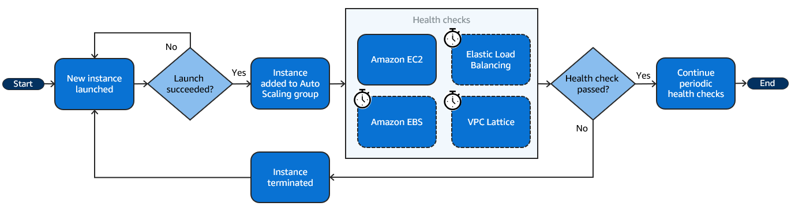
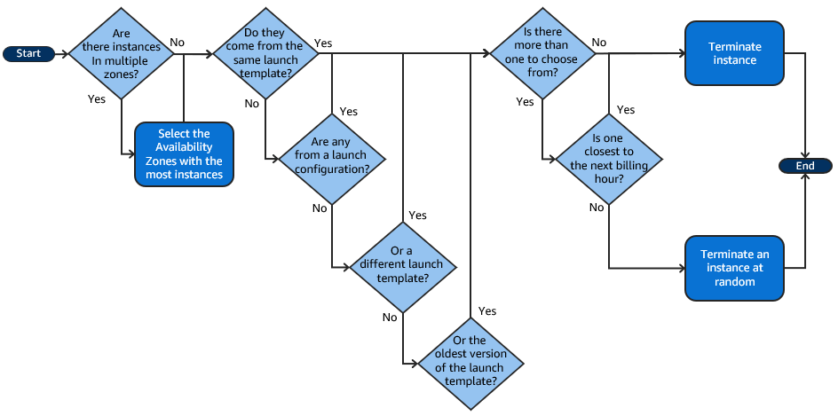
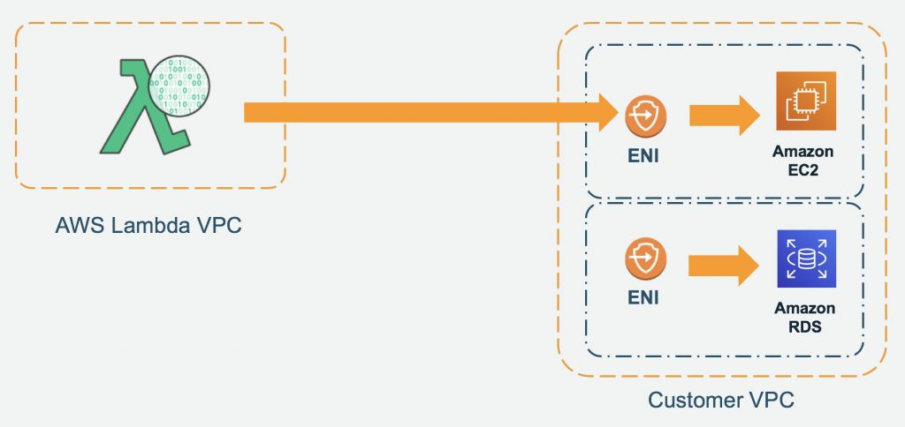

# Compute

## EC2

### Networking
- [Elastic Network Interfaces in the Virtual Private Cloud](https://aws.amazon.com/blogs/aws/new-elastic-network-interfaces-in-the-virtual-private-cloud/)
- [Enhanced networking on Amazon EC2 instances](https://docs.aws.amazon.com/AWSEC2/latest/UserGuide/enhanced-networking.html)
  > Enhanced networking uses single root I/O virtualization (SR-IOV) to provide high-performance networking capabilities on supported instance types. SR-IOV is a method of device virtualization that provides higher I/O performance and lower CPU utilization when compared to traditional virtualized network interfaces. Enhanced networking provides higher bandwidth, higher packet per second (PPS) performance, and consistently lower latency between instances. There is no additional charge for using enhanced networking.
  >
  > You can enable enhanced networking using one of the following mechanisms:
  > - Elastic Network Adapter (ENA)
  > - Intel 82599 Virtual Function (VF) interface
- [Elastic Network Adapter – High Performance Network Interface for Amazon EC2](https://aws.amazon.com/blogs/aws/elastic-network-adapter-high-performance-network-interface-for-amazon-ec2/)
- [Elastic Fabric Adapter for HPC and ML workloads on Amazon EC2](https://docs.aws.amazon.com/AWSEC2/latest/UserGuide/efa.html)
- [Now Available – Elastic Fabric Adapter (EFA) for Tightly-Coupled HPC Workloads](https://aws.amazon.com/blogs/aws/now-available-elastic-fabric-adapter-efa-for-tightly-coupled-hpc-workloads/)
  > An Elastic Fabric Adapter is an AWS Elastic Network Adapter (ENA) with added capabilities (read my post, Elastic Network Adapter – High Performance Network Interface for Amazon EC2, to learn more about ENA). An EFA can still handle IP traffic, but also supports an important access model commonly called OS bypass. This model allows the application (most commonly through some user-space middleware) access the network interface without having to get the operating system involved with each message.
- [How do I turn on and configure enhanced networking on my EC2 instances?](https://repost.aws/knowledge-center/enable-configure-enhanced-networking)

### Storage
- [Block device mappings](https://docs.aws.amazon.com/AWSEC2/latest/UserGuide/block-device-mapping-concepts.html)
- [Add instance store volumes to your EC2 instance | Only at launch](https://docs.aws.amazon.com/AWSEC2/latest/UserGuide/add-instance-store-volumes.html)
- [Instance store temporary block storage for EC2 instances](https://docs.aws.amazon.com/AWSEC2/latest/UserGuide/InstanceStorage.html)
- [Data persistence for Amazon EC2 instance store volumes](https://docs.aws.amazon.com/AWSEC2/latest/UserGuide/instance-store-lifetime.html)
- [Add instance store volumes to an Amazon EC2 instance](https://docs.aws.amazon.com/AWSEC2/latest/UserGuide/add-instance-store-volumes.html)
  > Instance store volumes can be attached to an instance only when you launch it. You can't attach instance store volumes to an instance after you've launched it.

### Purchasing
- [Instance purchasing options](https://docs.aws.amazon.com/AWSEC2/latest/UserGuide/instance-purchasing-options.html)
  > **Reserved Instances do not reserve capacity**
  >
  > RIs do not guarantee that the reserved instance type will be available when you need it. This is an important distinction, as it means that even if you have an RI, you may not be able to launch an instance of the reserved type if the AZ is fully utilized or if there's an outage.
- [Reserve compute capacity with On-Demand Capacity Reservations](https://docs.aws.amazon.com/AWSEC2/latest/UserGuide/ec2-capacity-reservations.html)
  > When you create a Capacity Reservation, you specify:
  > - The Availability Zone in which to reserve the capacity
  > - The number of instances for which to reserve capacity
  > - The instance attributes, including the instance type, platform, Availability Zone, and tenancy
- [Differences between Capacity Reservations, Reserved Instances, and Savings Plans](https://docs.aws.amazon.com/AWSEC2/latest/UserGuide/ec2-capacity-reservations.html#capacity-reservations-differences)
- [Using new vCPU-based On-Demand Instance limits with Amazon EC2](https://aws.amazon.com/blogs/compute/preview-vcpu-based-instance-limits/)
- [Placement groups](https://docs.aws.amazon.com/AWSEC2/latest/UserGuide/placement-groups.html)
- [Spot Instances](https://docs.aws.amazon.com/AWSEC2/latest/UserGuide/using-spot-instances.html)
- [How Spot Instances work](https://docs.aws.amazon.com/AWSEC2/latest/UserGuide/how-spot-instances-work.html)
  > A one-time Spot Instance request remains active until Amazon EC2 launches the Spot Instance, the request expires, or you cancel the request. If capacity is not available, your Spot Instance is terminated and the Spot Instance request is closed.
  > 
  > A persistent Spot Instance request remains active until it expires or you cancel it, even if the request is fulfilled. If capacity is not available, your Spot Instance is interrupted. After your instance is interrupted, when capacity becomes available again, the Spot Instance is started if stopped or resumed if hibernated. You can stop a Spot Instance and start it again if capacity is available. If the Spot Instance is terminated (irrespective of whether the Spot Instance is in a stopped or running state), the Spot Instance request is opened again and Amazon EC2 launches a new Spot Instance. 
- [Create a Spot Instance request](https://docs.aws.amazon.com/AWSEC2/latest/UserGuide/spot-requests.html)
- [EC2 Fleet and Spot Fleet](https://docs.aws.amazon.com/AWSEC2/latest/UserGuide/Fleets.html)
- [Which is the best fleet method to use?](https://docs.aws.amazon.com/AWSEC2/latest/UserGuide/which-fleet-method-to-use.html)
- [EC2 Fleet and Spot Fleet request types](https://docs.amazonaws.cn/en_us/AWSEC2/latest/UserGuide/ec2-fleet-request-type.html)
- [Use allocation strategies to determine how EC2 Fleet or Spot Fleet fulfills Spot and On-Demand capacity](https://docs.aws.amazon.com/AWSEC2/latest/UserGuide/ec2-fleet-allocation-strategy.html)
- [Best practices for handling EC2 Spot Instance interruptions](https://aws.amazon.com/blogs/compute/best-practices-for-handling-ec2-spot-instance-interruptions/)
- [Regions and Zones](https://docs.aws.amazon.com/AWSEC2/latest/UserGuide/using-regions-availability-zones.html)

### Lifecycle
- [Hibernate your Amazon EC2 instance](https://docs.aws.amazon.com/AWSEC2/latest/UserGuide/Hibernate.html)  
- [Status checks for Amazon EC2 instances](https://docs.aws.amazon.com/AWSEC2/latest/UserGuide/monitoring-system-instance-status-check.html)
  - System status checks
  - Instance status checks
  - Attached EBS status checks
- [Instance resiliency](https://docs.aws.amazon.com/AWSEC2/latest/UserGuide/ec2-instance-recover.html)
  > **Instance recovery alternatives**
  > - Auto Scaling groups
  > - Amazon EBS Multi-Attach
  - [Configure CloudWatch action based recovery](https://docs.aws.amazon.com/AWSEC2/latest/UserGuide/cloudwatch-recovery.html)
  - [Configure simplified automatic recovery](https://docs.aws.amazon.com/AWSEC2/latest/UserGuide/instance-configuration-recovery.html)
- [Enable termination protection](https://docs.aws.amazon.com/AWSEC2/latest/UserGuide/Using_ChangingDisableAPITermination.html)
  - `DisableApiTermination` attribute

### AMI
- [Amazon Machine Images in Amazon EC2](https://docs.aws.amazon.com/AWSEC2/latest/UserGuide/AMIs.html)
- [AMI types and characteristics in Amazon EC2](https://docs.aws.amazon.com/AWSEC2/latest/UserGuide/ComponentsAMIs.html)
- [How Amazon EC2 AMI copy works](https://docs.aws.amazon.com/AWSEC2/latest/UserGuide/how-ami-copy-works.html)
  - Cross-Region copying
  - Cross-account copying
  - Encryption and copying
- [Access instance metadata for an EC2 instance](https://docs.aws.amazon.com/AWSEC2/latest/UserGuide/instancedata-data-retrieval.html)
  > http://169.254.169.254/latest/meta-data/

### EC2 Roles
- [IAM roles for Amazon EC2](https://docs.aws.amazon.com/AWSEC2/latest/UserGuide/iam-roles-for-amazon-ec2.html)
- [IAM role for applications that run on Amazon EC2 instances](https://docs.aws.amazon.com/autoscaling/ec2/userguide/us-iam-role.html)
  > A service role is an IAM role that a service assumes to perform actions on your behalf. Service roles provide access only within your account and cannot be used to grant access to services in other accounts. An IAM administrator can create, modify, and delete a service role from within IAM. When you create the service role, you define the `trusted entity` in the definition.
  > 
  > If you are going to use the role with Amazon EC2 or another AWS service that uses Amazon EC2, you must store the role in an instance profile. An instance profile is a container for a role that can be attached to an Amazon EC2 instance when launched. An instance profile can contain only one role, and that limit cannot be increased. If you create the role using the AWS Management Console, the instance profile is created for you with the same name as the role.
- [Use an IAM role to grant permissions to applications running on Amazon EC2 instances](https://docs.aws.amazon.com/IAM/latest/UserGuide/id_roles_use_switch-role-ec2.html)
  > When the application runs, it obtains temporary security credentials from Amazon EC2 instance metadata, as described in Retrieving Security Credentials from Instance Metadata. These are temporary security credentials that represent the role and are valid for a limited period of time.
  > 
  > With some AWS SDKs, the developer can use a provider that manages the temporary security credentials transparently.
- [How does an EC2 instance assume an IAM Role?](https://repost.aws/questions/QUQuYy16JHTzqRHuvM7uxGfw/how-does-an-ec2-instance-assume-an-iam-role)

## EC2 Auto-Scaling
- [Dynamic scaling for Amazon EC2 Auto Scaling](https://docs.aws.amazon.com/autoscaling/ec2/userguide/as-scale-based-on-demand.html)
- [Step and simple scaling policies for Amazon EC2 Auto Scaling](https://docs.aws.amazon.com/autoscaling/ec2/userguide/as-scaling-simple-step.html)
  > Step scaling and simple scaling policies scale the capacity of your Auto Scaling group in predefined increments based on CloudWatch alarms. You can define separate scaling policies to handle scaling out (increasing capacity) and scaling in (decreasing capacity) when an alarm threshold is breached.
- [Target tracking scaling policies for Amazon EC2 Auto Scaling](https://docs.aws.amazon.com/autoscaling/ec2/userguide/as-scaling-target-tracking.html)
  > We strongly recommend that you use target tracking scaling policies to scale on metrics like average CPU utilization or average request count per target. Metrics that decrease when capacity increases and increase when capacity decreases can be used to proportionally scale out or in the number of instances using target tracking. This **helps ensure that Amazon EC2 Auto Scaling follows the demand curve for your applications closely**. 
- [Scheduled scaling for Amazon EC2 Auto Scaling](https://docs.aws.amazon.com/autoscaling/ec2/userguide/ec2-auto-scaling-scheduled-scaling.html)
  > To use scheduled scaling, create scheduled actions, which tell Amazon EC2 Auto Scaling to perform scaling activities at specific times. When you create a scheduled action, you specify the Auto Scaling group, when the scaling activity should occur, the new desired capacity, and optionally a new minimum capacity and a new maximum capacity. You can create scheduled actions that scale one time only or that scale on a recurring schedule.
  > 
  > At the specified time, Amazon EC2 Auto Scaling scales based on the new capacity values, by comparing current capacity to the specified desired capacity.
  > - If current capacity is less than the specified desired capacity, Amazon EC2 Auto Scaling scales out, or adds instances, to the specified desired capacity.
  > - If current capacity is greater than the specified desired capacity, Amazon EC2 Auto Scaling scales in, or removes instances, to the specified desired capacity.
  > 
  > A scheduled action sets the group's desired, minimum, and maximum capacity at the date and time specified. You can create a scheduled action for only one of these capacities at a time, for example, desired capacity. However, there are some cases where you must include the minimum and maximum capacity to ensure that the desired capacity that you specified in the action is not outside of these limits.
- [Scaling policy based on Amazon SQS](https://docs.aws.amazon.com/autoscaling/ec2/userguide/as-using-sqs-queue.html)
- [Temporarily remove instances from your Auto Scaling group](https://docs.aws.amazon.com/autoscaling/ec2/userguide/as-enter-exit-standby.html)
- [Suspend and resume Amazon EC2 Auto Scaling processes](https://docs.aws.amazon.com/autoscaling/ec2/userguide/as-suspend-resume-processes.html)
- [How an instance refresh works in an Auto Scaling group](https://docs.aws.amazon.com/autoscaling/ec2/userguide/instance-refresh-overview.html)
- [Deprecated: Auto Scaling launch configurations](https://docs.aws.amazon.com/autoscaling/ec2/userguide/launch-configurations.html)
- [Auto Scaling launch templates](https://docs.aws.amazon.com/autoscaling/ec2/userguide/launch-templates.html)
- [Why can’t I modify my Amazon EC2 instance launch template?](https://repost.aws/knowledge-center/ec2-modify-launch-template)
  > Launch templates are immutable. After you create a launch template, you can't modify it. Instead, you can create a new version of the launch template that includes any changes that you require. You can create different versions of a launch template, set the default version, describe a launch template version, and delete launch template versions.
- [Health checks for instances in an Auto Scaling group](https://docs.aws.amazon.com/autoscaling/ec2/userguide/ec2-auto-scaling-health-checks.html)
  
- [Configure termination policies for Amazon EC2 Auto Scaling](https://docs.aws.amazon.com/autoscaling/ec2/userguide/ec2-auto-scaling-termination-policies.html)
  
- [Control which Auto Scaling instances terminate during scale in](https://docs.aws.amazon.com/autoscaling/ec2/userguide/as-instance-termination.html)
  > When rebalancing, Amazon EC2 Auto Scaling launches new instances before terminating the old ones, so that rebalancing does not compromise the performance or availability of your application.
- [Amazon EC2 Auto Scaling instance lifecycle](https://docs.aws.amazon.com/autoscaling/ec2/userguide/ec2-auto-scaling-lifecycle.html)
- [Amazon EC2 Auto Scaling lifecycle hooks](https://docs.aws.amazon.com/autoscaling/ec2/userguide/lifecycle-hooks.html)
- [Use instance scale-in protection to control instance termination](https://docs.aws.amazon.com/autoscaling/ec2/userguide/ec2-auto-scaling-instance-protection.html)
  > Instance scale-in protection gives you control over which instances Amazon EC2 Auto Scaling can terminate. 

## Cloud Watch
- [Manage detailed monitoring for your EC2 instances](https://docs.aws.amazon.com/AWSEC2/latest/UserGuide/manage-detailed-monitoring.html)
- [Metrics collected by the CloudWatch agent](https://docs.aws.amazon.com/AmazonCloudWatch/latest/monitoring/metrics-collected-by-CloudWatch-agent.html)
  - cpu
  - disk
  - diskio
  - ethtool
  - mem
  - net
  - netstat
  - processes
  - swap
- [Sharing CloudWatch dashboards](https://docs.aws.amazon.com/AmazonCloudWatch/latest/monitoring/cloudwatch-dashboard-sharing.html)
  > You can share your CloudWatch dashboards with people who do not have direct access to your AWS account. This enables you to share dashboards across teams, with stakeholders, and with people external to your organization.
- [Publish custom metrics](https://docs.aws.amazon.com/AmazonCloudWatch/latest/monitoring/publishingMetrics.html)
  > To publish a single data point for a new or existing metric, use the `put-metric-data` command with one value and time stamp.
- [CloudWatch cross-account observability](https://docs.aws.amazon.com/AmazonCloudWatch/latest/monitoring/CloudWatch-Unified-Cross-Account.html)

### Cloudwatch Alarms
- [Using Amazon CloudWatch alarms](https://docs.aws.amazon.com/AmazonCloudWatch/latest/monitoring/AlarmThatSendsEmail.html)
  > #### Alarm actions
  The following are supported as alarm actions.
  > - **Notify one or more subscribers by using an Amazon Simple Notification Service topic**. Subscribers can be applications as well as persons. For more information about Amazon SNS, see What is Amazon SNS?.
  > - **Invoke a Lambda function**. This is the easiest way for you to automate custom actions on alarm state changes.
  > - **Alarms based on EC2 metrics can also perform EC2 actions**, such as stopping, terminating, rebooting, or recovering an EC2 instance. For more information, see [Create alarms to stop, terminate, reboot, or recover an EC2 instance.](https://docs.aws.amazon.com/AmazonCloudWatch/latest/monitoring/UsingAlarmActions.html) NOTE: actions are based on alarms, not CloudWatch events
  > - Alarms can perform actions to **scale an Auto Scaling group**. For more information, see Step and simple scaling policies for Amazon EC2 Auto Scaling.
  > - Alarms can **create OpsItems in Systems Manager Ops Center or create incidents in AWS Systems Manager Incident Manager**. These actions are performed only when the alarm goes into ALARM state. For more information, see Configuring CloudWatch to create OpsItems from alarms and Incident creation.


### Cloud Watch Logs
- [Working with log groups and log streams](https://docs.aws.amazon.com/AmazonCloudWatch/latest/logs/Working-with-log-groups-and-streams.html)
- [Real-time processing of log data with subscriptions](https://docs.aws.amazon.com/AmazonCloudWatch/latest/logs/Subscriptions.html)
- [Streaming CloudWatch Logs data to Amazon OpenSearch Service](https://docs.aws.amazon.com/AmazonCloudWatch/latest/logs/CWL_OpenSearch_Stream.html)
  > You can configure a CloudWatch Logs log group to stream data it receives to your Amazon OpenSearch Service cluster in near real-time through a CloudWatch Logs subscription. For more information, see Real-time processing of log data with subscriptions.
  - Firehose is a possible solution as well, but it involves another service
- [Analyzing log data with CloudWatch Logs Insights](https://docs.aws.amazon.com/AmazonCloudWatch/latest/logs/AnalyzingLogData.html)
- [Creating metrics from log events using filters](https://docs.aws.amazon.com/AmazonCloudWatch/latest/logs/MonitoringLogData.html)
  > You can search and filter the log data coming into CloudWatch Logs by creating one or more metric filters. Metric filters define the terms and patterns to look for in log data as it is sent to CloudWatch Logs. CloudWatch Logs uses these metric filters to turn log data into numerical CloudWatch metrics that you can graph or set an alarm on.

### CloudWatch Container Insighsts
- [Container Insights](https://docs.aws.amazon.com/AmazonCloudWatch/latest/monitoring/ContainerInsights.html)
  > Use CloudWatch Container Insights to collect, aggregate, and summarize metrics and logs from your containerized applications and microservices. Container Insights is available for Amazon Elastic Container Service (Amazon ECS), Amazon Elastic Kubernetes Service (Amazon EKS), and Kubernetes platforms on Amazon EC2.
  > 
  > With Container Insights for EKS you can see the top contributors by memory or CPU, or the most recently active resources. This is available when you select any of the following dashboards in the drop-down box near the top of the page:
  > - ECS Services
  > - ECS Tasks
  > - EKS Namespaces
  > - EKS Services
  > - EKS Pods

## HPC
- [High Performance Computing Lens - AWS Well-Architected Framework](https://docs.aws.amazon.com/wellarchitected/latest/high-performance-computing-lens/welcome.html)

## Batch
- [Components of AWS Batch](https://docs.aws.amazon.com/batch/latest/userguide/batch_components.html)
  - Jobs
  - Job definitions
  - Job queues
  - Compute environment
- [Compute environments for AWS Batch](https://docs.aws.amazon.com/batch/latest/userguide/compute_environments.html)
- [Multi-node parallel jobs](https://docs.aws.amazon.com/batch/latest/userguide/multi-node-parallel-jobs.html)
  > You can use multi-node parallel jobs to run single jobs that span multiple Amazon EC2 instances. With AWS Batch multi-node parallel jobs, you can run large-scale, high-performance computing applications and distributed GPU model training without the need to launch, configure, and manage Amazon EC2 resources directly. An AWS Batch multi-node parallel job is compatible with any framework that supports IP-based, internode communication. Examples include Apache MXNet, TensorFlow, Caffe2, or Message Passing Interface (MPI).

## Lambda
- [Invoking Lambda with events from other AWS services](https://docs.aws.amazon.com/lambda/latest/dg/lambda-services.html)
- [Using Lambda with Amazon SQS](https://docs.aws.amazon.com/lambda/latest/dg/with-sqs.html)
- [Invoking Lambda functions with Amazon SNS notifications](https://docs.aws.amazon.com/lambda/latest/dg/with-sns.html)
- [Understanding the Different Ways to Invoke Lambda Functions](https://aws.amazon.com/blogs/architecture/understanding-the-different-ways-to-invoke-lambda-functions/)
- [Understanding Lambda function scaling](https://docs.aws.amazon.com/lambda/latest/dg/lambda-concurrency.html)
   - Account quota of 1,000 concurrent executions across all functions in an AWS Region
   - Reserved Concurrency | reserve a portion of your account's concurrency for a function
   - Provisioned Concurrency |  pre-initialize a number of environment instances for a function.
- [New – Provisioned Concurrency for Lambda Functions](https://aws.amazon.com/blogs/aws/new-provisioned-concurrency-for-lambda-functions/)
- [Best Practices for Developing on AWS Lambda](https://aws.amazon.com/blogs/architecture/best-practices-for-developing-on-aws-lambda/)
  > #### Tip #1: When to VPC-Enable a Lambda Function
  > Lambda functions always operate from an AWS-owned VPC. By default, your function has full ability to make network requests to any public internet address — this includes access to any of the public AWS APIs. For example, your function can interact with AWS DynamoDB APIs to PutItem or Query for records. You should only enable your functions for VPC access when you need to interact with a private resource located in a private subnet. An RDS instance is a good example.
  >
  >  
  > Once your function is VPC-enabled, all network traffic from your function is subject to the routing rules of your VPC/Subnet. If your function needs to interact with a public resource, you will need a route through a NAT gateway in a public subnet.
  >
  > #### Tip #2: Deploy Common Code to a Lambda Layer (i.e. the AWS SDK)
  > If you intend to reuse code in more than one function, consider creating a Layer and deploying it there. A great candidate would be a logging package that your team is required to standardize on. Another great example is the AWS SDK. AWS will include the AWS SDK for NodeJS and Python functions (and update the SDK periodically). However, you should bundle your own SDK and pin your functions to a version of the SDK you have tested.
  > 
  > #### Tip #3: Watch Your Package Size and Dependencies
  > Lambda functions require you to package all needed dependencies (or attach a Layer) — the bigger your deployment package, the slower your function will cold-start. Remove all unnecessary items, such as documentation and unused libraries. If you are using Java functions with the AWS SDK, only bundle the module(s) that you actually need to use — not the entire SDK.
  > 
  > Good:
  >```
  ><dependency>
  >  <groupId>software.amazon.awssdk</groupId>
  >  <artifactId>dynamodb</artifactId>
  >  <version>2.6.0</version>
  ></dependency>
  >```
  > Bad:
  >```
  ><!-- https://mvnrepository.com/artifact/software.amazon.awssdk/aws-sdk-java -->
  ><dependency>
  >  <groupId>software.amazon.awssdk</groupId>
  >  <artifactId>aws-sdk-java</artifactId>
  >  <version>2.6.0</version>
  ></dependency>
  >```
  >
  > #### Tip #4: Monitor Your Concurrency (and Set Alarms)
  > Our first post in this series talked about how concurrency can effect your down stream systems. Since Lambda functions can scale extremely quickly, this means you should have controls in place to notify you when you have a spike in concurrency. A good idea is to deploy a CloudWatch Alarm that notifies your team when function metrics such as ConcurrentExecutions or Invocations exceeds your threshold. You should create an AWS Budget so you can monitor costs on a daily basis. Here is a great example of how to set up automated cost controls.
  > 
  > #### Tip #5: Over-Provision Memory (in some use cases) but Not Function Timeout
  > Lambda allocates compute power in proportion to the memory you allocate to your function. This means you can over provision memory to run your functions faster and potentially reduce your costs. You should benchmark your use case to determine where the breakeven point is for running faster and using more memory vs running slower and using less memory.
  > 
  > However, we recommend you do not over provision your function time out settings. Always understand your code performance and set a function time out accordingly. Overprovisioning function timeout often results in Lambda functions running longer than expected and unexpected costs.
- [Managing Lambda dependencies with layers](https://docs.aws.amazon.com/lambda/latest/dg/chapter-layers.html)
- [Lambda – Container Image Support](https://aws.amazon.com/blogs/aws/new-for-aws-lambda-container-image-support/)
  >  To work with Lambda, these images must implement the Lambda Runtime API.
- [Visualize Lambda function invocations using AWS X-Ray](https://docs.aws.amazon.com/lambda/latest/dg/services-xray.html)
- [Networking and VPC configurations](https://docs.aws.amazon.com/lambda/latest/operatorguide/networking-vpc.html)
- [Announcing improved VPC networking for AWS Lambda functions](https://aws.amazon.com/blogs/compute/announcing-improved-vpc-networking-for-aws-lambda-functions/)
- [Augment Lambda functions using Lambda extensions](https://docs.aws.amazon.com/lambda/latest/dg/lambda-extensions.html)

## ECS
- [IAM roles for Amazon ECS](https://docs.aws.amazon.com/AmazonECS/latest/developerguide/security-ecs-iam-role-overview.html)
  - [Amazon ECS task execution IAM role](https://docs.aws.amazon.com/AmazonECS/latest/developerguide/task_execution_IAM_role.html)
  - [Amazon ECS task IAM role](https://docs.aws.amazon.com/AmazonECS/latest/developerguide/task-iam-roles.html)
  - [Amazon ECS container instance IAM role](https://docs.aws.amazon.com/AmazonECS/latest/developerguide/instance_IAM_role.html)
- [AWS managed policies for Amazon Elastic Container Service](https://docs.aws.amazon.com/AmazonECS/latest/developerguide/security-iam-awsmanpol.html)
  - [AmazonECSTaskExecutionRolePolicy](https://docs.aws.amazon.com/AmazonECS/latest/developerguide/security-iam-awsmanpol.html#security-iam-awsmanpol-AmazonECSTaskExecutionRolePolicy) grants the permissions that are needed by the Amazon ECS container agent and AWS Fargate container agents to make AWS API calls on your behalf (pull image, write logs etc)
  - [AmazonEC2ContainerServiceforEC2Role](https://docs.aws.amazon.com/aws-managed-policy/latest/reference/AmazonEC2ContainerServiceforEC2Role.html) policy
- [Automatically scale your Amazon ECS service](https://docs.aws.amazon.com/AmazonECS/latest/developerguide/service-auto-scaling.html)
  - [Scale your Amazon ECS service using a target metric value](https://docs.aws.amazon.com/AmazonECS/latest/developerguide/service-autoscaling-targettracking.html)
  - [Scale your Amazon ECS service using predefined increments based on CloudWatch alarms](https://docs.aws.amazon.com/AmazonECS/latest/developerguide/service-autoscaling-stepscaling.html)
- [How do I set up ALB dynamic port mapping for Amazon ECS?](https://repost.aws/knowledge-center/dynamic-port-mapping-ecs)


## EKS
- [Cluster Architecture](https://kubernetes.io/docs/concepts/architecture/)
- [Pods](https://kubernetes.io/docs/concepts/workloads/pods/)
- [De-mystifying cluster networking for Amazon EKS worker nodes](https://aws.amazon.com/blogs/containers/de-mystifying-cluster-networking-for-amazon-eks-worker-nodes/)
- [Deploy private clusters with limited internet access](https://docs.aws.amazon.com/eks/latest/userguide/private-clusters.html)
  > If your cluster doesn't have outbound internet access, then it must meet the following requirements:
  > - Your cluster must pull images from a container registry that's in your VPC.
  > - Your cluster must have endpoint private access enabled. This is required for nodes to register with the cluster endpoint.
- [Metrics Server](https://kubernetes.io/docs/tasks/debug/debug-cluster/resource-metrics-pipeline/#metrics-server)
  > The Metrics Server collects resource metrics like CPU and memory usage from each node and its pods and provides these metrics to the Kubernetes API server for use by the Horizontal Pod Autoscaler, which automatically scales the number of pods in a deployment, replication controller, replica set, or stateful set based on observed CPU utilization.
- [What is Application Auto Scaling?](https://docs.aws.amazon.com/autoscaling/application/userguide/what-is-application-auto-scaling.html)
- [Horizontal Pod Autoscaling](https://kubernetes.io/docs/tasks/run-application/horizontal-pod-autoscale/)
- [Vertical Pod Autoscaler](https://github.com/kubernetes/autoscaler/tree/master/vertical-pod-autoscaler#readme)
- [EKS Cluseter Autoscaling](https://docs.aws.amazon.com/eks/latest/userguide/autoscaling.html)
  > The Kubernetes Cluster Autoscaler automatically adjusts the size of the Kubernetes cluster when there are pods that failed to run in the cluster due to insufficient resources or when there are nodes in the cluster that have been underutilized for an extended period and their pods can be placed on other existing nodes.
- [EKS | Encrypt Kubernetes secrets with AWS KMS on existing clusters](https://docs.aws.amazon.com/eks/latest/userguide/enable-kms.html)
- [Amazon EKS Simplifies Kubernetes Cluster Authentication](https://aws.amazon.com/about-aws/whats-new/2019/05/amazon-eks-simplifies-kubernetes-cluster-authentication/)