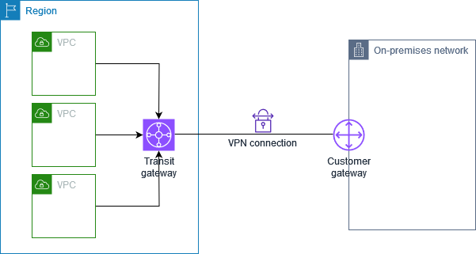
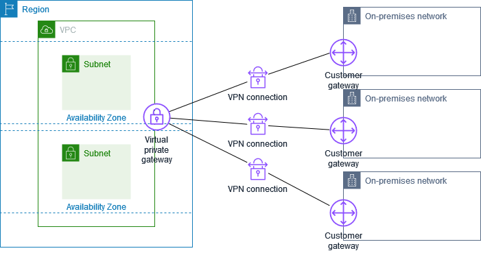
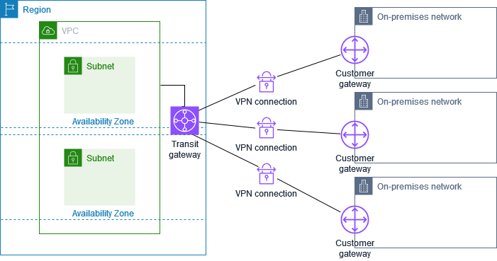
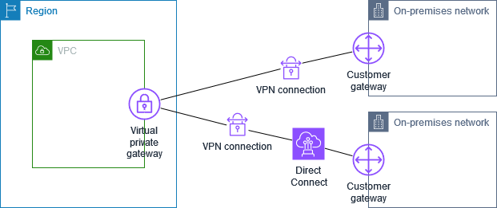
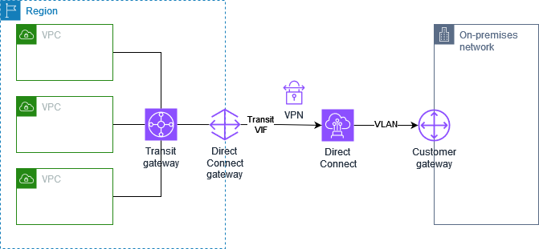
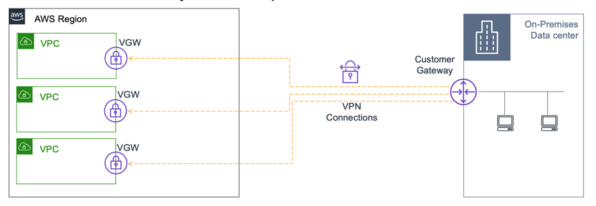
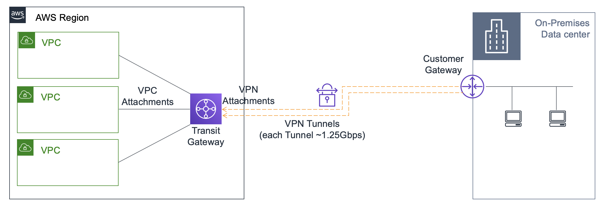
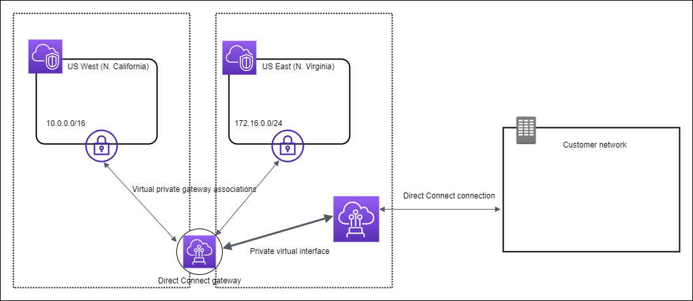
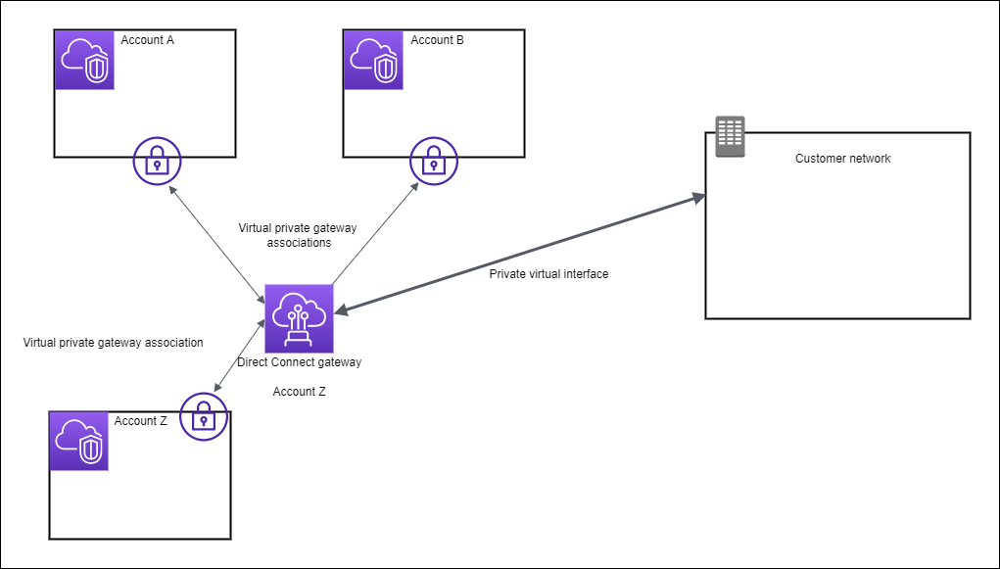
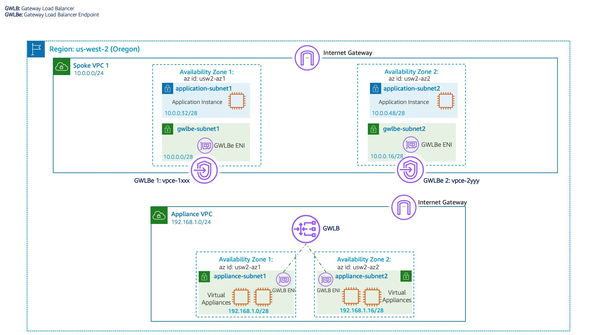

# Networking  
## VPC
- [NAT gateways](https://docs.aws.amazon.com/vpc/latest/userguide/vpc-nat-gateway.html)
  - Public
  - Private
- [NAT gateway basics](https://docs.aws.amazon.com/vpc/latest/userguide/nat-gateway-basics.html)
    - created in a specific Availability Zone 
    - implemented with redundancy in that zone
    - quota (of 5) of NAT gateways that you can create in each Availability Zone
    - A NAT gateway supports 5 Gbps of bandwidth and automatically scales up to 45 Gbps.
    - You can associate exactly one Elastic IP address with a NAT gateway.
    - A NAT gateway supports the following protocols: TCP, UDP, and ICMP.
    - You cannot associate a security group with a NAT gateway.
    - You can use a network access control list (network ACL) to control the traffic to and from the subnet in which the NAT gateway is located.
    - A NAT gateway can support up to 55,000 simultaneous connections to each unique destination.
- [Compare NAT gateways and NAT instances](https://docs.aws.amazon.com/vpc/latest/userguide/vpc-nat-comparison.html)
  - Nat Gateway:
    - You cannot associate security groups with NAT gateways. 
    - You can associate them with the resources behind the NAT gateway to control inbound and outbound traffic.
    - Port forwarding	Not supported.
    - Bastion servers	Not supported.
  - Nat Instance:
    - Associate with your NAT instance and the resources behind your NAT instance to control inbound and outbound traffic.
    - Port forwarding	Manually customize the configuration to support port forwarding.
    - Bastion servers	Use as a bastion server.
- [Why does a AWS NAT Gateway require an ElasticIP?](https://stackoverflow.com/questions/43094786/why-does-a-aws-nat-gateway-require-an-elasticip)
- [Control traffic to your AWS resources using security groups](https://docs.aws.amazon.com/vpc/latest/userguide/vpc-security-groups.html)
    - You can assign a security group only to resources created in the same VPC as the security group. You can assign multiple security groups to a resource.
    - Default SG allows inbound from from within the group and all outbound traffic
    - Custom SG denies all inbound and allows all outbound traffic by default
- [Control subnet traffic with network access control lists](https://docs.aws.amazon.com/vpc/latest/userguide/vpc-network-acls.html)
- [Network ACL basics](https://docs.aws.amazon.com/vpc/latest/userguide/nacl-basics.html)
    - [Default network ACL | Allows all inbound and outbound](https://docs.aws.amazon.com/vpc/latest/userguide/default-network-acl.html)
    - Custom Network ACL | Denies all inbound and outbound by default
    - Gotcha: Network ACL only applies to services in a subnet - cannot be used for CloudFront
- [Why can't I connect to a service when the security group and network ACL allow inbound traffic?](https://repost.aws/knowledge-center/resolve-connection-sg-acl-inbound)
  > - If you accept traffic from the internet, then you also must establish a route through an internet gateway. 
  > - If you accept traffic over VPN/AWS Direct Connect/Transit Gateway, then you must establish a corresponding route through a virtual private gateway/transit gateway.
- [Update your security groups to reference peer security groups](https://docs.aws.amazon.com/vpc/latest/peering/vpc-peering-security-groups.html)
  > - **You cannot reference the security group of a peer VPC that's in a different Region. Instead, use the CIDR block of the peer VPC.**
- [Hybrid network connections](https://docs.aws.amazon.com/whitepapers/latest/hybrid-connectivity/hybrid-network-connections.html)
- [Share your VPC subnets with other accounts](https://docs.aws.amazon.com/vpc/latest/userguide/vpc-sharing.html)
  > VPC sharing allows multiple AWS accounts to create their application resources, such as Amazon EC2 instances, Amazon Relational Database Service (RDS) databases, Amazon Redshift clusters, and AWS Lambda functions, into shared, centrally-managed virtual private clouds (VPCs). In this model, the account that owns the VPC (owner) shares one or more subnets with other accounts (participants) that belong to the same organization from AWS Organizations.
- [VPC sharing: A new approach to multiple accounts and VPC management](https://aws.amazon.com/blogs/networking-and-content-delivery/vpc-sharing-a-new-approach-to-multiple-accounts-and-vpc-management/)
- [Logging IP traffic using VPC Flow Logs](https://docs.aws.amazon.com/vpc/latest/userguide/flow-logs.html)
  > Flow log data can be published to the following locations: Amazon CloudWatch Logs, Amazon S3, or Amazon Data Firehose.
- [Consolidate and manage network CIDR blocks with managed prefix lists](https://docs.aws.amazon.com/vpc/latest/userguide/managed-prefix-lists.html)

## PrivateLink
- [What is AWS PrivateLink?](https://docs.aws.amazon.com/vpc/latest/privatelink/what-is-privatelink.html)
  > AWS PrivateLink is a highly available, scalable technology that you can use to privately connect your VPC to services as if they were in your VPC. You do not need to use an internet gateway, NAT device, public IP address, AWS Direct Connect connection, or AWS Site-to-Site VPN connection to allow communication with the service from your private subnets. Therefore, you control the specific API endpoints, sites, and services that are reachable from your VPC.
- [AWS PrivateLink concepts](https://docs.aws.amazon.com/vpc/latest/privatelink/concepts.html)
  > A service consumer creates a VPC endpoint to connect their VPC to an endpoint service. A service consumer must specify the service name of the endpoint service when creating a VPC endpoint. There are multiple types of VPC endpoints. You must create the type of VPC endpoint that's required by the endpoint service.
  > - Interface - Create an interface endpoint to send TCP traffic to an endpoint service. Traffic destined for the endpoint service is resolved using DNS.
  > - GatewayLoadBalancer - Create a Gateway Load Balancer endpoint to send traffic to a fleet of virtual appliances using private IP addresses. You route traffic from your VPC to the Gateway Load Balancer endpoint using route tables. The Gateway Load Balancer distributes traffic to the virtual appliances and can scale with demand.
  >
  > There is another type of VPC endpoint, Gateway, which creates a gateway endpoint to send traffic to Amazon S3 or DynamoDB. Gateway endpoints do not use AWS PrivateLink, unlike the other types of VPC endpoints. For more information, see Gateway endpoints.
- [Access AWS services through AWS PrivateLink](https://docs.aws.amazon.com/vpc/latest/privatelink/privatelink-access-aws-services.html)
- [Securely Access Services Over AWS PrivateLink](https://docs.aws.amazon.com/whitepapers/latest/aws-privatelink/aws-privatelink.html)
- [Gateway endpoints](https://docs.aws.amazon.com/vpc/latest/privatelink/gateway-endpoints.html) Do not use PrivateLink
  - S3
  - DynamoDB
- [AWS PrivateLink for Amazon S3](https://docs.aws.amazon.com/AmazonS3/latest/userguide/privatelink-interface-endpoints.html)
> | **Feature** | **Gateway endpoints for Amazon S3** | **Interface endpoints for Amazon S3** |
> | --- | --- | --- |
> | **Network Traffic** | Remains on AWS network | Remains on AWS network |
> | **IP Addresses** | Amazon S3 public IP addresses | Private IP addresses from your Amazon VPC |
> | **On-Premises Access** | Do not allow access from on premises | Allow access from on premises |
> | **Cross-Region Access** | Do not allow access from another AWS Region | Allow access from a VPC in another AWS Region using Amazon VPC peering or AWS Transit Gateway |
> | **Billing** | Not billed | Billed |
- [AWS PrivateLink for DynamoDB](https://docs.aws.amazon.com/amazondynamodb/latest/developerguide/privatelink-interface-endpoints.html)
> | **Feature** | **Gateway Endpoints for DynamoDB** | **Interface Endpoints for DynamoDB** |
> | --- | --- | --- |
> | **Network Traffic** | Remains on AWS network | Remains on AWS network |
> | **IP Addresses** | Amazon DynamoDB public IP addresses | Private IP addresses from your Amazon VPC |
> | **On-Premises Access** | Do not allow access from on premises | Allow access from on premises |
> | **Cross-Region Access** | Do not allow access from another AWS Region | Allow access from an Amazon VPC endpoint in another AWS Region using Amazon VPC peering or AWS Transit Gateway |
> | **Billing** | Not billed | Billed |
- [Gateway endpoints for Amazon S3](https://docs.aws.amazon.com/vpc/latest/privatelink/vpc-endpoints-s3.html)
  > Amazon S3 supports both gateway endpoints and interface endpoints. With a gateway endpoint, you can access Amazon S3 from your VPC, without requiring an internet gateway or NAT device for your VPC, and with no additional cost. However, gateway endpoints do not allow access from on-premises networks, from peered VPCs in other AWS Regions, or through a transit gateway. For those scenarios, you must use an interface endpoint, which is available for an additional cost. For more information, see Types of VPC endpoints for Amazon S3 in the Amazon S3 User Guide.
- [Share your services through AWS PrivateLink](https://docs.aws.amazon.com/vpc/latest/privatelink/privatelink-share-your-services.html)
  > You can host your own AWS PrivateLink powered service, known as an endpoint service, and share it with other AWS customers.
  >
  > PrivateLink endpoint in consumer VPC
  > Load balancer (NLB or GWLB) in provider VPC
- [Reduce Cost and Increase Security with Amazon VPC Endpoints](https://aws.amazon.com/blogs/architecture/reduce-cost-and-increase-security-with-amazon-vpc-endpoints/)
    
## VPN
- [What is AWS Client VPN?](https://docs.aws.amazon.com/vpn/latest/clientvpn-user/client-vpn-user-what-is.html)
  - Client VPN endpoint
  - VPN client application
- [What is AWS Client VPN? (Admin)](https://docs.aws.amazon.com/vpn/latest/clientvpn-admin/what-is.html)
- [What is AWS Site-to-Site VPN?](https://docs.aws.amazon.com/vpn/latest/s2svpn/VPC_VPN.html)
- [How AWS Site-to-Site VPN works](https://docs.aws.amazon.com/vpn/latest/s2svpn/how_it_works.html)
  > A Site-to-Site VPN connection consists of the following components:
  > - A virtual private gateway or a transit gateway
  > - A customer gateway device 
  >   - A customer gateway device is a physical device or software application on your side of the Site-to-Site VPN connection. You configure the device to work with the Site-to-Site VPN connection.
  > - A customer gateway
  >   - A customer gateway is a resource that you create in AWS that represents the customer gateway device in your on-premises network. When you create a customer gateway, you provide information about your device to AWS.
- [Your customer gateway device](https://docs.aws.amazon.com/vpn/latest/s2svpn/your-cgw.html)
- [Site-to-Site VPN single and multiple VPN connection examples](https://docs.aws.amazon.com/vpn/latest/s2svpn/Examples.html)
  - Single Site-to-Site VPN connection
    >  
  - Single Site-to-Site VPN connection with a transit gateway
    > 
  - Multiple Site-to-Site VPN connections
    > 
    >
    > When you create multiple Site-to-Site VPN connections to a single VPC, you can configure a second customer gateway to create a redundant connection to the same external location. For more information, see Using redundant Site-to-Site VPN connections to provide failover.
    >
    > You can also use this scenario to create Site-to-Site VPN connections to multiple geographic locations and provide secure communication between sites. For more information, see Providing secure communication between sites using VPN CloudHub.
  - Multiple Site-to-Site VPN connections with a transit gateway
    > 
  - Site-to-Site VPN connection with AWS Direct Connect
    > 
  - Private IP Site-to-Site VPN connection with AWS Direct Connect
    > 
- [Using redundant Site-to-Site VPN connections to provide failover](https://docs.aws.amazon.com/vpn/latest/s2svpn/vpn-redundant-connection.html)
- [Network-to-Amazon VPC connectivity options](https://docs.aws.amazon.com/whitepapers/latest/aws-vpc-connectivity-options/network-to-amazon-vpc-connectivity-options.html)
  - [AWS Site-to-Site VPN](https://docs.aws.amazon.com/whitepapers/latest/aws-vpc-connectivity-options/aws-site-to-site-vpn.html)
  - [AWS Transit Gateway + Site-to-Site VPN](https://docs.aws.amazon.com/whitepapers/latest/aws-vpc-connectivity-options/aws-transit-gateway-vpn.html)
  - [AWS Direct Connect](https://docs.aws.amazon.com/whitepapers/latest/aws-vpc-connectivity-options/aws-direct-connect.html)
  - [AWS Direct Connect + AWS Transit Gateway](https://docs.aws.amazon.com/whitepapers/latest/aws-vpc-connectivity-options/aws-direct-connect-aws-transit-gateway.html)
  - [AWS Direct Connect + AWS Site-to-Site VPN](https://docs.aws.amazon.com/whitepapers/latest/aws-vpc-connectivity-options/aws-direct-connect-site-to-site-vpn.html)
    > With AWS Direct Connect + AWS Site-to-Site VPN, you can combine AWS Direct Connect connections with an AWS-managed VPN solution. AWS Direct Connect public VIFs establish a dedicated network connection between your network and public AWS resources such as an AWS Site-to-Site VPN endpoint. **Once you establish the connection to the service, you can create IPsec connections to the corresponding Amazon VPC virtual private gateways**.
  - [AWS Direct Connect + AWS Transit Gateway + AWS Site-to-Site VPN](https://docs.aws.amazon.com/whitepapers/latest/aws-vpc-connectivity-options/aws-direct-connect-aws-transit-gateway-vpn.html)
  - [AWS VPN CloudHub](https://docs.aws.amazon.com/whitepapers/latest/aws-vpc-connectivity-options/aws-vpn-cloudhub.html)
    - [Providing secure communication between sites using VPN CloudHub](https://docs.aws.amazon.com/vpn/latest/s2svpn/VPN_CloudHub.html)
  - [AWS Transit Gateway + SD-WAN solutions](https://docs.aws.amazon.com/whitepapers/latest/aws-vpc-connectivity-options/aws-transit-gateway-sd-wan.html)
  - [Software VPN](https://docs.aws.amazon.com/whitepapers/latest/aws-vpc-connectivity-options/software-vpn.html)
- [Amazon VPC-to-Amazon VPC connectivity options](https://docs.aws.amazon.com/whitepapers/latest/aws-vpc-connectivity-options/amazon-vpc-to-amazon-vpc-connectivity-options.html)
  - [VPC peering](https://docs.aws.amazon.com/whitepapers/latest/aws-vpc-connectivity-options/vpc-peering.html)
  - [AWS Transit Gateway](https://docs.aws.amazon.com/whitepapers/latest/aws-vpc-connectivity-options/aws-transit-gateway.html)
  - [AWS PrivateLink](https://docs.aws.amazon.com/whitepapers/latest/aws-vpc-connectivity-options/aws-privatelink.html)
  - [Software VPN](https://docs.aws.amazon.com/whitepapers/latest/aws-vpc-connectivity-options/software-vpn-1.html)
  - [Software VPN-to-AWS Site-to-Site VPN](https://docs.aws.amazon.com/whitepapers/latest/aws-vpc-connectivity-options/software-vpn-to-aws-site-to-site-vpn.html)
  - Gotcha: No Amazon-managed VPN between VPCs
- [Scaling VPN throughput using AWS Transit Gateway](https://aws.amazon.com/blogs/networking-and-content-delivery/scaling-vpn-throughput-using-aws-transit-gateway/)
  > Virtual private gateways are a highly available logical function that provides routing to VPCs by VPN or AWS Direct Connect gateway. You can use static or dynamic routing to route to and from the VPC. Before the launch of AWS Transit Gateway, virtual private gateways were the only choice for VPN connectivity, other than third-party solutions. Virtual private gateways with a VPN are suitable for single-VPC connectivity.
  > 
  > Typically, when connecting multiple VPCs to the on-premises environment, each VPC must have a separate VPN connection through a respective virtual private gateway, or follow the transit VPC architecture. VPN connection is a secure connection between your on-premises equipment and your VPCs. Each VPN connection has two VPN tunnels which you can use for high availability. VPN tunnel is an encrypted link where data can pass from the customer network to or from AWS. The following diagram shows the high-level connectivity with virtual private gateways. 
  >
  > **Virtual Private Gateway with Multiple VPCs and VPN Connections**
  > 
  > With AWS Transit Gateway, you can simplify the connectivity between multiple VPCs and also connect to any VPC attached to AWS Transit Gateway with a single VPN connection. AWS Transit Gateway also enables you to scale the IPsec VPN throughput with equal cost multi-path (ECMP) routing support over multiple VPN tunnels. A single VPN tunnel still has a maximum throughput of 1.25 Gbps. If you establish multiple VPN tunnels to an ECMP-enabled transit gateway, it can scale beyond the default maximum limit of 1.25 Gbps.  You also must enable the dynamic routing option on your transit gateway to be able to take advantage of ECMP for scalability. 
  >
  > **Transit gateway with multiple VPC attachments and VPN connection**
  > 
- [Building a Scalable and Secure Multi-VPC AWS Network Infrastructure](https://docs.aws.amazon.com/whitepapers/latest/building-scalable-secure-multi-vpc-network-infrastructure/welcome.html)
  - [AWS Transit Gateway](https://docs.aws.amazon.com/whitepapers/latest/building-scalable-secure-multi-vpc-network-infrastructure/transit-gateway.html)
  - [Transit VPC solution](https://docs.aws.amazon.com/whitepapers/latest/building-scalable-secure-multi-vpc-network-infrastructure/transit-vpc-solution.html)
- [Moving to Transit Gateway](https://www.linkedin.com/pulse/moving-transit-gateway-andrew-larssen/)
  > From the AWS documentation this is what Transit Gateway can do:
  > - Transit Gateway abstracts away the complexity of maintaining VPN connections with hundreds of VPCs.
  > - Transit Gateway removes the need to manage and scale EC2 based software appliances. AWS is responsible for managing all resources needed to route traffic.
  > - Transit Gateway removes the need to manage high availability by providing a highly available and redundant Multi-AZ infrastructure.
  > - Transit Gateway improves bandwidth for inter-VPC communication to burst speeds of 50 Gbps per AZ.
  > Transit Gateway streamlines user costs to a simple per hour per/GB transferred model.
  > Transit Gateway decreases latency by removing EC2 proxies and the need for VPN encapsulation.

## Direct Connect
- [What is AWS Direct Connect?](https://docs.aws.amazon.com/directconnect/latest/UserGuide/Welcome.html)
- [AWS Direct Connect virtual interfaces](https://docs.aws.amazon.com/directconnect/latest/UserGuide/WorkingWithVirtualInterfaces.html)
> You must create one of the following virtual interfaces (VIFs) to begin using your AWS Direct Connect connection.
- Private virtual interface: A private virtual interface should be used to access an Amazon VPC using private IP addresses.
- Public virtual interface: A public virtual interface can access all AWS public services using public IP addresses.
- Transit virtual interface: A transit virtual interface should be used to access one or more Amazon VPC Transit Gateways associated with Direct Connect gateways. You can use transit virtual interfaces with any AWS Direct Connect dedicated or hosted connection of any speed. For information about Direct Connect gateway configurations, see Direct Connect gateways.
- [Direct Connect gateways](https://docs.aws.amazon.com/directconnect/latest/UserGuide/direct-connect-gateways-intro.html)
  > Use AWS Direct Connect gateway to connect your VPCs. You associate an AWS Direct Connect gateway with either of the following gateways:
  > - A transit gateway when you have multiple VPCs in the same Region
  > - A virtual private gateway
  - [Virtual private gateway associations](https://docs.aws.amazon.com/directconnect/latest/UserGuide/direct-connect-gateways-intro.html#virtual-private-gateway)
    
  - [Virtual private gateway associations across accounts](https://docs.aws.amazon.com/directconnect/latest/UserGuide/direct-connect-gateways-intro.html#virtual-private-gateway-across-accounts)
    
  - [Transit gateway associations](https://docs.aws.amazon.com/directconnect/latest/UserGuide/direct-connect-gateways-intro.html#transit-gateway)
    
- Do I need a Direct connect gateway to use AWS Direct Connect?  
  > **When you don't need a Direct Connect Gateway:**
  >
  > **Single connection**: If you have a single AWS Direct Connect connection to a single AWS Region, you don't need a Direct Connect Gateway.
  >
  > **When you need a Direct Connect Gateway:**
  > - Multiple AWS Regions
  > - Multiple AWS Accounts
  An AWS Direct Connect Gateway is a virtual router that allows you to manage and route traffic between your on-premises network and multiple AWS Regions or accounts. It's a logical component that sits between your on-premises network and AWS, providing a centralized point of management for your Direct Connect connections.
  > 
- [AWS Direct Connect Resiliency Recommendations](https://aws.amazon.com/directconnect/resiliency-recommendation/)
- [Which type of Direct Connect virtual interface should I use to connect different AWS resources?](https://repost.aws/knowledge-center/public-private-interface-dx)
> #### Public virtual interface
> To connect to AWS resources that are reachable by a public IP address such as an Amazon Simple Storage Service (Amazon S3) bucket or AWS public endpoints, use a public virtual interface. With a public virtual interface, you can:
> - Connect to all AWS public IP addresses globally.
> - Create public virtual interfaces in any Direct Connect location to receive Amazon’s global IP routes.
> - Access publicly routable Amazon services in any AWS Region (except the AWS China Region).
> #### Private virtual interface
> To connect to your resources hosted in an Amazon Virtual Private Cloud (Amazon VPC) using their private IP addresses, use a private virtual interface. With a private virtual interface, you can:
> - Connect VPC resources such as Amazon Elastic Compute Cloud (Amazon EC2) instances or load balancers on your private IP address or endpoint.
> - Connect a private virtual interface to a Direct Connect gateway. Then, associate the Direct Connect gateway with one or more virtual private gateways in any AWS Region (except the AWS China Region).
> - Connect to multiple Amazon VPCs in any AWS Region (except the AWS China Region), because a virtual private gateway is associated with a single VPC.
>
> Note: For a private virtual interface, AWS advertises the VPC CIDR only over the Border Gateway Protocol (BGP) neighbor. AWS can't advertise or suppress specific subnet blocks in the Amazon VPC for a private virtual interface.
> #### Transit virtual interface
> To connect to your resources hosted in an Amazon VPC (using their private IP addresses) through a transit gateway, use a transit virtual interface. With a transit virtual interface, you can:
> - Connect multiple Amazon VPCs in the same or different AWS account using Direct Connect.
> - Associate up to three transit gateways in any AWS Region when you use a transit virtual interface to connect to a Direct Connect gateway.
> - Attach Amazon VPCs in the same AWS Region to the transit gateway. Then, access multiple VPCs in different AWS accounts in the same AWS Region using a transit virtual interface.
> 
> Note: For transit virtual interface, AWS advertises only routes that you specify in the allowed prefixes list on the Direct Connect gateway. For a list of all AWS Regions that offer Direct Connect support for AWS Transit Gateway, see AWS Transit Gateway support.
- [AWS Direct Connect Resiliency Recommendations](https://aws.amazon.com/directconnect/resiliency-recommendation/)

## Load Balancers
- [How Elastic Load Balancing works](https://docs.aws.amazon.com/elasticloadbalancing/latest/userguide/how-elastic-load-balancing-works.html)
- [Load balancer subnets and routing](https://docs.aws.amazon.com/prescriptive-guidance/latest/load-balancer-stickiness/subnets-routing.html)
  > for internewt facing, the load balancer must be mapped to a public subnet. Otherwise:
  >
  > The selected subnet does not have a route to an internet gateway. This means that your load balancer will not receive internet traffic.
  > You can proceed with this selection; however, for internet traffic to reach your load balancer, you must update the subnet’s route table in the VPC console .
- [Access logs for your Application Load Balancer | to S3 bucket](https://docs.aws.amazon.com/elasticloadbalancing/latest/application/load-balancer-access-logs.html)
- [Application Load Balancer Features](https://aws.amazon.com/elasticloadbalancing/application-load-balancer/)
  - TLS Offloading
  - [Server Name Indication (SNI)](https://en.wikipedia.org/wiki/Server_Name_Indication)
- [What is a Network Load Balancer?](https://docs.aws.amazon.com/elasticloadbalancing/latest/network/introduction.html)
- [What is a Gateway Load Balancer?](https://docs.aws.amazon.com/elasticloadbalancing/latest/gateway/introduction.html)
- [Getting started with Gateway Load Balancers](https://docs.aws.amazon.com/elasticloadbalancing/latest/gateway/getting-started.html)
- [Scaling network traffic inspection using AWS Gateway Load Balancer](https://aws.amazon.com/blogs/networking-and-content-delivery/scaling-network-traffic-inspection-using-aws-gateway-load-balancer/)

- [Health checks for your target groups](https://docs.aws.amazon.com/elasticloadbalancing/latest/network/target-group-health-checks.html)
- [How do I attach backend instances with private IP addresses to my internet-facing load balancer in ELB?](https://repost.aws/knowledge-center/public-load-balancer-private-ec2)
  > - you must enable a public subnet in the ELB that is in the same AZ as the private subnet.
  > - Configure your load balancer's security group and network access control list (ACL) settings
- [Target groups for your Network Load Balancers](https://docs.aws.amazon.com/elasticloadbalancing/latest/network/load-balancer-target-groups.html)
  > **Request routing and IP addresses**
  >
  >If you specify targets using an instance ID, traffic is routed to instances using the primary private IP address that is specified in the primary network interface for the instance. The load balancer rewrites the destination IP address from the data packet before forwarding it to the target instance.
  >
  > If you specify targets using IP addresses, you can route traffic to an instance using any private IP address from one or more network interfaces. This enables multiple applications on an instance to use the same port. Note that each network interface can have its own security group. The load balancer rewrites the destination IP address before forwarding it to the target.
  >
  >For more information about allowing traffic to your instances, see Target security groups.
- [Monitor your Network Load Balancers](https://docs.aws.amazon.com/elasticloadbalancing/latest/network/load-balancer-monitoring.html)
   - [CloudWatch metrics](https://docs.aws.amazon.com/elasticloadbalancing/latest/network/load-balancer-cloudwatch-metrics.html)
   - VPC Flow Logs (One per network interface. There is one network interface per load balancer subnet)
   - Access logs
   - CloudTrail logs
- [Elastic Load Balancing adds support for Connection Draining](https://aws.amazon.com/about-aws/whats-new/2014/03/20/elastic-load-balancing-supports-connection-draining/)
- [Authenticate users using an Application Load Balancer](https://docs.aws.amazon.com/elasticloadbalancing/latest/application/listener-authenticate-users.html)
  > - Authenticate users through an identity provider (IdP) that is OpenID Connect (OIDC) compliant.
  > - Authenticate users through social IdPs, such as Amazon, Facebook, or Google, through the user pools supported by Amazon Cognito.
  > - Authenticate users through corporate identities, using SAML, OpenID Connect (OIDC), or OAuth, through the user pools supported by Amazon Cognito.
- [Deprecated: Using AWS Lambda to enable static IP addresses for Application Load Balancers](https://aws.amazon.com/blogs/networking-and-content-delivery/using-aws-lambda-to-enable-static-ip-addresses-for-application-load-balancers/)
  - NLB + ALB
    > Update: On September 27th, 2021, we launched Application Load Balancer(ALB)-type target groups for Network Load Balancer (NLB). With this launch, you can register ALB as a target of NLB to forward traffic from NLB to ALB without needing to actively manage ALB IP address changes through Lambda.
    >
    > Old version: We end up with a TCP listener on a NLB that accepts traffic and forwards it to an internal ALB. The ALB terminates TLS, examines HTTP headers, and routes requests based on your configured rules to target groups with your instances, servers, or containers. The AWS Lambda function keeps everything in sync by watching the ALB for IP address changes and updating the NLB target group. In the end we’ll have a few static IP addresses that are easy for whitelisting, and we won’t lose any of the benefits of ALB. Note that we will be sending all of the traffic through two load balancers.
  - Global Accelerator
- [Application Load Balancers Now Support Multiple TLS Certificates With Smart Selection Using SNI](https://aws.amazon.com/blogs/aws/new-application-load-balancer-sni/)
- [New – TLS Termination for Network Load Balancers](https://aws.amazon.com/blogs/aws/new-tls-termination-for-network-load-balancers/)
- [Mutual authentication for Application Load Balancer reliably verifies certificate-based client identities](https://aws.amazon.com/blogs/aws/mutual-authentication-for-application-load-balancer-to-reliably-verify-certificate-based-client-identities/)

## Cloudfront
- [How CloudFront delivers content](https://docs.aws.amazon.com/AmazonCloudFront/latest/DeveloperGuide/HowCloudFrontWorks.html)
  > - Proxy HTTP methods (PUT, POST, PATCH, OPTIONS, and DELETE) go directly to the origin from the POPs and do not proxy through the regional edge caches.
  > - Dynamic requests, as determined at request time, do not flow through regional edge caches, but go directly to the origin.
- [Amazon CloudFront Dynamic Content Delivery](https://aws.amazon.com/cloudfront/dynamic-content/)
  - Slack Talks About Secure API Acceleration with Amazon CloudFront
- [Amazon S3 + Amazon CloudFront](https://aws.amazon.com/blogs/networking-and-content-delivery/amazon-s3-amazon-cloudfront-a-match-made-in-the-cloud/)
- [How do I use CloudFront to serve a static website that’s hosted on Amazon S3?](https://repost.aws/knowledge-center/cloudfront-serve-static-website)
- [Restrict access to an Amazon Simple Storage Service origin](https://docs.aws.amazon.com/AmazonCloudFront/latest/DeveloperGuide/private-content-restricting-access-to-s3.html)
  > CloudFront provides two ways to send authenticated requests to an Amazon S3 origin: origin access control (OAC) and origin access identity (OAI). OAC helps you secure your origins, such as for Amazon S3. We recommend using OAC
  - origin access control (OAC): `"AWS:SourceArn": "arn:aws:cloudfront::111122223333:distribution/<CloudFront distribution ID>"`
  - origin access identity (OAI): `"Principal": { "AWS": "arn:aws:iam::cloudfront:user/CloudFront Origin Access Identity <origin access identity ID>"}`
- [Restrict access to an AWS Lambda function URL origin](https://docs.aws.amazon.com/AmazonCloudFront/latest/DeveloperGuide/private-content-restricting-access-to-lambda.html)
  > CloudFront provides origin access control (OAC) for restricting access to a Lambda function URL origin.
- [How do I restrict direct traffic to an Application Load Balancer and allow traffic through only CloudFront?](https://repost.aws/knowledge-center/waf-restrict-alb-allow-cloudfront)
  > To restrict direct traffic to an Application Load Balancer and allow access only through CloudFront, use one or both of the following solutions:
  > - AWS WAF
  > - Security groups
  >
  > Note: It's a best practice to combine the two following solutions.
  > 
  > To use AWS WAF to restrict direct traffic to an Application Load Balancer and allow traffic through only CloudFront, do the following:
  > 1. Configure CloudFront to add a custom HTTP header with a secret value in the requests that CloudFront sends to the Application Load Balancer.
  > 2. Create a rule in the AWS WAF web access control list (web ACL) associated with the Application Load Balancer. Use this rule to block requests that don't contain the custom HTTP header secret value.
  >
  > You can use security groups to restrict direct traffic to an Application Load Balancer and allow traffic through only CloudFront. To do this, use an AWS managed prefix list on security groups in the Application Load Balancer.
  >
  > To update an existing security group, follow the steps in Update the associated security groups. To associate your Application Load Balancer with a security group, complete the following:
  > 1. Open the Amazon EC2 console.
  > 2. Select Load balancers, and then select the Application Load Balancer that you want to restrict direct access to.
  > 3. Choose Security.
  > 4. Select the security group that you want to associate with your Application Load Balancer.
  > 5. To modify the inbound rules, select Edit inbound rules, and then update the configurations to your use case.
  > 6. To allow specific protocols, select the protocol and then choose Custom.
  > 7. For Source type, choose CloudFront, and then select your prefixes from the AWS managed prefix list.
  > 8. Choose Save.
  >
  > - See [Limit access to your origins using the AWS-managed prefix list for Amazon CloudFront](https://aws.amazon.com/blogs/networking-and-content-delivery/limit-access-to-your-origins-using-the-aws-managed-prefix-list-for-amazon-cloudfront/)
  > - See [Deprecated?: How to Automatically Update Your Security Groups for Amazon CloudFront and AWS WAF by Using AWS Lambda](https://aws.amazon.com/blogs/security/how-to-automatically-update-your-security-groups-for-amazon-cloudfront-and-aws-waf-by-using-aws-lambda/)
  > - See [Deprecated: Automatically update security groups for Amazon CloudFront IP ranges using AWS Lambda](https://aws.amazon.com/blogs/security/automatically-update-security-groups-for-amazon-cloudfront-ip-ranges-using-aws-lambda/)

- [Optimize high availability with CloudFront origin failover](https://docs.aws.amazon.com/AmazonCloudFront/latest/DeveloperGuide/high_availability_origin_failover.html)
- [Differences between CloudFront Functions and Lambda@Edge](https://docs.aws.amazon.com/AmazonCloudFront/latest/DeveloperGuide/edge-functions-choosing.html)
  > CloudFront Functions is ideal for lightweight, short-running functions for the following use cases:
  > - **Cache key normalization** – Transform HTTP request attributes (headers, query strings, cookies, and even the URL path) to create an optimal cache key, which can improve your cache hit ratio.
  > - **Header manipulation** – Insert, modify, or delete HTTP headers in the request or response. For example, you can add a True-Client-IP header to every request.
  > - **URL redirects or rewrites** – Redirect viewers to other pages based on information in the request, or rewrite all requests from one path to another.
  > - **Request authorization** – Validate hashed authorization tokens, such as JSON web tokens (JWT), by inspecting authorization headers or other request metadata.
  >
  > Lambda@Edge is ideal for the following use cases:
  > - Functions that take several milliseconds or more to complete
  > - Functions that require adjustable CPU or memory
  > - Functions that depend on third-party libraries (including the AWS SDK, for integration with other AWS services)
  > - Functions that require network access to use external services for processing
  > - Functions that require file system access or access to the body of HTTP requests

- [Restrict the geographic distribution of your content](https://docs.aws.amazon.com/AmazonCloudFront/latest/DeveloperGuide/georestrictions.html)
- [Use signed cookies](https://docs.aws.amazon.com/AmazonCloudFront/latest/DeveloperGuide/private-content-signed-cookies.html)
  > CloudFront signed cookies are a method to control who can access your content. When a user authenticates and is verified as an enrolled student, the application can set a cookie in the student's browser. The cookie contains the same information that can be included in a signed URL but applies to multiple files in one or multiple directories.
- [Amazon CloudFront Pricing | Price Class](https://aws.amazon.com/cloudfront/pricing/)
- [Lambda@Edge Use cases](https://aws.amazon.com/lambda/edge/)
  - SIMPLIFY AND REDUCE ORIGIN INFRASTRUCTURE
    - Website Security and Privacy
    - Dynamic Web Application at the Edge
    - Search Engine Optimization (SEO)
    - Intelligently Route Across Origins and Data Centers
    - Bot Mitigation at the Edge
  - IMPROVED USER EXPERIENCE
    - Real-time Image Transformation
    - A/B Testing
    - User Authentication and Authorization
    - User Prioritization
- Gotcha: CloudFront cannot listen on UDP
- [Authorization@Edge using cookies: Protect your Amazon CloudFront content from being downloaded by unauthenticated users](https://aws.amazon.com/blogs/networking-and-content-delivery/authorizationedge-using-cookies-protect-your-amazon-cloudfront-content-from-being-downloaded-by-unauthenticated-users/)
- [Use field-level encryption to help protect sensitive data](https://docs.aws.amazon.com/AmazonCloudFront/latest/DeveloperGuide/field-level-encryption.html)
- [Amazon CloudFront – Content Uploads Via POST, PUT, other HTTP Methods](https://aws.amazon.com/blogs/aws/amazon-cloudfront-content-uploads-post-put-other-methods/)
- [Serve private content with signed URLs and signed cookies](https://docs.aws.amazon.com/AmazonCloudFront/latest/DeveloperGuide/PrivateContent.html)
  > **How to serve private content**
  > - (Optional but recommended) Require your users to access your content only through CloudFront.
  > - Specify the trusted key groups or trusted signers that you want to use to create signed URLs or signed cookies. We recommend that you use trusted key groups.
  > - Write your application to respond to requests from authorized users either with signed URLs or with Set-Cookie headers that set signed cookies.

## AWS Global Accelerator
- [What is AWS Global Accelerator?](https://docs.aws.amazon.com/global-accelerator/latest/dg/what-is-global-accelerator.html)
- [Using AWS Global Accelerator to achieve blue/green deployments](https://aws.amazon.com/blogs/networking-and-content-delivery/using-aws-global-accelerator-to-achieve-blue-green-deployments/)
  > While relying on the DNS service is a great option for blue/green deployments, it may not fit use-cases that require a fast and controlled transition of the traffic. Some client devices and internet resolvers cache DNS answers for long periods of time; this DNS feature improves the efficiency of the DNS service as it reduces the DNS traffic across the Internet, and serves as a resiliency technique by preventing authoritative name-server overloads. The downside of this in blue/green deployments is that you don’t know how long it will take before all of your users receive updated IP addresses when you update a record, change your routing preference or when there is an application failure.
- [How is AWS Global Accelerator different from Amazon CloudFront?](https://aws.amazon.com/global-accelerator/faqs/)
  > AWS Global Accelerator and Amazon CloudFront are separate services that use the AWS global network and its edge locations around the world. 
  > CloudFront improves performance for both cacheable content (such as images and videos) and dynamic content (such as API acceleration and dynamic site delivery). 
  > Global Accelerator improves performance for a wide range of applications over TCP or UDP by proxying packets at the edge to applications running in one or more AWS Regions. 
  > Global Accelerator is a good fit for non-HTTP use cases, such as gaming (UDP), IoT (MQTT), or Voice over IP, as well as for HTTP use cases that specifically require static IP addresses or deterministic, fast regional failover. 
  > Both services integrate with AWS Shield for DDoS protection.

## API Gateway
- [Deploy REST APIs in API Gateway](https://docs.aws.amazon.com/apigateway/latest/developerguide/how-to-deploy-api.html)
- [Create a deployment for a REST API in API Gateway](https://docs.aws.amazon.com/apigateway/latest/developerguide/set-up-deployments.html)
- [Set up an API Gateway canary release deployment](https://docs.aws.amazon.com/apigateway/latest/developerguide/canary-release.html)
- [Choose between REST APIs and HTTP APIs](https://docs.aws.amazon.com/apigateway/latest/developerguide/http-api-vs-rest.html)
- [Set up VPC links for HTTP APIs](https://docs.aws.amazon.com/apigateway/latest/developerguide/http-api-vpc-links.html)
- [Create private integrations for HTTP APIs in API Gateway](https://docs.aws.amazon.com/apigateway/latest/developerguide/http-api-develop-integrations-private.html)
   > Private integrations enable you to create API integrations with private resources in a VPC, such as Application Load Balancers or Amazon ECS container-based applications.
   >
   > To create a private integration, you must first create a **VPC link**.
- [Invoking a Lambda function using an Amazon API Gateway endpoint](https://docs.aws.amazon.com/lambda/latest/dg/services-apigateway.html)
- [Tutorial: Create a REST API with a Lambda proxy integration](https://docs.aws.amazon.com/apigateway/latest/developerguide/api-gateway-create-api-as-simple-proxy-for-lambda.html)
  > Lambda proxy integration is a lightweight, flexible API Gateway API integration type that allows you to integrate an API method – or an entire API – with a Lambda function. The Lambda function can be written in any language that Lambda supports. Because it's a proxy integration, you can change the Lambda function implementation at any time without needing to redeploy your API.
- [Using Amazon API Gateway as a proxy for DynamoDB](https://aws.amazon.com/blogs/compute/using-amazon-api-gateway-as-a-proxy-for-dynamodb/)
- [How do you control access to your serverless API?](https://docs.aws.amazon.com/wellarchitected/latest/serverless-applications-lens/identity-and-access-management.html)
  > From an authentication and authorization perspective, there are currently five mechanisms to authorize an API call within API Gateway:
  > - AWS_IAM authorization
  > - Amazon Cognito user pools
  > - API Gateway Lambda authorizer
  > - Resource policies
  > - Mutual TLS authentication
  > - Not recommended: API keys
- [Control access to a REST API with IAM permissions](https://docs.aws.amazon.com/apigateway/latest/developerguide/permissions.html)
- [Use API Gateway Lambda authorizers](https://docs.aws.amazon.com/apigateway/latest/developerguide/apigateway-use-lambda-authorizer.html)
- [Control access to REST APIs using Amazon Cognito user pools as an authorizer](https://docs.aws.amazon.com/apigateway/latest/developerguide/apigateway-integrate-with-cognito.html)
- [Integrate a REST API with an Amazon Cognito user pool](https://docs.aws.amazon.com/apigateway/latest/developerguide/apigateway-enable-cognito-user-pool.html)
- [Cache settings for REST APIs in API Gateway](https://docs.aws.amazon.com/apigateway/latest/developerguide/api-gateway-caching.html)

## AppSync
- [GraphQL | Building Serverless APIs on AWS](https://aws.amazon.com/graphql/serverless-api/)
- [How to Build GraphQL Resolvers for AWS Data Sources](https://aws.amazon.com/graphql/resolvers/)

## Route53
- [Working with hosted zones](https://docs.aws.amazon.com/Route53/latest/DeveloperGuide/hosted-zones-working-with.html)
  > A hosted zone is a container for records, and records contain information about how you want to route traffic for a specific domain, such as example.com, and its subdomains (acme.example.com, zenith.example.com).
  >  A hosted zone and the corresponding domain have the same name. There are two types of hosted zones:
  > - *Public hosted zones* contain records that specify how you want to route traffic on the internet. For more information, see [Working with public hosted zones](https://docs.aws.amazon.com/Route53/latest/DeveloperGuide/AboutHZWorkingWith.html).
  > - *Private hosted zones* contain records that specify how you want to route traffic in an Amazon VPC. For more information, see [Working with private hosted zones](https://docs.aws.amazon.com/Route53/latest/DeveloperGuide/hosted-zones-private.html).
- [Which Amazon VPC options do I need to turn on to use my private hosted zone?](https://repost.aws/knowledge-center/vpc-enable-private-hosted-zone)
  > - DNS hostnames
  > - DNS resolution 
- [Considerations when working with a private hosted zone](https://docs.aws.amazon.com/Route53/latest/DeveloperGuide/hosted-zone-private-considerations.html)
  > **Amazon VPC settings**
  > To use private hosted zones, you must set the following Amazon VPC settings to true:
  > - `enableDnsHostnames`
  > - `enableDnsSupport`
- [Considerations when working with public hosted zones](https://docs.aws.amazon.com/Route53/latest/DeveloperGuide/hosted-zone-public-considerations.html)
  > **NS and SOA records**
  >
  > When you create a hosted zone, Amazon Route 53 automatically creates a name server (NS) record and a start of authority (SOA) record for the zone. The NS record identifies the four name servers that you give to your registrar or your DNS service so that DNS queries are routed to Route 53 name servers.
- [Working with records](https://docs.aws.amazon.com/Route53/latest/DeveloperGuide/rrsets-working-with.html)
  > Each record includes the name of a domain or a subdomain, a record type (for example, a record with a type of MX routes email), and other information applicable to the record type (for MX records, the host name of one or more mail servers and a priority for each server). For information about the different record types, see Supported DNS record types.
  >
  >The name of each record in a hosted zone must end with the name of the hosted zone. For example, the example.com hosted zone can contain records for www.example.com and accounting.tokyo.example.com subdomains, but cannot contain records for a www.example.ca subdomain.
- [Supported DNS record types](https://docs.aws.amazon.com/Route53/latest/DeveloperGuide/ResourceRecordTypes.html)
  - A record type
  - AAAA record type
  - CAA record type
  - CNAME record type
  - DS record type
  - MX record type
  - NAPTR record type
  - NS record type
  - PTR record type
  - SOA record type
  - SPF record type
  - SRV record type
  - TXT record type
- [Choosing between alias and non-alias records](https://docs.aws.amazon.com/Route53/latest/DeveloperGuide/resource-record-sets-choosing-alias-non-alias.html)
  > Amazon Route 53 alias records provide a Route 53–specific extension to DNS functionality. Alias records let you route traffic to selected AWS resources, including but not limited to, CloudFront distributions and Amazon S3 buckets. They also let you route traffic from one record in a hosted zone to another record.
  > 
  > Unlike a CNAME record, you can create an alias record at the top node of a DNS namespace, also known as the zone apex. For example, if you register the DNS name *example.com*, the zone apex is *example.com*. 
  > You can't create a CNAME record for example.com, but you can create an alias record for *example.com* that routes traffic to *www.example.com* (as long as the record type for *www.example.com* is not of type CNAME).
- [NS and SOA records that Amazon Route 53 creates for a public hosted zone](https://docs.aws.amazon.com/Route53/latest/DeveloperGuide/SOA-NSrecords.html)
- [DNS domain name format](https://docs.aws.amazon.com/Route53/latest/DeveloperGuide/DomainNameFormat.html)
  - Using an asterisk (*) in the names of hosted zones and records
- [Configuring DNS failover](https://docs.aws.amazon.com/Route53/latest/DeveloperGuide/dns-failover-configuring.html)
- [Choosing a routing policy](https://docs.aws.amazon.com/Route53/latest/DeveloperGuide/routing-policy.html)
  - Simple routing policy
  - Failover routing policy 
  - Geolocation routing policy
  - Geoproximity routing policy
  - Latency routing policy
  - IP-based routing policy
  - Multivalue answer routing policy
  - Weighted routing policy
- [How do I use Route 53 health checks for DNS failover?](https://repost.aws/knowledge-center/route-53-dns-health-checks)
  > You can use Route 53 to check the health of your resources and only return healthy resources in response to DNS queries. There are three types of DNS failover configurations:
  > 1. Active-passive: Route 53 actively returns a primary resource. If there's a failure, then Route 53 returns the backup resource. Route 53 configures this method from a failover policy.
  > 2. Active-active: Route 53 actively returns more than one resource. If there's a failure, then Route 53 fails back to the healthy resource. Route 53 configures this method from any routing policy other than a failover.
  > 3. Combination: Multiple routing policies (such as latency-based and weighted) combine into a tree to configure a more complex DNS failover.
- [Amazon Route 53 Adds ELB Integration for DNS Failover](https://aws.amazon.com/blogs/aws/amazon-route-53-elb-integration-dns-failover/)
  > Determining the health of an ELB endpoint is more complex than health checking a single IP address. For example, what if your application is running fine on EC2, but the load balancer itself isnt reachable? Or if your load balancer and your EC2 instances are working correctly, but a bug in your code causes your application to crash? Or how about if the EC2 instances in one Availability Zone of a multi-AZ ELB are experiencing problems?
  >
  > Route 53 DNS Failover handles all of these failure scenarios by integrating with ELB behind the scenes. Once enabled, Route 53 automatically configures and manages health checks  for individual ELB nodes. Route 53 also takes advantage of the EC2 instance health checking that ELB performs (information on configuring your ELB health checks is available [here](https://docs.aws.amazon.com/Route53/latest/DeveloperGuide/dns-failover.html)). By combining the results of health checks of your EC2 instances and your ELBs, Route 53 DNS Failover is able to evaluate the health of the load balancer and the health of the application running on the EC2 instances behind it. In other words, if any part of the stack goes down, Route 53 detects the failure and routes traffic away from the failed endpoint.
- [Routing traffic to a website that is hosted in an Amazon S3 bucket](https://docs.aws.amazon.com/Route53/latest/DeveloperGuide/RoutingToS3Bucket.html)
- [Routing traffic to an Amazon CloudFront distribution by using your domain name](https://docs.aws.amazon.com/Route53/latest/DeveloperGuide/routing-to-cloudfront-distribution.html)
- [What is Amazon Route 53 Resolver?](https://docs.aws.amazon.com/Route53/latest/DeveloperGuide/resolver.html)
  > Amazon Route 53 Resolver responds recursively to DNS queries from AWS resources for public records, Amazon VPC-specific DNS names, and Amazon Route 53 private hosted zones, and is available by default in all VPCs.
  > 
  > An Amazon VPC connects to a Route 53 Resolver at a VPC+2 IP address. This VPC+2 address connects to a Route 53 Resolver within an Availability Zone.
  >
  > A Route 53 Resolver automatically answers DNS queries for:
  > - Local VPC domain names for EC2 instances (for example, ec2-192-0-2-44.compute-1.amazonaws.com).
  > - Records in private hosted zones (for example, acme.example.com).
  > - For public domain names, Route 53 Resolver performs recursive lookups against public name servers on the internet.
  >
  > If you have workloads that leverage both VPCs and on-premises resources, you also need to resolve DNS records hosted on-premises. Similarly, these on-premises resources may need to resolve names hosted on AWS. Through Resolver endpoints and conditional forwarding rules, you can resolve DNS queries between your on-premises resources and VPCs to create a hybrid cloud setup over VPN or Direct Connect (DX). Specifically:
  > - Inbound Resolver endpoints allow DNS queries to your VPC from your on-premises network or another VPC.
  > - Outbound Resolver endpoints allow DNS queries from your VPC to your on-premises network or another VPC.
  > - Resolver rules enable you to create one forwarding rule for each domain name and specify the name of the domain for which you want to forward DNS queries from your VPC to an on-premises DNS resolver and from your on-premises to your VPC. Rules are applied directly to your VPC and can be shared across multiple accounts.