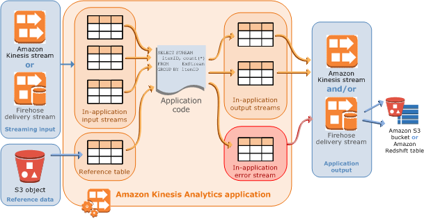
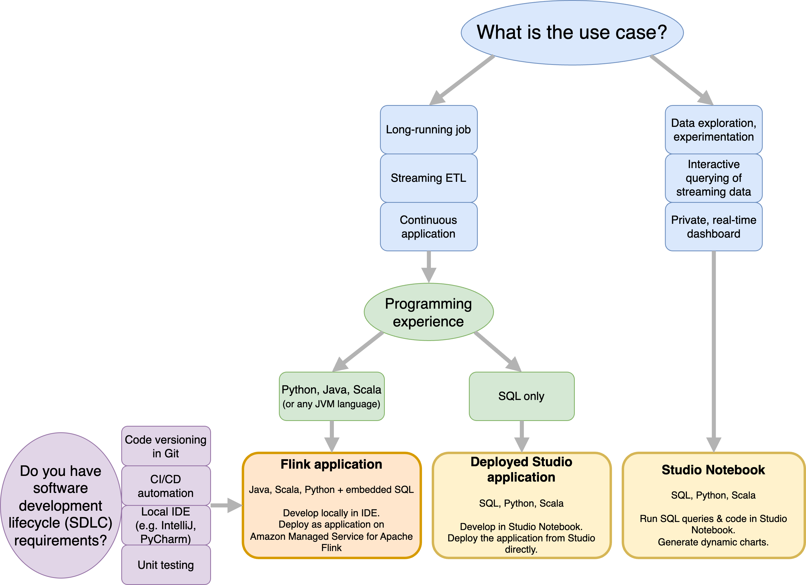
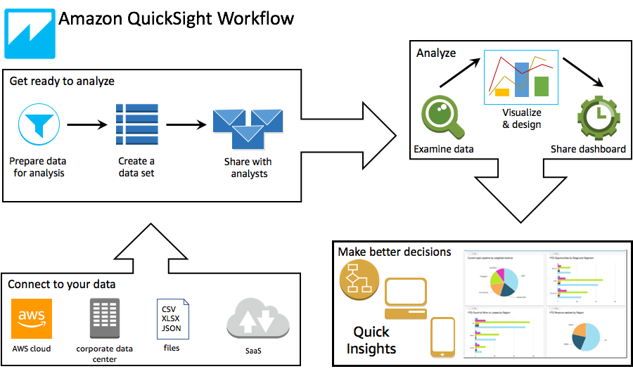

# Integration
## SQS
- [What is Amazon Simple Queue Service?](https://docs.aws.amazon.com/AWSSimpleQueueService/latest/SQSDeveloperGuide/welcome.html)
- [High throughput for FIFO queues in Amazon SQS](https://docs.aws.amazon.com/AWSSimpleQueueService/latest/SQSDeveloperGuide/high-throughput-fifo.html)
- [Amazon SQS FIFO queue quotas](https://docs.aws.amazon.com/AWSSimpleQueueService/latest/SQSDeveloperGuide/quotas-fifo.html)
  > -  Messages per queue (backlog): unlimited
  > - Messages per queue (in flight): ~~20,000~~ 120,000 (received from a queue by a consumer, but not yet deleted from the queue)
- [Amazon SQS standard queue quotas](https://docs.aws.amazon.com/AWSSimpleQueueService/latest/SQSDeveloperGuide/quotas-queues.html)
  > -  Messages per queue (backlog): unlimited
  > - Messages per queue (in flight): 120,000 (received from a queue by a consumer, but not yet deleted from the queue)
- [Amazon SQS message quotas](https://docs.aws.amazon.com/AWSSimpleQueueService/latest/SQSDeveloperGuide/quotas-messages.html)
  > - Message size: The minimum message size is 1 byte (1 character). The maximum is 262,144 bytes (256 KiB).
  > - Standard queues support a nearly unlimited number of API calls per second, per API action (SendMessage, ReceiveMessage, or DeleteMessage).
  > - FIFO queues
  >   - Each partition in a FIFO queue is limited to 300 transactions per second, per API action (SendMessage, ReceiveMessage, and DeleteMessage). This limit applies specifically to non-high throughput mode. By switching to high throughput mode, you can surpass this default limit.
  >   - If you use batching, non-high throughput FIFO queues support up to 3,000 messages per second, per API action (SendMessage, ReceiveMessage, and DeleteMessage). The 3,000 messages per second represent 300 API calls, each with a batch of 10 messages.
  > - High throughput for FIFO queues
  >   - Amazon SQS FIFO limits are based on the number of API requests, not message limits.
  >   - These limits define how frequently each API operation (such as SendMessage, ReceiveMessage, or DeleteMessage) can be performed independently, ensuring efficient system performance within the allowed transactions per second (TPS).

- [Do Amazon SQS FIFO queues support multiple consumers?](https://aws.amazon.com/sqs/faqs/)
  > By design, Amazon SQS FIFO queues don't serve messages from the same message group to more than one consumer at a time. However, if your FIFO queue has multiple message groups, you can take advantage of parallel consumers, allowing Amazon SQS to serve messages from different message groups to different consumers.
- [Amazon SQS visibility timeout](https://docs.aws.amazon.com/AWSSimpleQueueService/latest/SQSDeveloperGuide/sqs-visibility-timeout.html)
- [Amazon SQS short and long polling](https://docs.aws.amazon.com/AWSSimpleQueueService/latest/SQSDeveloperGuide/sqs-short-and-long-polling.html)
- [Basic examples of Amazon SQS policies](https://docs.aws.amazon.com/AWSSimpleQueueService/latest/SQSDeveloperGuide/sqs-basic-examples-of-sqs-policies.html)
  - Grant one permission to one AWS account
  - Grant two permissions to one AWS account
  - Grant all permissions to two AWS accounts
  - Grant cross-account permissions to a role and a username
  - Grant a permission to all users
  - Grant a time-limited permission to all users
  - Grant all permissions to all users in a CIDR range
  - Allowlist and blocklist permissions for users in different CIDR ranges
- [FIFO queue and message identifiers in Amazon SQS](https://docs.aws.amazon.com/AWSSimpleQueueService/latest/SQSDeveloperGuide/sqs-fifo-queue-message-identifiers.html)
  > The name of a FIFO queue must end with the `.fifo` suffix.
- [Amazon SQS delay queues](https://docs.aws.amazon.com/AWSSimpleQueueService/latest/SQSDeveloperGuide/sqs-delay-queues.html)
- [Amazon SQS temporary queues](https://docs.aws.amazon.com/AWSSimpleQueueService/latest/SQSDeveloperGuide/sqs-temporary-queues.html)
- [Simple Two-way Messaging using the Amazon SQS Temporary Queue Client](https://aws.amazon.com/blogs/compute/simple-two-way-messaging-using-the-amazon-sqs-temporary-queue-client/)
  > Why would anyone use SQS for request-reply instead of HTTPS endpoint?
  > - Creating a queue is often easier and faster than creating an HTTPS endpoint and the infrastructure necessary to ensure the endpoint’s scalability.
  > - Queues are safe by default because they are locked down to the AWS account that created them. In addition, any DDoS attempt on your service is absorbed by SQS instead of loading down your own servers.
  > - There is generally no need to create firewall rules for the communication between microservices if they use queues.
  > - Although SQS provides durable storage (which isn’t necessary for short-lived messages), it is still a cost-effective solution for this use case. This is especially true when you consider all the messaging broker maintenance that is done for you.

## SNS
- [What is Amazon SNS?](https://docs.aws.amazon.com/sns/latest/dg/welcome.html)
  > While SNS provides some control over message delivery, such as:
  > 1. **Message filtering**: You can use message attributes and filtering policies to control which messages are delivered to specific subscribers.
  > 2. **Message throttling**: You can set a limit on the number of messages delivered per second to a subscriber.
  >
  > However, SNS does not provide direct control over the flow of messages or buffering, which means that if the consumer is not able to process messages quickly enough, they might be lost or delivered multiple times.
- [Amazon SNS dead-letter queues (DLQs)](https://docs.aws.amazon.com/sns/latest/dg/sns-dead-letter-queues.html)
  > Server-side errors can happen when the system responsible for the subscribed endpoint becomes unavailable or returns an exception that indicates that it can't process a valid request from Amazon SNS. When server-side errors occur, Amazon SNS retries the failed deliveries using either a linear or exponential backoff function. For server-side errors caused by **AWS managed endpoints backed by Amazon SQS or AWS Lambda**, Amazon SNS retries delivery up to 100,015 times, over 23 days.
  > 
  > **Customer managed endpoints (such as HTTP, SMTP, SMS, or mobile push)** can also cause server-side errors. Amazon SNS retries delivery to these types of endpoints as well. While HTTP endpoints support customer-defined retry policies, Amazon SNS sets an internal delivery retry policy to 50 times over 6 hours, for SMTP, SMS, and mobile push endpoints.
  >
  > **How do dead-letter queues work?**
  > A dead-letter queue is attached to an Amazon SNS subscription (rather than a topic) because message deliveries happen at the subscription level.
- [Amazon SNS message delivery retries](https://docs.aws.amazon.com/sns/latest/dg/sns-message-delivery-retries.html)
- [High throughput FIFO topics in Amazon SNS](https://docs.aws.amazon.com/sns/latest/dg/fifo-high-throughput.html)

## Kinesis
- [Amazon Kinesis Data Streams Terminology and Concepts](https://docs.aws.amazon.com/streams/latest/dev/key-concepts.html)
  - Gotcha: Amazon Kinesis Data Streams should be used for near-real time or real-time use cases instead of Amazon SQS
- [Choose the data stream capacity mode](https://docs.aws.amazon.com/streams/latest/dev/how-do-i-size-a-stream.html)
- [Read data from Amazon Kinesis Data Streams](https://docs.aws.amazon.com/streams/latest/dev/building-consumers.html)
  - [Develop enhanced fan-out consumers with dedicated throughput](https://docs.aws.amazon.com/streams/latest/dev/enhanced-consumers.html)
  - [Use the Kinesis Client Library](https://docs.aws.amazon.com/streams/latest/dev/kcl.html)
    - > Instantiates a record processor for every shard it manages
    - [KCL concepts](https://docs.aws.amazon.com/streams/latest/dev/kcl-concepts.html)
    - [KCL 1.x and 2.x information](https://docs.aws.amazon.com/streams/latest/dev/shared-throughput-kcl-consumers.html)
    - [Migrate from KCL 2.x to KCL 3.x](https://docs.aws.amazon.com/streams/latest/dev/kcl-migration-from-2-3.html)
  - [Develop consumers with the AWS SDK for Java](https://docs.aws.amazon.com/streams/latest/dev/develop-consumers-sdk.html)
  - [How Lambda processes records from Amazon Kinesis Data Streams](https://docs.aws.amazon.com/lambda/latest/dg/with-kinesis.html)
  - [Develop consumers using Amazon Data Firehose](https://docs.aws.amazon.com/streams/latest/dev/kdf-consumer.html)
- [Troubleshoot Kinesis Data Streams consumers](https://docs.aws.amazon.com/streams/latest/dev/troubleshooting-consumers.html)
- [Implementing Efficient and Reliable Producers with the Amazon Kinesis Producer Library](https://aws.amazon.com/blogs/big-data/implementing-efficient-and-reliable-producers-with-the-amazon-kinesis-producer-library/)
  > - Use Batching
  > - Use parallel HTTP requests
- [Amazon Kinesis Data Streams Adds Enhanced Fan-Out and HTTP/2 for Faster Streaming](https://aws.amazon.com/blogs/aws/kds-enhanced-fanout/)
  > Kinesis Data Streams are scaled using the concept of a shard. One shard provides an ingest capacity of 1MB/second or 1000 records/second and an output capacity of 2MB/second. It’s not uncommon for customers to have thousands or tens of thousands of shards supporting 10s of GB/sec of ingest and egress. Before the enhanced fan-out capability, that 2MB/second/shard output was shared between all of the applications consuming data from the stream. With enhanced fan-out developers can register stream consumers to use enhanced fan-out and receive their own 2MB/second pipe of read throughput per shard, and this throughput automatically scales with the number of shards in a stream. Prior to the launch of Enhanced Fan-out customers would frequently fan-out their data out to multiple streams to support their desired read throughput for their downstream applications.
- [Building a scalable streaming data processor with Amazon Kinesis Data Streams on AWS Fargate](https://aws.amazon.com/blogs/big-data/building-a-scalable-streaming-data-processor-with-amazon-kinesis-data-streams-on-aws-fargate/)

## Amazon Managed Service for Apache Flink
- [Amazon Kinesis Data Analytics for SQL Applications discontinuation](https://docs.aws.amazon.com/kinesisanalytics/latest/dev/discontinuation.html)
  > We recommend that you migrate your applications to [Amazon Managed Service for Apache Flink](https://docs.aws.amazon.com/managed-flink/latest/java/what-is.html) or [Amazon Managed Service for Apache Flink Studio](https://aws.amazon.com/managed-service-apache-flink/studio/) before October 15, 2025.
  > 
  > **Why are you no longer offering Amazon Kinesis Data Analytics for SQL applications?**
  > We have found that customers prefer Amazon Managed Service for Apache Flink offerings for real-time data stream processing workloads. Amazon Managed Service for Apache Flink is a serverless, low latency, highly scalable and available real-time stream processing service using Apache Flink, an open source engine for processing data streams. Amazon Managed Service for Apache Flink offers functionality such as native scaling, exactly once processing semantics, multi-language support (including SQL), over 40 source and destination connectors, durable application state, and more. These features help customers build end to end streaming pipelines and ensure the accuracy and timeliness of data.

- [Deprecated: Amazon Kinesis Data Analytics for SQL Applications: How It Works](https://docs.aws.amazon.com/kinesisanalytics/latest/dev/how-it-works.html)
  > 
  - Gotcha: Kinesis Data Streams can handle real-time data ingestion and Lambda can perform real-time processing, but this approach requires managing the stream consumers (like AWS Lambda) and ensuring they are scaled properly.
- [What is Amazon Managed Service for Apache Flink?](https://docs.aws.amazon.com/managed-flink/latest/java/what-is.html)
  > You have two options for running your Flink jobs with Amazon Managed Service for Apache Flink. With [Managed Service for Apache Flink](https://docs.aws.amazon.com/managed-flink/latest/java/getting-started.html), you build Flink applications in Java, Scala, or Python (and embedded SQL) using an IDE of your choice and the Apache Flink Datastream or Table APIs. With [Managed Service for Apache Flink Studio](https://docs.aws.amazon.com/managed-flink/latest/java/how-notebook.html), you can interactively query data streams in real time and easily build and run stream processing applications using standard SQL, Python, and Scala.
  > 
  > **Apache Flink APIs**
  > - Flink SQL
  > - Table API
  > - DataStream API
  > - Process Function
- [Apache Flink APIs](https://nightlies.apache.org/flink/flink-docs-release-1.18/docs/concepts/overview/#flinks-apis)

## Data Firehose
- [What is Amazon Data Firehose?](https://docs.aws.amazon.com/firehose/latest/dev/what-is-this-service.html)
- [Choose source and destination for your Firehose stream](https://docs.aws.amazon.com/firehose/latest/dev/create-name.html)
  > - **Direct PUT** – Choose this option to create a Firehose stream that producer applications write to directly. Here is a list of AWS services and agents and open source services that integrate with Direct PUT in Amazon Data Firehose. This list is not exhaustive, and there may be additional services that can be used to send data directly to Firehose.
  > - **Amazon Kinesis Data Streams** – Choose this option to configure a Firehose stream that uses a Kinesis data stream as a data source. You can then use Firehose to read data easily from an existing Kinesis data stream and load it into destinations.
  > - **Amazon MSK (Managed Streaming for Apache Kafka)** – Choose this option to configure a Firehose stream that uses Amazon MSK as a data source. You can then use Firehose to read data easily from an existing Amazon MSK clusters and load it into specified S3 buckets.
- [Amazon Data Firehose Destinations](https://docs.aws.amazon.com/firehose/latest/dev/create-destination.html)
  > Gotcha: DynamoDB is not supported

# Analytics

## Athena
- [Amazon Athena FAQs](https://aws.amazon.com/athena/faqs/)
- [AWS Data Exchange](https://aws.amazon.com/data-exchange/)
- [Using Amazon Athena Federated Query](https://docs.aws.amazon.com/athena/latest/ug/federated-queries.html)
  > If you have data in sources other than Amazon S3, you can use Athena Federated Query to query the data in place or build pipelines that extract data from multiple data sources and store them in Amazon S3. With Athena Federated Query, you can run SQL queries across data stored in relational, non-relational, object, and custom data sources.
  > 
  > Athena uses data source connectors that run on AWS Lambda to run federated queries. A data source connector is a piece of code that can translate between your target data source and Athena. You can think of a connector as an extension of Athena's query engine. Prebuilt Athena data source connectors exist for data sources like Amazon CloudWatch Logs, Amazon DynamoDB, Amazon DocumentDB, and Amazon RDS, and JDBC-compliant relational data sources such MySQL, and PostgreSQL under the Apache 2.0 license
- [Use SerDes](https://docs.aws.amazon.com/athena/latest/ug/serde-reference.html)
  > Athena supports several SerDe (Serializer/Deserializer) libraries that parse data from a variety of data formats. When you create a table in Athena, you can specify a SerDe that corresponds to the format that your data is in. Athena does not support custom SerDes.
- [Querying AWS CloudTrail logs](https://docs.aws.amazon.com/athena/latest/ug/cloudtrail-logs.html)
  > If you want to perform SQL queries on CloudTrail event information across accounts, regions, and dates, consider using CloudTrail Lake. CloudTrail Lake is an AWS alternative to creating trails that aggregates information from an enterprise into a single, searchable event data store. Instead of using Amazon S3 bucket storage, it stores events in a data lake, which allows richer, faster queries.
- [Querying JSON](https://docs.aws.amazon.com/athena/latest/ug/querying-JSON.html)

## EMR
- [What is Amazon EMR?](https://docs.aws.amazon.com/emr/latest/ManagementGuide/emr-what-is-emr.html)
  > Amazon EMR, which was previously called Amazon Elastic MapReduce, is a managed cluster platform that simplifies running big data frameworks, such as Apache Hadoop and Apache Spark, on AWS to process and analyze vast amounts of data. Using these frameworks and related open-source projects, you can process data for analytics purposes and business intelligence workloads. Amazon EMR also lets you transform and move large amounts of data into and out of other AWS data stores and databases, such as Amazon Simple Storage Service (Amazon S3) and Amazon DynamoDB.
  >
  > **Flexible deployment options**
  > - Amazon EMR Serverless
  > - Amazon EMR on Amazon EC2
  > - Amazon EMR on Amazon EKS

## QuickSight
- [What is Amazon QuickSight?](https://docs.aws.amazon.com/quicksight/latest/user/welcome.html)
- [How Amazon QuickSight works](https://docs.aws.amazon.com/quicksight/latest/user/how-quicksight-works.html)
  
- [Refreshing data in Amazon QuickSight](https://docs.aws.amazon.com/quicksight/latest/user/refreshing-data.html)
  > When refreshing data, Amazon QuickSight handles datasets differently depending on the connection properties and the storage location of the data.
  >
  > If QuickSight connects to the data store by using a direct query, the data automatically refreshes when you open an associated dataset, analysis, or dashboard. Filter controls are refreshed automatically every 24 hours.
  >
  > To refresh SPICE datasets, QuickSight must independently authenticate using stored credentials to connect to the data. QuickSight can't refresh manually uploaded data—even from S3 buckets, even though it's stored in SPICE—because QuickSight doesn't store its connection and location metadata. If you want to automatically refresh data that's stored in an S3 bucket, create a dataset by using the S3 data source card.
- [Importing data into SPICE](https://docs.aws.amazon.com/quicksight/latest/user/spice.html)
  > Importing (also called ingesting) your data into SPICE can save time and money:
  > * Your analytical queries process faster.
  > * You don't need to wait for a direct query to process. 
  > * Data stored in SPICE can be reused multiple times without incurring additional costs. If you use a data source that charges per query, you're charged for querying the data when you first create the dataset and later when you refresh the dataset.
- [Logging operations with AWS CloudTrail](https://docs.aws.amazon.com/quicksight/latest/user/logging-using-cloudtrail.html)