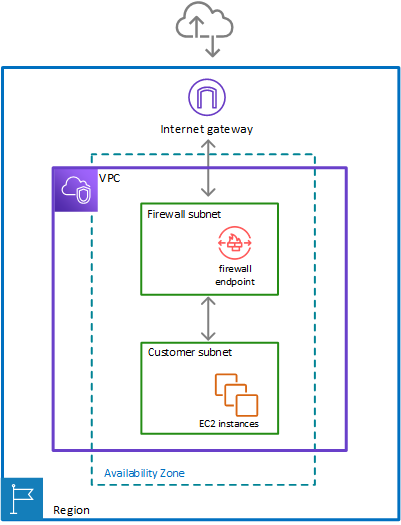

# Security
## KMS
- [AWS KMS keys](https://docs.aws.amazon.com/kms/latest/developerguide/concepts.html)
  > |          | **Customer managed keys** | **AWS managed keys** | **AWS owned keys** |
  > |----------|---------------------------|----------------------|------------------- |
  > | **Key policy** | Exclusively controlled by the customer | Controlled by service; viewable by customer | Exclusively controlled and only viewable by the AWS service that encrypts your data |
  > | **Logging** | CloudTrail customer trail or event data store | CloudTrail customer trail or event data store | Not viewable by the customer |
  > | **Lifecycle management** | Customer manages rotation, deletion and Regional location | AWS KMS manages rotation (annual), deletion and Regional location | AWS service manages rotation (annual), deletion and Regional location |
  > | **Pricing** | Monthly fee for existence of keys (pro-rated  hourly). Also charged for key usage | No charge for key usage; but the caller is charged for API usage on these keys | No charges to customer |
- [Generate data keys](https://docs.aws.amazon.com/kms/latest/developerguide/data-keys.html)
- [Generate data key pairs](https://docs.aws.amazon.com/kms/latest/developerguide/data-key-pairs.html) 
- [Rotating AWS KMS keys](https://docs.aws.amazon.com/kms/latest/developerguide/rotate-keys.html)
  > AWS KMS saves all previous versions of the cryptographic material in perpetuity so you can decrypt any data encrypted with that KMS key. AWS KMS does not delete any rotated key material until you delete the KMS key.
  >
  > automatic key rotation has no effect on the data that the KMS key protects. It does not rotate the data keys that the KMS key generated or re-encrypt any data protected by the KMS key, and it will not mitigate the effect of a compromised data key.
  >
  > You might decide to create a new KMS key and use it in place of the original KMS key. This has the same effect as rotating the key material in an existing KMS key, so it's often thought of as manually rotating the key. Manual rotation is a good choice when you want to rotate KMS keys that are not eligible for automatic key rotation, including asymmetric KMS keys, HMAC KMS keys, KMS keys in custom key stores, and KMS keys with imported key material.
- [Deleting AWS KMS keys](https://docs.aws.amazon.com/kms/latest/developerguide/deleting-keys.html)
  > Because it is destructive and potentially dangerous to delete a KMS key, AWS KMS requires you to set a waiting period of 7 – 30 days. The default waiting period is 30 days.
  >
  > During the waiting period, the KMS key status and key state is Pending deletion.
  > - A KMS key pending deletion cannot be used in any cryptographic operations.
  > - AWS KMS does not rotate the key material of KMS keys that are pending deletion.
- [Multi-Region keys in AWS KMS](https://docs.aws.amazon.com/kms/latest/developerguide/multi-region-keys-overview.html)
  > Multi-Region keys are not global. You create a multi-Region primary key and then replicate it into Regions that you select within an AWS partition. Then you manage the multi-Region key in each Region independently. Neither AWS nor AWS KMS ever automatically creates or replicates multi-Region keys into any Region on your behalf. AWS managed keys, the KMS keys that AWS services create in your account for you, are always single-Region keys.
  > 
  > You cannot convert an existing single-Region key to a multi-Region key. This design ensures that all data protected with existing single-Region keys maintain the same data residency and data sovereignty properties.
  >
  > For most data security needs, the Regional isolation and fault tolerance of Regional resources make standard AWS KMS single-Region keys a best-fit solution. However, when you need to encrypt or sign data in client-side applications across multiple Regions, multi-Region keys might be the solution.

## AWS Network Firewall
- [What is AWS Network Firewall?](https://docs.aws.amazon.com/network-firewall/latest/developerguide/what-is-aws-network-firewall.html)
   > AWS Network Firewall is a stateful, managed, network firewall and intrusion detection and prevention service for your virtual private cloud (VPC) that you create in Amazon Virtual Private Cloud (Amazon VPC). With Network Firewall, you can filter traffic at the perimeter of your VPC. This includes filtering traffic going to and coming from an internet gateway, NAT gateway, or over VPN or AWS Direct Connect.
  >
  > Network Firewall uses the open source intrusion prevention system (IPS), Suricata, for stateful inspection, and supports Suricata compatible rules. For more information, see Working with stateful rule groups in AWS Network Firewall.
- [How AWS Network Firewall works](https://docs.aws.amazon.com/network-firewall/latest/developerguide/how-it-works.html)
  > 
  >
  > Image: A VPC spans the Region and contains a Network Firewall firewall subnet and a customer subnet. The firewall subnet is between the customer subnet and an internet gateway and is filtering traffic in both directions.
  >
  > **Firewall subnet** – A subnet that you've designated for exclusive use by Network Firewall for a firewall endpoint. A firewall endpoint can't filter traffic coming into or going out of the subnet in which it resides, so don't use your firewall subnets for anything other than Network Firewall.
  >
  > To enable the firewall's protection, you modify your Amazon VPC route tables to send your network traffic through the Network Firewall firewall endpoints.

## AWS WAF, AWS Firewall Manager, and AWS Shield Advanced
- [What are AWS WAF, AWS Shield Advanced, and AWS Firewall Manager?](https://docs.aws.amazon.com/waf/latest/developerguide/what-is-aws-waf.html)
  > AWS WAF is a web application firewall that lets you monitor the HTTP and HTTPS requests that are forwarded to your protected web application resources. You can protect the following resource types:
  > - Amazon CloudFront distribution
  > - Amazon API Gateway REST API
  > - Application Load Balancer
  > - AWS AppSync GraphQL API
  > - Amazon Cognito user pool
  > - AWS App Runner service
  > - AWS Verified Access instance
  > - AWS Amplify
- [Protecting the application layer with AWS WAF web ACLs and Shield Advanced](https://docs.aws.amazon.com/waf/latest/developerguide/ddos-app-layer-web-ACL-and-rbr.html)
  > At a minimum, your Shield Advanced protection requires you to associate a web ACL with a rate-based rule, which limits the rate of requests for each IP address.

## Web Application Firewall (WAF)
- [AWS WAF](https://docs.aws.amazon.com/waf/latest/developerguide/waf-chapter.html)
  > AWS WAF is a web application firewall that lets you monitor the HTTP(S) requests that are forwarded to your protected web application resources. You can protect the following resource types:
  > - Amazon CloudFront distribution
  > - Amazon API Gateway REST API
  > - Application Load Balancer
  > - AWS AppSync GraphQL API
  > - Amazon Cognito user pool
  > - AWS App Runner service
  > - AWS Verified Access instance
  > - AWS Amplify
  >
  > Note: You can also use AWS WAF to protect your applications that are hosted in Amazon Elastic Container Service (Amazon ECS) containers. Amazon ECS is a highly scalable, fast container management service that makes it easy to run, stop, and manage Docker containers on a cluster. To use this option, you configure Amazon ECS to use an Application Load Balancer that is enabled for AWS WAF to route and protect HTTP(S) layer 7 traffic across the tasks in your service.
- [AWS WAF FAQs](https://aws.amazon.com/waf/faqs/)
  > **How does AWS WAF protect my web site or application?**
  >
  > AWS WAF is tightly integrated with Amazon CloudFront, the Application Load Balancer (ALB), Amazon API Gateway, and AWS AppSync – services that AWS customers commonly use to deliver content for their websites and applications. When you use AWS WAF on Amazon CloudFront, your rules run in all AWS Edge Locations, located around the world close to your end users. This means security doesn’t come at the expense of performance. Blocked requests are stopped before they reach your web servers. When you use AWS WAF on regional services, such as Application Load Balancer, Amazon API Gateway, and AWS AppSync, your rules run in region and can be used to protect internet-facing resources as well as internal resources.
  >
  > **What services does AWS WAF support?**
  >
  > AWS WAF can be deployed on Amazon CloudFront, the Application Load Balancer (ALB), Amazon API Gateway, and AWS AppSync. As part of Amazon CloudFront it can be part of your Content Distribution Network (CDN) protecting your resources and content at the Edge locations. As part of the Application Load Balancer it can protect your origin web servers running behind the ALBs. As part of Amazon API Gateway, it can help secure and protect your REST APIs. As part of AWS AppSync, it can help secure and protect your GraphQL APIs.
  >
  > **Can I use AWS WAF to protect web sites not hosted in AWS?**
  >
  > Yes, AWS WAF is integrated with Amazon CloudFront, which supports custom origins outside of AWS.

- [AWS WAF rules](https://docs.aws.amazon.com/waf/latest/developerguide/waf-rules.html)
- [Match rule statements](https://docs.aws.amazon.com/waf/latest/developerguide/waf-rule-statements-match.html)
  - Geographic match
  - IP set match
  - Label match rule statement
  - Regex match rule statement
  - Regex pattern set
  - Size constraint
  - SQLi attack
  - String match
  - XSS scripting attack
- [AWS WAF Now Supports Geographic Match](https://aws.amazon.com/about-aws/whats-new/2017/10/aws-waf-now-supports-geographic-match/)
- [How to use granular geographic match rules with AWS WAF](https://aws.amazon.com/blogs/security/how-to-use-granular-geographic-match-rules-with-aws-waf/)
- [Geo-Blocking](https://aws.amazon.com/developer/application-security-performance/articles/geo-blocking/)
> Geo-blocking can be implemented using:
> - CloudFront's native geographic restrictions
>
>    Use [CloudFront geographic restrictions](https://docs.aws.amazon.com/AmazonCloudFront/latest/DeveloperGuide/georestrictions.html) to restrict countries at the distribution level, with no additional charges
> - edge functions 
>
>   To implement geo based logic in CloudFront functions, you need to allow list the required CloudFront headers (e.g., CloudFront-Viewer-Country or CloudFront-Viewer-Country-Region) in an origin request policy attached to the same CloudFront cache behavior to which the function is associated.
>
> - AWS WAF

## AWS Firewall Manager
- [AWS Firewall Manager](https://docs.aws.amazon.com/waf/latest/developerguide/fms-chapter.html)
  > AWS Firewall Manager simplifies your administration and maintenance tasks across multiple accounts and resources for a variety of protections, including AWS WAF, AWS Shield Advanced, Amazon VPC security groups, AWS Network Firewall, and Amazon Route 53 Resolver DNS Firewall. With Firewall Manager, you set up your protections just once and the service automatically applies them across your accounts and resources, even as you add new accounts and resources.
- [AWS Firewall Manager FAQs](https://aws.amazon.com/firewall-manager/faqs/)
  > **What does AWS Firewall Manager configure?**
  >
  > Using AWS Firewall Manager, you can centrally configure:
  > - AWS WAF rules
  > - AWS Shield Advanced protections
  > - Amazon Virtual Private Cloud (VPC) security groups 
  > - network access control lists (ACLs)
  > - AWS Network Firewalls
  > - Amazon Route 53 Resolver DNS Firewall rules 
  > across accounts and resources in your organization.
  >
  > **Which AWS resources can AWS Firewall Manager configure rules on ?**
  >
  > Using AWS Firewall Manager, you can 
  > - Easily roll out AWS WAF rules across Application Load Balancer, API Gateways and Amazon CloudFront distributions. 
  > - You can create AWS Shield Advanced protections for your Application Load Balancers, ELB Classic Load Balancers, Elastic IP Addresses and CloudFront distributions. 
  > - You can configure new Amazon Virtual Private Cloud (VPC) security groups and audit any existing security groups for your Amazon EC2, Application Load Balancers (ALBs) and ENI resource types. 
  > - You can also deploy AWS Network Firewalls across accounts and VPCs in your organization.
  > - Finally, with AWS Firewall Manager, you can also associate Amazon Route 53 Resolver DNS Firewall rules across VPCs in your organization.
  > - You can configure new Amazon Virtual Private Cloud (VPC) network access control lists (ACLs) for your VPC subnets.

## AWS Certificate Manager (ACM)
- [What is AWS Certificate Manager?](https://docs.aws.amazon.com/acm/latest/userguide/acm-overview.html)
  > AWS Certificate Manager (ACM) handles the complexity of creating, storing, and renewing public and private SSL/TLS X.509 certificates and keys that protect your AWS websites and applications. You can provide certificates for your integrated AWS services either by issuing them directly with ACM or by importing third-party certificates into the ACM management system. ACM certificates can secure singular domain names, multiple specific domain names, wildcard domains, or combinations of these. ACM wildcard certificates can protect an unlimited number of subdomains. You can also export ACM certificates signed by AWS Private CA for use anywhere in your internal PKI.
- [How to monitor expirations of imported certificates in AWS Certificate Manager (ACM)](https://aws.amazon.com/blogs/security/how-to-monitor-expirations-of-imported-certificates-in-aws-certificate-manager-acm/)

## IAM Identity Center
- [What is IAM Identity Center?](https://docs.aws.amazon.com/singlesignon/latest/userguide/what-is.html)
  > AWS IAM Identity Center is the AWS solution for connecting your workforce users to AWS managed applications such as Amazon Q Developer and Amazon QuickSight, and other AWS resources. You can connect your existing identity provider and synchronize users and groups from your directory, or create and manage your users directly in IAM Identity Center. You can then use IAM Identity Center for either or both of the following:
  > - User access to applications
  > - User access to AWS accounts
  >
  > IAM Identity Center supports two types of instances: *organization instances* and *account instances*. An organization instance is the best practice.
- [Manage your identity source](https://docs.aws.amazon.com/singlesignon/latest/userguide/manage-your-identity-source.html)
  > Your identity source in IAM Identity Center defines where your users and groups are managed. After you configure your identity source, you can look up users or groups to grant them single sign-on access to AWS accounts, applications, or both.
  >
  > You can have only one identity source per organization in AWS Organizations. You can choose one of the following as your identity source:
  > - **External identity provider** – Choose this option if you want to manage users in an external identity provider (IdP) such as Okta or Microsoft Entra ID.
  > - **Active Directory** – Choose this option if you want to continue managing users in either your AWS Managed Microsoft AD directory using AWS Directory Service or your self-managed directory in Active Directory (AD).
  > - **Identity Center directory** – When you enable IAM Identity Center for the first time, it's automatically configured with an Identity Center directory as your default identity source unless you choose a different identity source. With the Identity Center directory, you create your users and groups, and assign their level of access to your AWS accounts and applications.
- [Connect to a Microsoft AD directory](https://docs.aws.amazon.com/singlesignon/latest/userguide/manage-your-identity-source-ad.html)
  > IAM Identity Center uses the connection provided by the AWS Directory Service to synchronize user, group, and membership information from your source directory in Active Directory to the IAM Identity Center identity store. No password information is synchronized to IAM Identity Center, because user authentication takes place directly from the source directory in Active Directory.
- [Connect a self-managed directory in Active Directory to IAM Identity Center](https://docs.aws.amazon.com/singlesignon/latest/userguide/connectonpremad.html)
  > o configure single sign-on access for these users, you can do either of the following:
  > - **Create a two-way trust relationship** – When two-way trust relationships are created between AWS Managed Microsoft AD and a self-managed directory in AD, users in your self-managed directory in AD can sign in with their corporate credentials to various AWS services and business applications. One-way trusts do not work with IAM Identity Center.
  >
  >   AWS IAM Identity Center requires a two-way trust so that it has permissions to read user and group information from your domain to synchronize user and group metadata. IAM Identity Center uses this metadata when assigning access to permission sets or applications. User and group metadata is also used by applications for collaboration, like when you share a dashboard with another user or group. The trust from AWS Directory Service for Microsoft Active Directory to your domain permits IAM Identity Center to trust your domain for authentication. The trust in the opposite direction grants AWS permissions to read user and group metadata.
  > - **Create an AD Connector** – AD Connector is a directory gateway that can redirect directory requests to your self-managed AD without caching any information in the cloud.
- [Manage access to AWS accounts](https://docs.aws.amazon.com/singlesignon/latest/userguide/manage-your-accounts.html)
  > AWS IAM Identity Center is integrated with AWS Organizations, which enables you to centrally manage permissions across multiple AWS accounts without configuring each of your accounts manually. You can define permissions and assign these permissions to workforce users to control their access to specific AWS accounts using an organization instance of IAM Identity Center. Account instances of IAM Identity Center don't support account access.
  >
  > When you enable IAM Identity Center, IAM Identity Center creates a service-linked role in all accounts within the organization in AWS Organizations. IAM Identity Center also creates the same service-linked role in every account that is subsequently added to your organization. This role allows IAM Identity Center to access each account's resources on your behalf.
  >
  > **Assigning AWS account access**
  > 
  > You can use permission sets to simplify how you assign users and groups in your organization access to AWS accounts. Permission sets are stored in IAM Identity Center and define the level of access that users and groups have to an AWS account. You can create a single permission set and assign it to multiple AWS accounts within your organization. You can also assign multiple permission sets to the same user.

## Active Directory
- [What is AWS Directory Service?](https://docs.aws.amazon.com/directoryservice/latest/admin-guide/what_is.html)
  > Use AWS Directory Service for Microsoft Active Directory (Standard Edition or Enterprise Edition) if you need an actual Microsoft Active Directory in the AWS Cloud that supports Active Directory–aware workloads, or AWS applications and services such as Amazon WorkSpaces and Amazon QuickSight, or you need LDAP support for Linux applications.
  > 
  > Use AD Connector if you only need to allow your on-premises users to log in to AWS applications and services with their Active Directory credentials. You can also use AD Connector to join Amazon EC2 instances to your existing Active Directory domain.
  > 
  > Use Simple AD if you need a low-scale, low-cost directory with basic Active Directory compatibility that supports Samba 4–compatible applications, or you need LDAP compatibility for LDAP-aware applications.
- [AWS Managed Microsoft AD](https://docs.aws.amazon.com/directoryservice/latest/admin-guide/directory_microsoft_ad.html)
  > AWS Managed Microsoft AD is available in two editions: Standard and Enterprise.
  > 
  > **Standard Edition**: AWS Managed Microsoft AD (Standard Edition) is optimized to be a primary directory for small and midsize businesses with up to 5,000 employees. It provides you enough storage capacity to support up to 30,000* directory objects, such as users, groups, and computers.
  >
  > **Enterprise Edition**: AWS Managed Microsoft AD (Enterprise Edition) is designed to support enterprise organizations with up to 500,000* directory objects.
- [AD Connector](https://docs.aws.amazon.com/directoryservice/latest/admin-guide/directory_ad_connector.html)
  > AD Connector does not support Active Directory transitive trusts. AD Connectors and your on-premises Active Directory domains have a 1-to-1 relationship. That is, for each on-premises domain, including child domains in an Active Directory forest that you want to authenticate against, you must create a unique AD Connector.
- [Simple AD](https://docs.aws.amazon.com/directoryservice/latest/admin-guide/directory_simple_ad.html)
  > - Small - Supports up to 500 users (approximately 2,000 objects including users, groups, and computers).
  >  - Large - Supports up to 5,000 users (approximately 20,000 objects including users, groups, and computers).

## Cognito
- [Amazon Cognito user pools](https://docs.aws.amazon.com/cognito/latest/developerguide/cognito-user-identity-pools.html)
  > An Amazon Cognito user pool is a user directory for web and mobile app authentication and authorization. From the perspective of your app, an Amazon Cognito user pool is an OpenID Connect (OIDC) identity provider (IdP). A user pool adds layers of additional features for security, identity federation, app integration, and customization of the user experience.
- [Amazon Cognito identity pools](https://docs.aws.amazon.com/cognito/latest/developerguide/cognito-identity.html)
  > An Amazon Cognito identity pool is a directory of federated identities that you can exchange for AWS credentials. Identity pools generate temporary AWS credentials for the users of your app, whether they’ve signed in or you haven’t identified them yet. With AWS Identity and Access Management (IAM) roles and policies, you can choose the level of permission that you want to grant to your users. 
  > #### Features of Amazon Cognito identity pools
  > - Sign requests for AWS services
  > - Filter requests with resource-based policies
  > - Assign guest access
  > - Assign IAM roles based on user characteristics
  > - Accept a variety of identity providers
  > - Validate your own identities
- [Accessing AWS services using an identity pool after sign-in](https://docs.aws.amazon.com/cognito/latest/developerguide/amazon-cognito-integrating-user-pools-with-identity-pools.html)

## Other
- [What is AWS Security Hub?](https://docs.aws.amazon.com/securityhub/latest/userguide/what-is-securityhub.html)
  > AWS Security Hub provides you with a comprehensive view of your security state in AWS and helps you assess your AWS environment against security industry standards and best practices.
  >
  > Security Hub collects security data across AWS accounts, AWS services, and supported third-party products and helps you analyze your security trends and identify the highest priority security issues.
  >
  > Security Hub runs checks against security controls and generates control findings to help you assess your compliance against security best practices.
  >
  > In addition to generating control findings, Security Hub also receives findings from other AWS services—such as Amazon GuardDuty, Amazon Inspector, and Amazon Macie— and supported third-party products.
- [REL13-BP02 Use defined recovery strategies to meet the recovery objectives](https://docs.aws.amazon.com/wellarchitected/latest/reliability-pillar/rel_planning_for_recovery_disaster_recovery.html)
  - Backup and restore (RPO in hours, RTO in 24 hours or less)
  - Pilot light (RPO in minutes, RTO in tens of minutes)
  - Warm standby (RPO in seconds, RTO in minutes)
  - Multi-Region (multi-site) active-active (RPO near zero, RTO potentially zero)

## Cloud Formation
- [How CloudFormation works](https://docs.aws.amazon.com/AWSCloudFormation/latest/UserGuide/cloudformation-overview.html)
  - Templates
  - Stacks
  - Change sets
- [CloudFormation template sections](https://docs.aws.amazon.com/AWSCloudFormation/latest/UserGuide/template-anatomy.html)
  - [Outputs section syntax reference for CloudFormation templates](https://docs.aws.amazon.com/AWSCloudFormation/latest/UserGuide/outputs-section-structure.html)
- [Managing stacks across accounts and Regions with StackSets](https://docs.aws.amazon.com/AWSCloudFormation/latest/UserGuide/what-is-cfnstacksets.html)
- [Protect CloudFormation stacks from being deleted](https://docs.aws.amazon.com/AWSCloudFormation/latest/UserGuide/using-cfn-protect-stacks.html)
- [Prevent updates to stack resources](https://docs.aws.amazon.com/AWSCloudFormation/latest/UserGuide/protect-stack-resources.html)
- [Refer to resource outputs in another CloudFormation stack](https://docs.aws.amazon.com/AWSCloudFormation/latest/UserGuide/walkthrough-crossstackref.html)
- [New – CloudFormation Drift Detection](https://aws.amazon.com/blogs/aws/new-cloudformation-drift-detection/)

### AWS Cloud Development Kit (AWS CDK) v2
- [What is the AWS CDK?](https://docs.aws.amazon.com/cdk/v2/guide/home.html)
  > The AWS Cloud Development Kit (AWS CDK) is an open-source software development framework for defining cloud infrastructure in code and provisioning it through AWS CloudFormation.