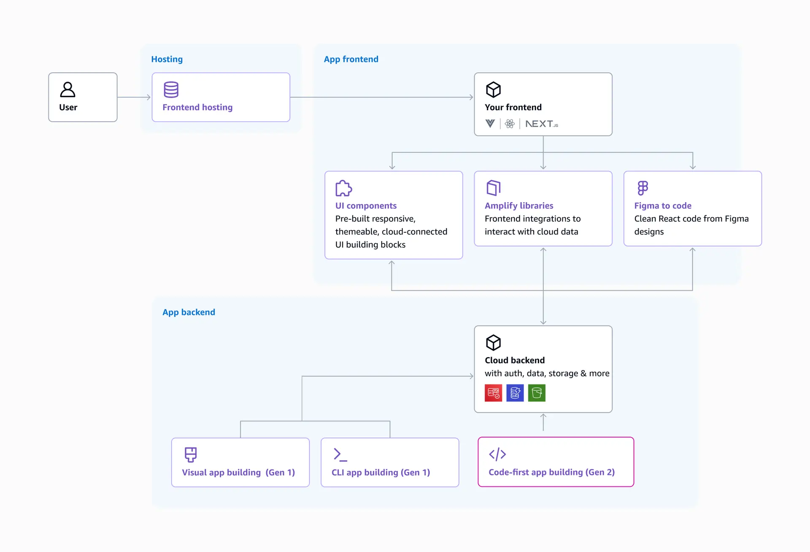

# Misc
- [Deprecated: AWS Private 5G](https://aws.amazon.com/about-aws/whats-new/2025/05/aws-service-changes/)
- [AWS Amplify](https://aws.amazon.com/amplify/)
  > AWS Amplify simplifies the process of hosting web applications with automated deployment processes. It also integrates with CloudFront, providing a global content delivery network to efficiently serve the game interface.
- [How Amplify works](https://docs.amplify.aws/react/how-amplify-works/concepts/)
  > Amplify empowers frontend developers to deploy cloud infrastructure by simply expressing their app’s data model, business logic, authentication, and authorization rules completely in TypeScript. Amplify automatically configures the correct cloud resources and removes the requirement to stitch together underlying AWS services.
  >
  > With the Gen 2 DX, you can provision backend infrastructure by authoring TypeScript. In the following diagram, the box at the bottom (outlined in pink), highlights the main difference in how you provision infrastructure compared to Gen 1. In Gen 1, you would use Studio's console or the CLI to provision infrastructure; in Gen 2, you author TypeScript code in files following a file-based convention (such as amplify/auth/resource.ts or amplify/auth/data.ts). With TypeScript types and classes for resources, you gain strict typing and IntelliSense in Visual Studio Code to prevent errors. A breaking change in the backend code immediately reflects as a type error in the co-located frontend code. The file-based convention follows the "convention over configuration" paradigm—you know exactly where to look for resource definitions when you group them by type in separate files.
  > 
  > 
- [Automate OS Image Build Pipelines with EC2 Image Builder](https://aws.amazon.com/blogs/aws/automate-os-image-build-pipelines-with-ec2-image-builder/)